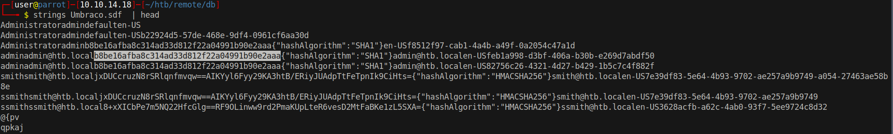
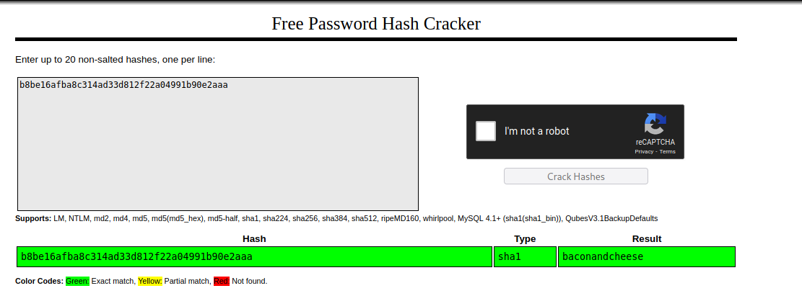

# 20 - NFS


NFS port 2049 is open.

# List shares
```bash
┌─[user@parrot]─[10.10.14.18]─[~/htb/remote]
└──╼ $ showmount -e 10.10.10.180
Export list for 10.10.10.180:
/site_backups (everyone)
```

# Mount site_backups
```bash
┌─[user@parrot]─[10.10.14.18]─[~/htb/remote]
└──╼ $ sudo mkdir -p /mnt/remote
┌─[user@parrot]─[10.10.14.18]─[~/htb/remote]
└──╼ $ sudo mount -t nfs 10.10.10.180:site_backups /mnt/remote/
┌─[user@parrot]─[10.10.14.18]─[~/htb/remote]
└──╼ $ cd /mnt/remote/
┌─[user@parrot]─[10.10.14.18]─[/mnt/remote]
└──╼ $ ls
App_Browsers  App_Data  App_Plugins  aspnet_client  bin  Config  css  default.aspx  Global.asax  Media  scripts  Umbraco  Umbraco_Client  Views  Web.config
```

It looks like the web server but the share is not writable. 


# SDF 
```bash
┌─[user@parrot]─[10.10.14.18]─[/mnt/remote/App_Data]
└──╼ $ ls -l Umbraco.sdf 
-rwx------ 1 nobody 4294967294 1965978 Feb 20  2020 Umbraco.sdf
┌─[user@parrot]─[10.10.14.18]─[/mnt/remote/App_Data]
└──╼ $ file Umbraco.sdf 
Umbraco.sdf: data
```
SDF is a database file.

See [SQL Server Compact](https://en.wikipedia.org/wiki/SQL_Server_Compact) for more information


# Admin's Hash



# [Password cracked](https://crackstation.net/)




* admin@htb.local:baconandcheese

# Umbraco version
```bash
┌─[user@parrot]─[10.10.14.18]─[~/htb/remote/db]
└──╼ $ grep -i umbracoConfigurationStatus Web.config 
                <add key="umbracoConfigurationStatus" value="7.12.4" />
```


# Searchsploit
```bash
┌─[user@parrot]─[10.10.14.18]─[~/htb/remote]
└──╼ $ searchsploit umbraco
------------------------------------------------------------------------------------------------------------------------------------------------------------ ---------------------------------
 Exploit Title                                                                                                                                              |  Path
------------------------------------------------------------------------------------------------------------------------------------------------------------ ---------------------------------
Umbraco CMS - Remote Command Execution (Metasploit)                                                                                                         | windows/webapps/19671.rb
Umbraco CMS 7.12.4 - (Authenticated) Remote Code Execution                                                                                                  | aspx/webapps/46153.py
Umbraco CMS 7.12.4 - Remote Code Execution (Authenticated)                                                                                                  | aspx/webapps/49488.py
Umbraco CMS SeoChecker Plugin 1.9.2 - Cross-Site Scripting                                                                                                  | php/webapps/44988.txt
------------------------------------------------------------------------------------------------------------------------------------------------------------ ---------------------------------
Shellcodes: No Results
```

Our target is running a vulnerable version of Umbraco.


# Go back to 15 - HTTP.md