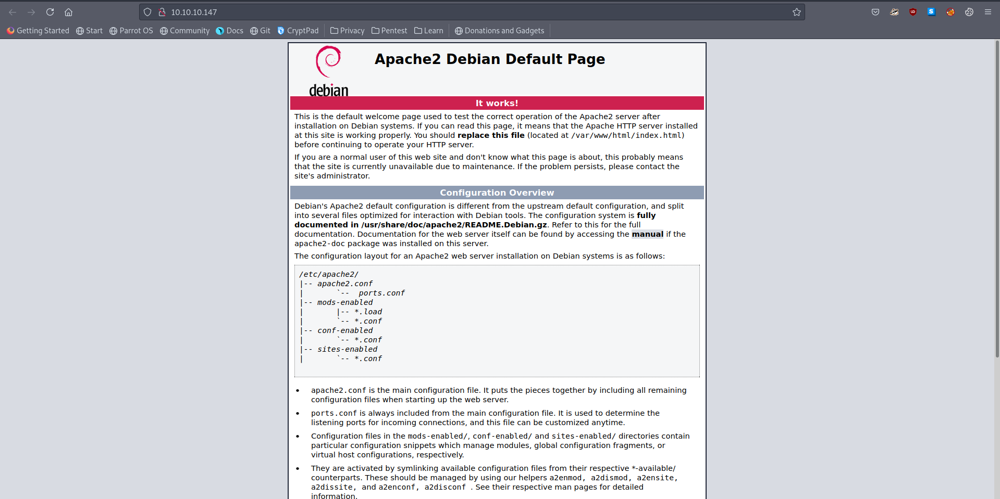
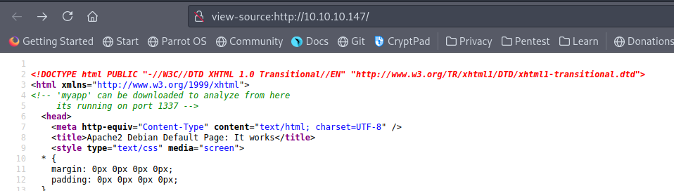

# 10 - Web Service


# Apache Default Page




# Myapp on port 1337



# Download myapp
```
┌─[user@parrot]─[10.10.14.18]─[~/htb/safe/myapp]
└──╼ $ wget 10.10.10.147/myapp
--2021-07-12 10:43:15--  http://10.10.10.147/myapp
Connecting to 10.10.10.147:80... connected.
HTTP request sent, awaiting response... 200 OK
Length: 16592 (16K)
Saving to: ‘myapp’

myapp                                           100%[=====================================================================================================>]  16.20K  --.-KB/s    in 0.07s   

2021-07-12 10:43:16 (243 KB/s) - ‘myapp’ saved [16592/16592]

┌─[user@parrot]─[10.10.14.18]─[~/htb/safe/myapp]
└──╼ $ file myapp 
myapp: ELF 64-bit LSB executable, x86-64, version 1 (SYSV), dynamically linked, interpreter /lib64/ld-linux-x86-64.so.2, for GNU/Linux 3.2.0, BuildID[sha1]=fcbd5450d23673e92c8b716200762ca7d282c73a, not stripped
```