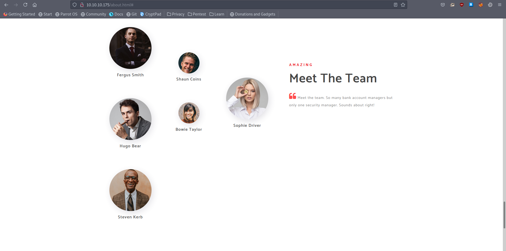

# 10 - HTTP


It seems like a static web page. 


# Potential Users


Since there is a domain controller, we may need to query AD for valid users.

# Generated list for username enumeration
```bash
┌─[user@parrot]─[10.10.14.18]─[~/htb/sauna]
└──╼ $ cat names.txt 
Fergus.Smith
F.Smith
Fergus_Smith
FSmith
Hugo.Bear
H.Bear
Hugo_Bear
HBear
Steven.Kerb
S.Kerb
Steven_Kerb
SKerb
Shaun.Coins
S.Coins
Shaun_Coins
SCoins
Bowie.Taylor
B.Taylor
Bowie_Taylor
BTaylor
Sophie.Driver
S.Driver
Sophie_Driver
SDriver
```