# 15 - PrivEsc


# Oracle issue.txt
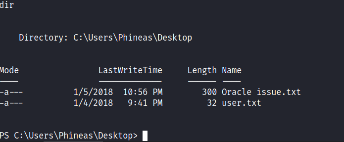

There is a note on Phineas's Desktop directory

# Contents of Oracle issue.txt
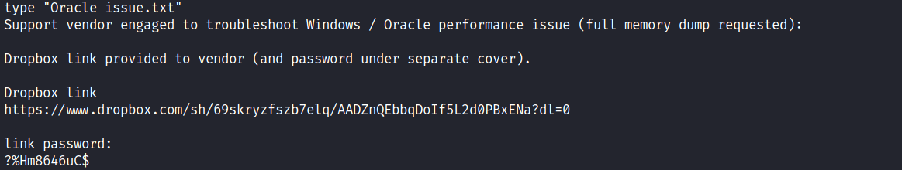

We should see a memory dump on dropbox.

# Password is incorrect

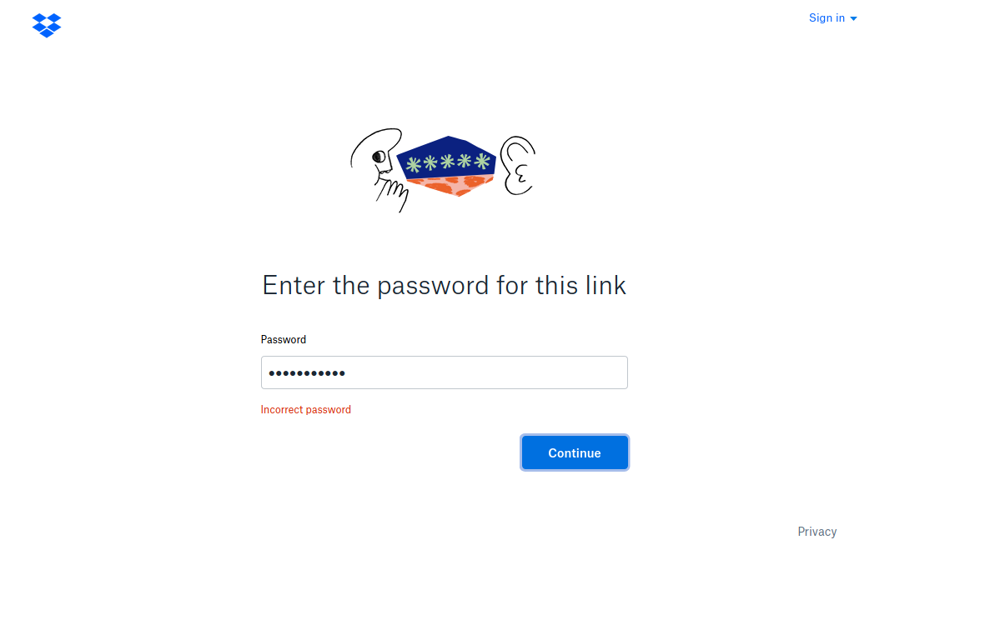

Let's check if there are any bad characters or if password is incorrect by base64 encoding the password. 

For the following lines of code I googled "base64 powershell" and I found [this](https://stackoverflow.com/a/42592976) answer on stackoverflow


```bash
PS C:\Users\Phineas\Desktop> $FileName="C:\Users\Phineas\Desktop\Oracle issue.txt"
PS C:\Users\Phineas\Desktop> echo $FileName
C:\Users\Phineas\Desktop\Oracle issue.txt
PS C:\Users\Phineas\Desktop> $base64string = [Convert]::ToBase64String([IO.File]::ReadAllBytes($FileName))
PS C:\Users\Phineas\Desktop> echo $base64string
U3VwcG9ydCB2ZW5kb3IgZW5nYWdlZCB0byB0cm91Ymxlc2hvb3QgV2luZG93cyAvIE9yYWNsZSBwZXJmb3JtYW5jZSBpc3N1ZSAoZnVsbCBtZW1vcnkgZHVtcCByZXF1ZXN0ZWQpOg0KDQpEcm9wYm94IGxpbmsgcHJvdmlkZWQgdG8gdmVuZG9yIChhbmQgcGFzc3dvcmQgdW5kZXIgc2VwYXJhdGUgY292ZXIpLg0KDQpEcm9wYm94IGxpbmsgDQpodHRwczovL3d3dy5kcm9wYm94LmNvbS9zaC82OXNrcnl6ZnN6YjdlbHEvQUFEWm5RRWJicURvSWY1TDJkMFBCeEVOYT9kbD0wDQoNCmxpbmsgcGFzc3dvcmQ6DQqjJUhtODY0NnVDJA0K
```


# New password
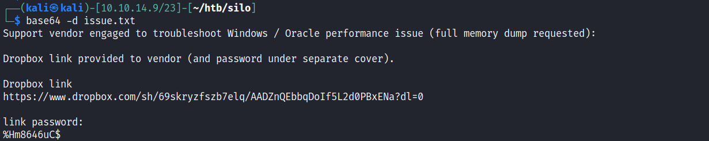

Question mark in the password disappeared let's try our new password

# Still Incorrect Password


# Hex view
```bash
┌──(kali㉿kali)-[10.10.14.9/23]-[~/htb/silo]
└─$ base64 -d issue.txt  | xxd
```
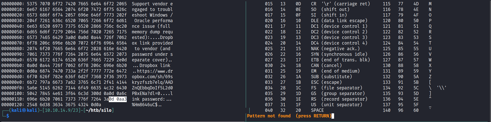


0d and 0a are carriage return and new line characters. ( \r \n ) I want to know what 0xa3 is about


# 0xa3 
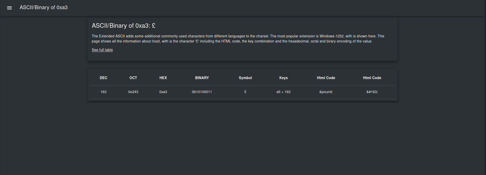

We now know what 0xa3 is. It's the pound sign.

And here is the final version of the password
```
Password: £%Hm8646uC$
```

# Dropbox

As it turns out this is in fact the correct password let's go ahead and download it

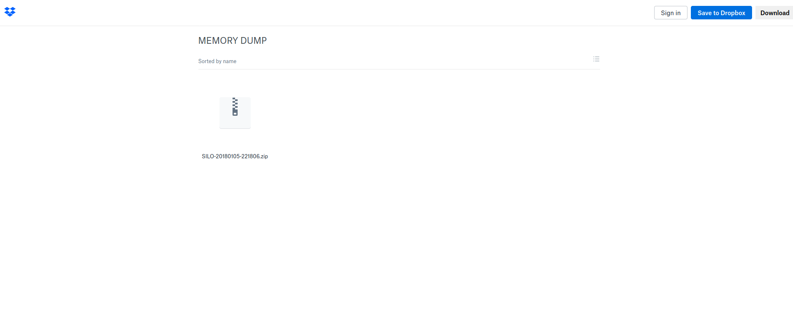

# Unzip the dump

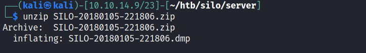


# Crash dump

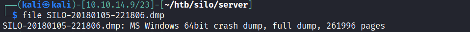


# Memory  dump analysis 
https://book.hacktricks.xyz/forensics/basic-forensic-methodology/memory-dump-analysis

I downloaded volatility2  and here is the hashdump output
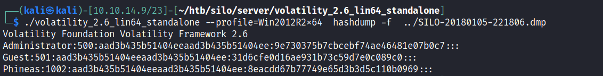


# evil-winrm login

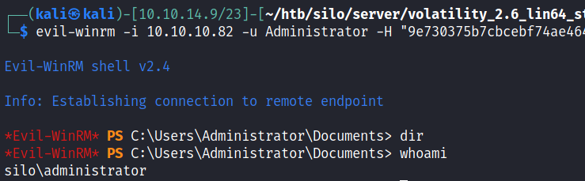
