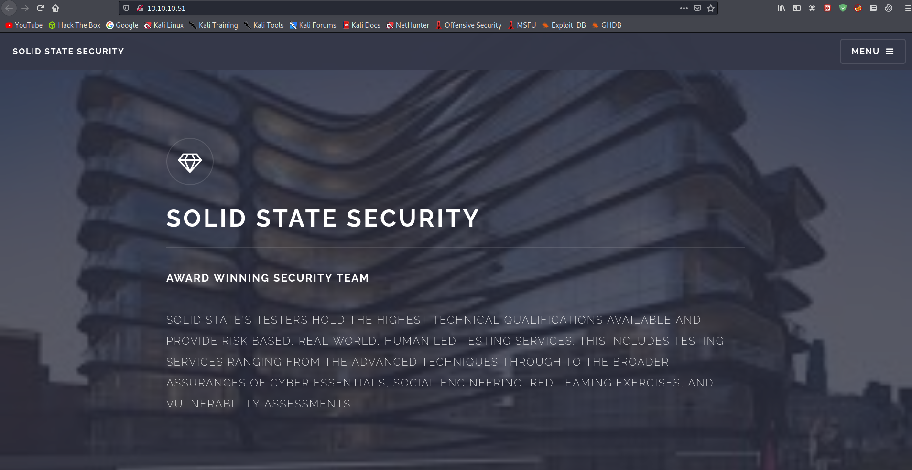
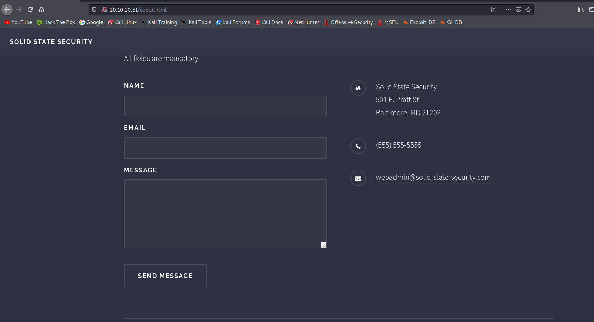
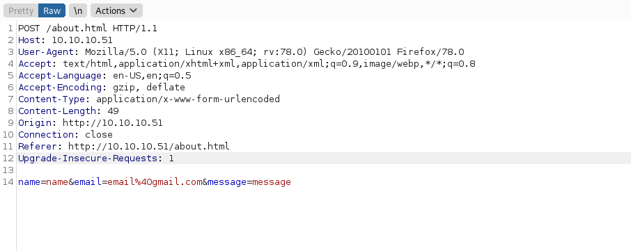

# 10 - SolitStateSecurity

# Index page

# DNS & about form

# Post request parameters

Unfortunately it's making a post request to about.html, there is probably no server side post handling. This looks like a rabbit hole, let's view the other services.