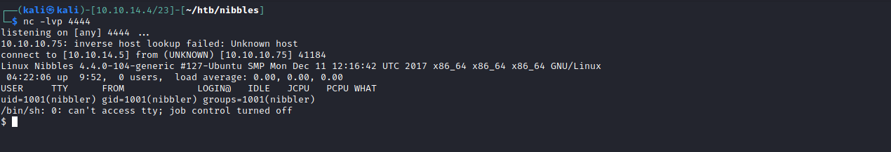

# <center>Web Server</center>
# Index


# [nibbleblog](http://10.10.10.75/nibbleblog/)


# searchsploit


# nibbleblog version history


# downloading the source code to find a file that includes version information


# in fact there is a file openly show its version

```bash
┌──(kali㉿kali)-[10.10.14.4/23]-[~/htb/nibbles/nibble/nibbleblog-v4.0.5]
└─$ grep -r 4.0.5
admin/boot/rules/98-constants.bit:define('NIBBLEBLOG_VERSION',          '4.0.5');
```


# admin/boot/rules/98-constants.bit


# install.php


# update.php


# [users.xml](view-source:http://10.10.10.75/nibbleblog/content/private/users.xml)
```xml
<users>
	<user username="admin">
		<id type="integer">0</id>
		<session_fail_count type="integer">0</session_fail_count>
		<session_date type="integer">1514544131</session_date>
	</user>
	<blacklist type="string" ip="10.10.10.1">
		<date type="integer">1512964659</date>
		<fail_count type="integer">1</fail_count>
	</blacklist>
</users>
```


# As it turns out I can't bruteforce the server, it blacklists the offenders, password  is either somewhere or it is guessable.


# generating some words from the blog

```bash
$ cewl 10.10.10.75/nibbleblog
CeWL 5.4.8 (Inclusion) Robin Wood (robin@digi.ninja) (https://digi.ninja/)
Nibbles
Yum
yum
Hello
world
posts
Home
Uncategorised
Music
Videos
HEADER
MAIN
PLUGINS
Categories
Latest
image
Pages
VIEW
There
are
FOOTER
Atom
Top
Powered
Nibbleblog
ATOM
Feed
http
nibbleblog
feed
php
```

# password is nibbles


# Googling nibbleblog exploit points us [here](https://curesec.com/blog/article/blog/NibbleBlog-403-Code-Execution-47.html).


# Enable My image plugin


# Upload [php shell](https://github.com/pentestmonkey/php-reverse-shell)


# Visit http://10.10.10.75/nibbleblog/content/private/plugins/my_image/image.php. This is the default name of images uploaded via the plugin.


